# introduction
MuJoCoは、ネイティブMJCF形式のXMLモデルファイルと、一般的ではあるがより限定的なURDF形式のXMLモデルファイルをロードできます。この章は、MJCFモデリングガイドです。リファレンスマニュアルは、XMLリファレンスの章にあります。 URDFドキュメントは他の場所にあります。ここでは、MuJoCo固有のURDF拡張のみを説明します。 MJCFモデルは、さまざまな機能とモデル要素を持つ複雑な動的システムを表すことができます。これらのすべての機能にアクセスするには、豊富なモデリング形式が必要です。使いやすさを考慮して設計されていないと、面倒になる可能性があります。そのため、MJCFをスケーラブルな形式として設計し、ユーザーが小規模から始めて、より詳細なモデルを後で構築できるように努力しました。この点で特に役立つのは、HTMLのカスケードスタイルシート（CSS）のアイデアに触発された広範なデフォルト設定メカニズムです。これにより、ユーザーは新しいモデルを迅速に作成し、それらを試すことができます。実験は、シミュレーションパイプラインの再構成に使用できる多数のオプションと、モデルの編集をインタラクティブなプロセスにするクイックリロードによってさらに支援されます。 MJCFは、モデリング形式とプログラミング言語のハイブリッドと考えることができます。組み込みコンパイラがあります。これは、通常プログラミング言語に関連付けられている概念です。 MJCFには汎用プログラミング言語の能力はありませんが、モデルの設計方法に応じて、多数の高度なコンパイル時計算が自動的に呼び出されます。 
## Loading models
概要の章のモデルインスタンスで説明されているように、MuJoCoモデルはMJCFまたはURDF形式のプレーンテキストXMLファイルからロードし、低レベルのmjModelにコンパイルできます。 または、以前に保存されたmjModelは、形式は文書化されていませんが、本質的にmjModelメモリバッファのコピーであるバイナリMJBファイルから直接ロードできます。 MJCFおよびURDFファイルはmj_loadXMLでロードされ、MJBファイルはmj_loadModelでロードされます。 XMLファイルがロードされると、内部でTinyXMLパーサーを使用して、最初に解析されてドキュメントオブジェクトモデル（DOM）になります。 次に、このDOMが処理され、高レベルのmjCModelオブジェクトに変換されます。 変換は、ファイル拡張子ではなくXMLファイルの最上位要素から推測されるモデル形式に依存します。 有効なXMLファイルには一意の最上位要素があることを思い出してください。 この要素は、MJCFの場合はmujoco、URDFの場合はrobotでなければなりません。
## Compling models
MJCFファイルまたはURDFファイルを読み込んで高レベルのmjCModelを作成するか、そのような機能が利用可能になったときにプログラムで作成すると、mjModelにコンパイルされます。現在、ロードとコンパイルは1つのステップで結合されていますが、コンパイルはロードとは無関係です。つまり、mjCModelの作成方法に関係なく、コンパイラは同じように動作します。パーサーとコンパイラの両方が広範なエラーチェックを実行し、最初のエラーが発生したときに中止します。結果のエラーメッセージにはXMLファイルの行番号と列番号が含まれており、自明であるため、ここでは説明しません。パーサーは、カスタムスキーマを使用して、ファイル構造、要素、および属性が有効であることを確認します。その後、コンパイラは多くの追加のセマンティックチェックを適用します。最後に、コンパイルされたモデルのシミュレーションステップが1つ実行され、実行時エラーがインターセプトされます。後者は、C ++例外をスローする関数を指すように（一時的に）mju_user_errorを設定することにより行われます。ユーザーは、必要に応じて、実行時に同様のエラー遮断機能を実装できます。モデルにシミュレーションで計算する必要がある大きなメッシュまたはアクチュエータの長さの範囲が含まれていない場合、解析とコンパイルのプロセス全体は非常に高速で1秒未満です。これにより、頻繁にリロードして変更を視覚化することで、モデルをインタラクティブに設計することができます。 HAPTIXとsimulate.cppの両方のコードサンプルには、現在のモデルを再ロードするためのキーボードショートカット（Ctrl + L）があることに注意してください。
## Saving models
MJCFモデルは、複数の（含まれる）XMLファイルと、XMLから参照されるメッシュ、高さフィールド、およびテクスチャで構成できます。コンパイル後、これらすべてのファイルの内容はmjModelにアセンブルされ、mj_saveModelを使用してバイナリMJBファイルに保存できます。 MJBはスタンドアロンファイルであり、他のファイルを参照しません。読み込みも高速です。そのため、一般的に使用されるモデルをMJBとして保存し、シミュレーションに必要なときにそれらをロードすることをお勧めします。 mj_saveLastXMLを使用して、コンパイル済みのmjCModelをMJCFとして保存することもできます。対応するmjModelの実数値フィールドがコンパイル後に変更された場合（これは異常ですが、たとえばシステム識別アプリケーションで発生する可能性があります）、変更は保存前にmjCModelに自動的にコピーされます。コンパイルされたモデルでは構造の変更はできないことに注意してください。 XMLライターは、同じモデルへのコンパイルが保証されている最小のMJCFファイルを生成しようとします。これは、実際の値のプレーンテキスト表現によって引き起こされる無視できる数値の差を法とします。 MJCFには多くのユーザーの便利な機能があり、同じモデルを異なる方法で指定できるため、結果のファイルは元のファイルと同じ構造を持たない場合があります。 XMLライターは、すべての座標がローカルであり、すべての体の位置、方向、慣性特性が明示的に指定されているMJCFの「標準」サブセットを使用します。計算の章では、MJCFファイルの例と対応する保存された例を示しました。
# MJCF Mechanisms
MJCFは、複数のモデル要素にまたがるモデル作成のためのいくつかのメカニズムを使用します。 繰り返しを避けるため、このセクションでは一度だけ詳細に説明します。 これらのメカニズムは、「計算」の章で紹介したもの以外の新しいシミュレーションの概念には対応していません。 それらの役割は、MJFCモデルの作成を簡素化し、標準形式に手動で変換する必要なく、さまざまなデータ形式を使用できるようにすることです。
## Kinematic tree
MJCFファイルの主要部分は、ネストされたbody要素によって作成されたXMLツリーです。トップレベルのボディは特別で、ワールドボディと呼ばれます。このツリー構造は、リンクのコレクションを作成し、それらを子および親リンクを指定するジョイントで接続するURDFとは対照的です。 MJCFでは、XMLの意味で、子ボディは文字通り親ボディの子です。ジョイントがボディ内で定義される場合、その機能は親子を接続することではなく、それらの間にモーションの自由度を作成することです。特定のボディ内にジョイントが定義されていない場合、そのボディはその親に溶接されます。 MJCFのボディには複数のジョイントを含めることができるため、複合ジョイントを作成するためにダミーボディを導入する必要はありません。代わりに、同じボディ内で目的の複合ジョイントを形成するすべてのプリミティブジョイントを定義するだけです。たとえば、2つのスライダーと1つのヒンジを使用して、平面内を移動する物体をモデル化できます。他のMJCF要素は、ネストされたボディ要素、特にジョイント、ジオム、サイト、カメラ、ライトによって作成されたツリー内で定義できます。要素がボディ内で定義されると、そのボディのローカルフレームに固定され、常に一緒に移動します。複数のボディを参照する要素、またはボディをまったく参照しない要素は、キネマティックツリーの外側の個別のセクションで定義されます。
## Default settings
MJCFには、デフォルトの属性値を設定するための精巧なメカニズムがあります。 これにより、ソフトウェアの豊富な機能を公開するために必要な多数の要素と属性を持ち、同時に短くて読みやすいモデルファイルを作成できます。 このメカニズムにより、ユーザーは1箇所で変更を導入し、モデル全体に変更を伝達できます。 例から始めます。
```xml
<mujoco>
    <default class="main">
        <geom rgba="1 0 0 1"/>
        <default class="sub">
            <geom rgba="0 1 0 1"/>
        </default>
    </default>

    <worldbody>
        <geom type="box"/>
        <body childclass="sub">
            <geom type="ellipsoid"/>
            <geom type="sphere" rgba="0 0 1 0"/>
            <geom type="cylinder" class="main"/>
        </geom>
    </worldbody>
</mujoco>
```
いくつかの必要な情報が欠落しているため、この例は実際にはコンパイルされませんが、ここではgeom rgba値の設定にのみ関心があります。 上記で作成された4つのgeomは、デフォルトの設定メカニズムの結果として、次のrgba値になります。
| geom type | geom rgba |
|-----------|-----------|
| box       | 1 0 0 1   |
| elipsoid  | 0 1 0 1   |
| sphere    | 0 0 1 1   |
| cylinder  | 1 0 0 1   |

他のクラスが指定されていないため、ボックスはトップレベルのデフォルトクラス「main」を使用して、未定義の属性の値を設定します。 本体はchildclass "sub"を指定します。これにより、この本体のすべての子（およびそのすべての子など）は、特に指定がない限り、クラス "sub"を使用します。 したがって、楕円体はクラス「sub」を使用します。 球体は、デフォルト設定をオーバーライドするrgbaを明示的に定義しています。 シリンダーはデフォルトクラス「main」を指定するため、「sub」の代わりに「main」を使用します。後者は、geomを含むボディのchildclass属性で指定されています。</br>   
次に、一般的な規則について説明します。 MuJoCoは、XMLのネストされたデフォルト要素によって作成される可能性のあるデフォルトクラスの数に制限はありません。 各クラスには一意の名前があります。これは、未定義のままの場合の名前が「main」である最上位クラスを除き、必須属性です。 各クラスには、次のように属性が設定されたダミーモデル要素の完全なコレクションもあります。 デフォルトクラスが別のデフォルトクラス内で定義されると、子は自動的にすべての属性値を親から継承します。 次に、対応する属性を定義することにより、それらの一部またはすべてをオーバーライドできます。 最上位のデフォルトクラスには親がないため、その属性は内部デフォルトに初期化されます。内部デフォルトについては、以下のリファレンスドキュメントを参照してください。</br>  
デフォルトクラスに含まれるダミー要素は、モデルの一部ではありません。 実際のモデル要素の属性値を初期化するためにのみ使用されます。 実際の要素が最初に作成された場合、そのすべての属性は、現在アクティブなデフォルトクラスの対応するダミー要素からコピーされます。 常にアクティブなデフォルトクラスがあり、3つの方法のいずれかで決定できます。 現在の要素またはその祖先ボディにクラスが指定されていない場合、最上位クラスが使用されます（「メイン」または他の何かと呼ばれるかどうかに関係なく）。 現在の要素にクラスが指定されていないが、その祖先ボディの1つ以上が子クラスを指定している場合、最も近い祖先ボディの子クラスが使用されます。 現在の要素がクラスを指定している場合、そのクラスはその祖先ボディの子クラス属性に関係なく使用されます。</br>  
グローバル座標で定義されたモデルの体の位置などの一部の属性は、特別な未定義の状態になります。 これは、対応する値を他の情報から推測するようにコンパイラーに指示します。この場合、ボディにアタッチされたgeomの位置です。 未定義の状態はXMLファイルに入力できません。 したがって、特定のクラスで属性を定義すると、そのクラスまたはその子クラスで属性を未定義にすることはできません。 そのため、特定の属性を特定のモデル要素で未定義のままにすることが目標である場合、inはアクティブなデフォルトクラスで未定義でなければなりません。</br>    
ここでの最後の工夫はアクチュエータです。 アクチュエータ関連の要素のいくつかは実際にはショートカットであり、ショートカットはデフォルト設定メカニズムと非自明な方法で相互作用するため、これらは異なります。 これについては、以下の「アクチュエータのショートカット」セクションで説明しています。</br>  
## Coordinate frames
コンパイル後、キネマティックツリーで定義されたすべての要素の位置と方向は、ローカル座標で、ボディの親ボディ、およびジオメトリ、ジョイント、サイト、カメラ、ライトのエレメントを所有するボディを基準にして表現されます。そのため、コンパイルされたモデルがMJCFとして保存される場合、座標は常にローカルです。ただし、ユーザーがMJCFファイルを書き込む場合、コンパイラの座標属性で指定されているように、座標はローカルまたはグローバルのいずれかになります。この設定は、MJCFファイル内のすべての位置および方向データに適用されます。関連する属性は角度です。 MJCFファイルのすべての角度を度またはラジアンで表現するかどうかを指定します（コンパイル角度は常にラジアンで表現されます）。新しいモデルを構築する際には、これらのグローバル設定を認識することが不可欠です。グローバル座標はより直感的である場合があり、体の位置と方向を省略できるという追加の利点があります。その場合、ボディフレームはボディ慣性フレームに設定されます。これは、それ自体を省略し、geomの質量と慣性から推測できます。一方、MJCFモデルがローカル座標で定義されている場合、ユーザーはボディフレームの位置と方向を明示的に指定する必要があります。これは、それらが省略され、ボディ内の要素がボディフレームに対するローカル座標で指定されている場合、ボディフレームを推測する方法がないためです。グローバル座標でのMJCFフラグメントの例を次に示します。
```xml
<body>
   <geom type="box" pos="1 0 0" size="0.5 0.5 0.5"/>
</body>
```
このモデルをコンパイルしてMJCFとして（ローカル座標で）保存すると、同じフラグメントが次のようになります。
```xml
<body pos="1 0 0">
   <inertial pos="0 0 0" mass="1000" diaginertia="166.667 166.667 166.667"/>
   <geom type="box" pos="0 0 0" size="0.5 0.5 0.5"/>
</body>
```
体の位置はgeom位置（1 0 0）に設定され、geomおよび慣性位置は体に対して（0 0 0）に設定されました。 原則として、ユーザーは常にローカル座標とグローバル座標を選択できますが、実際には、メッシュではなく幾何プリミティブを使用する場合にのみこの選択が実行可能です。 メッシュの場合、3D頂点の位置はローカルおよびグローバル座標のいずれかで表現されます。これは、メッシュが効果的に設計された方法に応じて、モデル全体に対して同じ規則をユーザーに強制するように強制します。 別の方法は、座標を変更するためにMuJoCoの外部でメッシュデータを前処理することですが、その努力はほとんど正当化されません。
## Frame orientations
いくつかのモデル要素には、右手空間フレームが関連付けられています。これらは、ジョイントを除き、キネマティックツリーで定義されているすべての要素です。空間フレームは、その位置と方向によって定義されます。 3D位置の指定は簡単ですが、3D方向の指定は難しい場合があります。これが、MJCFがいくつかの代替メカニズムを提供する理由です。ユーザーがどのメカニズムを選択しても、コンパイル後は常にフレームの方向がユニットクォータニオンとして表されます。単位ベクトル（x、y、z）で与えられる軸の周りの角度aによる3D回転は、クォータニオン（cos（a / 2）、sin（a / 2）*（x、y、z））に対応することを思い出してください。また、すべての3D方向は、特定の軸を中心とした角度による1回の3D回転によって一意に指定できることを思い出してください。空間フレームを持つすべてのMJCF要素は、以下にリストされている5つの属性を許可します。フレームの方向は、これらの属性のうち最大1つを使用して指定されます。 quat属性にはnull回転に対応するデフォルト値がありますが、他の属性は特別な未定義状態で初期化されます。したがって、これらの属性がユーザーによって指定されていない場合、フレームは回転しません。</br>   
<font color="indianRed"> quat : real(4), "1 0 0 0" </font>
+ クォータニオンが既知の場合、変換を伴わないため、フレームの方向を指定することが推奨されます。 代わりに、コンパイル時にユニット長に正規化され、mjModelにコピーされます。 モデルがMJCFとして保存されると、すべてのフレームの向きは、この属性を使用してクォータニオンとして表されます。

<font color="indianRed">  axisangle : real(4), optional"1 0 0 0" </font>
+ これらは、上記の数量（x、y、z、a）です。 最後の数値は、コンパイラーのangle属性で指定された度またはラジアン単位の回転角度です。 最初の3つの数値は、回転軸である3Dベクトルを決定します。 このベクトルはコンパイル時に単位長に正規化されるため、ユーザーはゼロ以外の長さのベクトルを指定できます。 回転は右利きであることに注意してください。 ベクトル（x、y、z）の方向が逆になっている場合、これは反対の回転になります。 aの符号を変更して、反対の回転を指定することもできます。

<font color="indianRed">  euler : real(3), optional"1 0 0 0" </font>
+ 3つの座標軸の周りの回転角度。 これらの回転が適用される軸のシーケンスは、コンパイラのeulerseq属性によって決定され、モデル全体で同じです。</br>    

<font color="indianRed">  xyaxes : real(6), optional "1 0 0 0" </font>
+ 最初の3つの数字は、フレームのX軸です。 次の3つの数字はフレームのY軸で、X軸に自動的に直交します。 Z軸は、X軸とY軸の外積として定義されます。</br>

<font color="indianRed">  zaxis : real(3), optional"1 0 0 0" </font>
+ フレームのZ軸。 コンパイラーは、ベクトル（0,0,1）をここで指定されたベクトルにマップする最小回転を見つけます。 これにより、フレームのX軸とY軸が暗黙的に決定されます。 これは、フレームのZ軸に沿って方向付けられたライトだけでなく、Z軸を中心に回転対称性を持つジオメトリに役立ちます。

## solver parameters
計算の章のソルバーパラメーターセクションでは、MuJoCoの制約の動作を決定する量d、b、kの数学的およびアルゴリズム的な意味について説明しました。 ここでそれらを設定する方法を説明します。 設定は、制約を含むすべてのMJCF要素で使用可能なsolrefおよびsolimp属性を介して間接的に行われます。 これらのパラメーターは、制約ごと、またはデフォルトクラスごとに調整できます。未定義のままにすると、MuJoCoは以下に示す内部デフォルトを使用します。 オプションで使用可能なオーバーライドメカニズムにも注意してください。 実行時にすべての接触関連ソルバーパラメーターを変更して、パラメーター設定をインタラクティブに実験したり、数値最適化の継続方法を実装したりするために使用できます。
ここでは、単一のスカラー制約に注目します。 計算の章とわずかに異なる表記を使用して、a1が加速度を、vが速度を、rが位置または残差（摩擦寸法で0として定義）、bおよびkが基準加速度を定義するために使用される仮想スプリングの剛性と減衰を表すとします aref = -b * vk * r。 dを拘束インピーダンス、a0を拘束力がない場合の加速度とします。 以前の分析では、制約空間のダイナミクスはおよそ   
$$ a_1 + d \times (b_v + k_r) = (1 - d) \times a_0 $$
繰り返しますが、ユーザーの制御下にあるパラメーターはd、b、kです。 残りの量はシステム状態の関数であり、各タイムステップで自動的に計算されます。
まず、インピーダンスdの設定について説明します。 dは0から1の間になければならないことを思い出してください。 内部的にMuJoCoは、現在[0.0001 0.9999]に設定されている範囲[mjMINIMP mjMAXIMP]にクランプします。 ソルバーは、強制されていない加速度a0と基準加速度arefの間を補間します。 dの小さい値はソフト/弱い制約に対応し、dの大きい値は強い/強い制約に対応します。 ユーザーはdを定数に設定するか、その補間プロパティを利用して位置依存、つまりrの関数にすることができます。 位置に依存するインピーダンスを使用して、オブジェクトの周囲のソフトコンタクトレイヤーをモデル化したり、違反が大きくなるにつれて強くなる等式制約を定義したりすることができます（たとえば、バックラッシュを近似するため）。 関数d（r）の形状は、要素固有のパラメーターベクトルsolimpによって決まります。

<font color="indianRed">  solimp : real(5), "0.9 0.95 0.001 0.5 2" "1 0 0 0" </font>
+ 5つの数値は（dmin、dmax、width、midpoint、power）です。関数d（r）をパラメーター化します。 MuJoCo 2.0以前では、この属性には3つのパラメーターと、関数の形状を指定するグローバルオプションがありました。 MuJoCo 2.0では、次のように下位互換性を維持しながら、インピーダンス関数のファミリを拡張しました。ユーザーは最初の3つのパラメーターのみを設定でき、そのデフォルトは以前のリリースと同じです。最後の2つのパラメーターのデフォルトは、以前のリリースでデフォルトであった同じ関数（シグモイド）を生成します。新しいパラメーター化により、追加パラメーターのさまざまな値について以下のプロットに示すように、シグモイドをシフトおよびスキューさせることができます。インピーダンス関数d（r）はrの絶対値に依存するため、プロットは実際には2つの反射シグモイドを示しています。この柔軟性は、遠隔接触力のより良い制御を可能にするために追加され、他の制約にも使用できます。 （関数の生成に使用される多項式スプラインの）パワーは1以上でなければなりません。中間点（変曲点を指定）は0から1の間でなければならず、幅の単位で表されます。パワーが1の場合、関数は中点に関係なく線形であることに注意してください。
+ 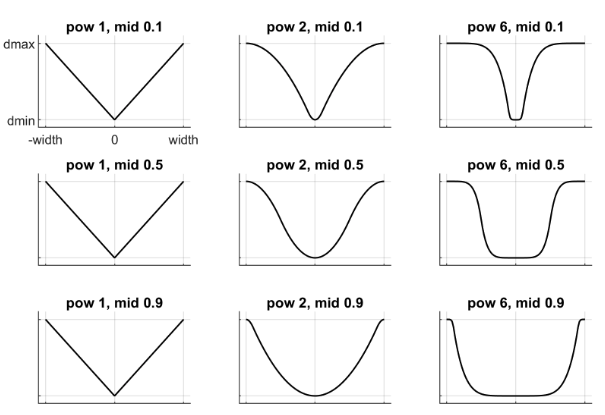
+ これらのプロットは、横軸の制約違反rの関数として、縦軸にインピーダンスd（r）を示しています。 量rは次のように計算されます。 等式制約の場合、rは制約違反に等しく、正または負のいずれかになります。 楕円錐の摩擦損失または摩擦寸法の場合、rは常に0です。制限、楕円錐の法線方向および錐体円錐のすべての方向の場合、rは（制限または接触）距離から拘束がアクティブになるマージンを引いたものです。 連絡先の場合、このマージンは実際にはマージンギャップです。 したがって、対応するrが負の場合、制限と接触の制約がアクティブになります。

次に、剛性kと減衰bの設定について説明します。 ここでの考え方は、上記の質量ばねダンパーシステムの時定数と減衰比に関してモデルを再パラメーター化することです。 「時定数」とは、固有振動数と減衰比の逆数を意味します。 残差がまったく0である制約には1次ダイナミクスがあり、質量ばねダンパー解析は適用されません。 その場合、時定数は拘束速度の指数関数的な減衰率であり、減衰比は無視されます。 この形式に加えて、MuJoCo 2.0では、剛性と減衰をより直接指定する2番目の形式を使用できます。

<font color="indianRed"> solref : real(2), "0.02 1"</font>
+ この属性には2つの形式があり、数字の符号によって決まります。両方の数値が正の場合、仕様は（timeconst、dampratio）形式であると見なされ、MuJoCoでずっと利用可能です。それ以外の場合、仕様はMuJoCo 2.0で導入された新しい（-stiffness、-damping）形式であると見なされます。最初に、2つの数値が（timeconst、dampratio）である元の形式について説明します。この場合、適切なスケーリングの後、質量ばねダンパーモデルを使用してk、bを計算します。有効剛性d（r）* kおよび減衰d（r）* bは、距離rの関数であるインピーダンスd（r）によってスケーリングされることに注意してください。したがって、dによるスケーリングを完全に元に戻さない限り、指定された質量-ばね-ダンパー特性を常に達成できるとは限りません。ただし、後者は補間プロパティを台無しにするため、特に制限d = 0が制約を無効にしないため、望ましくありません。代わりに、d（r）が小さくなると時定数が増加するように、減衰比が一定になるように剛性と減衰をスケーリングします。スケーリング式は

$$ b = 2 / (d_{max} * timeconst) $$
$$ k = d(r) / (d_{max}^2 \times timeconst^2 \times dampratio^2 ) $$
+ timeconstパラメーターは、シミュレーションタイムステップより少なくとも2倍大きくする必要があります。そうしないと、数値積分器に対してシステムが硬くなりすぎ（特にオイラー積分が使用される場合）、シミュレーションが不安定になる可能性があります。 flagのrefsafe属性がfalseに設定されていない限り、これは内部的に強制されます。 dampratioパラメーターは、通常、臨界減衰に対応する1に設定されます。 値が小さいと制約が不足または弾むようになり、値が大きいと制約が過剰になります。
+ 次に、2つの数値が（-stiffness、-damping）である新しい形式について説明します。 これにより、特に反発に対するより直接的な制御が可能になります。 同じ数値を異なるインピーダンスで使用できるように、ある程度のスケーリングを適用しますが、スケーリングはrに依存せず、2つの数値は相互作用しなくなります。 スケーリング式は
$$ d = damping / d_m $$
$$ k = stiffness / (d_m ^2) $$

## Contact prameters
各連絡先のパラメーターについては、「計算」の章の「連絡先」セクションで説明しました。 ここでは、これらのパラメーターの設定方法について説明します。 geomペアがXML要素ペアで明示的に定義されている場合、すべての連絡先パラメーターを直接指定する属性があります。 その場合、個々のgeomのパラメーターは無視されます。 一方、動的メカニズムによってコンタクトが生成される場合、そのパラメータはコンタクトペアの2つのジオメトリから推測する必要があります。 2つのgeomに同一のパラメーターがある場合、何もすることはありませんが、パラメーターが異なる場合はどうなりますか？ その場合、geom属性のsolmixとpriorityを使用して、それらの結合方法を決定します。 各連絡先パラメーターの組み合わせ規則は次のとおりです。
+ <font color="indianRed"> condim </font> 
    + 2つのgeomのいずれかが優先度が高い場合、そのcondimが使用されます。 両方のgeomの優先順位が同じ場合、2つのcondimsの最大値が使用されます。 このようにして、摩擦のないgeomと摩擦のgeomは、摩擦のないgeomの優先度が高くない限り、摩擦接触を形成します。 後者は、たとえばパーティクルをオブジェクトに付着させたくない場合のパーティクルシステムに適しています。

+ <font color="indianRed"> friction</font> 
    + 接点は最大5つの摩擦係数を持つことができることを思い出してください：2つの接線、1つのねじれ、2つのローリング。 condimが6未満で、すべての係数が使用されているわけではない場合でも、mjData.contactの各連絡先には実際に5つすべてが含まれています。 対照的に、geomには3つの摩擦係数のみがあります：タンジェンシャル（両方の軸に同じ）、ねじれ、ローリング（両方の軸に同じ）。 これらの摩擦係数の3Dベクトルのそれぞれは、タンジェントおよびローリングコンポーネントを複製することにより、摩擦係数の5Dベクトルに拡張されます。 接触摩擦係数は、次の規則に従って計算されます。2つのジオメトリのいずれかが優先度が高い場合、その摩擦係数が使用されます。 それ以外の場合、2つのジオムにわたる各摩擦係数の要素ごとの最大値が使用されます。 理論的根拠は、コンディムを超える最大値を取ることに似ています：より摩擦の多いgeomが勝つことを望みます。  
    連絡先ごとに5つの係数とジオムごとに3つの係数のみを持つ理由は次のとおりです。 接触ペアの場合、ソルバーが処理できる最も柔軟なモデルを許可します。 前述のように、異方性摩擦を利用して、スケートなどの効果をモデル化できます。 ただし、これには、接触接平面の2つの軸の向きを知る必要があります。 事前定義された接触ペアの場合、2つのgeomタイプを事前に知っており、対応する衝突関数は、ここでは説明しませんがビジュアライザーで見ることができる同じ方向の接触フレームを常に生成します。 ただし、個々のgeomについては、衝突する可能性のある他のgeomとそれらのgeomタイプがわからないため、個々のgeomを指定するときに接触接平面の向きを知る方法はありません。 これが、MuJoCoが個々のgeom仕様で異方性摩擦を許可するようになった理由ですが、明示的な接触ペア仕様でのみです。
+ <font color="indianRed"> margin,gap</font> 
    + 2つのgeomマージン（またはギャップ）の最大値が使用されます。 マージンとギャップは距離プロパティであり、一方的な仕様はほとんど意味をなさないため、geomの優先順位はここでは無視されます。

+ <font color="indianRed"> solref,solimp</font> 
    + 2つのgeomのいずれかが優先度が高い場合、solrefおよびsolimpパラメーターが使用されます。 両方のgeomの優先順位が同じ場合、加重平均が使用されます。 重みはsolmix属性に比例します。つまり、weight1 = solmix1 /（solmix1 + solmix2）およびweight2についても同様です。 この加重平均ルールには1つの重要な例外があります。 いずれかのgeomのsolrefが正でない場合、つまりMuJoCo 2.0で導入された新しい直接形式に依存している場合、solmixに関係なく要素ごとの最小値が使用されます。 これは、異なる形式のsolrefパラメーターを平均化しても意味がないためです。

## Contact override
MuJoCoは、「計算」の章で説明されている精巧な制約モデルを使用します。このモデルがどのように機能するかについて直感を得るには、いくつかの実験が必要です。このプロセスを容易にするために、実際のモデルに変更を加えることなく、ソルバーパラメーターの一部をオーバーライドするメカニズムを提供します。オーバーライドが無効になると、シミュレーションはモデルで指定されたパラメーターに戻ります。このメカニズムは、数値最適化（最適な制御や状態推定など）のコンテキストで継続方法を実装するためにも使用できます。これは、最適化の初期段階で連絡先が離れた場所から行動できるようにすることで、オプティマイザーが勾配を見つけて適切な解決策に近づくのを助け、この影響を後で減らして最終的な解決策を物理的に現実的なものにします。ここで関連する設定は、このメカニズムを有効または無効にするフラグのオーバーライド属性、および新しいソルバーパラメーターを指定するオプションのo_margin、o_solref、o_solimp属性です。オーバーライドは連絡先にのみ適用され、他のタイプの制約には適用されないことに注意してください。原則として、MuJoCoモデルには多くの実数値パラメーターがあり、同様のオーバーライドメカニズムの恩恵を受けることができます。しかし、どこかに線を引く必要があり、連絡先は最も豊かでありながら最も調整が難しい行動を引き起こすため、自然な選択です。さらに、接触のダイナミクスは数値最適化の観点からしばしば課題を提示し、経験により、接触パラメーターの継続は局所的最小値の回避に役立つことが示されています。

## User parameters
多くのMJCF要素には、カスタム要素固有のパラメーター配列を定義するオプション属性userがあります。 これは、サイズ要素の対応する「nuser_XXX」属性と対話します。 たとえば、nuser_geomを5に設定すると、mjModelのすべてのgeomには、5つの実数値パラメーターのカスタム配列があります。 これらのgeom固有のパラメーターは、geomのユーザー属性を介してMJCFファイルで定義されるか、この属性が省略された場合にコンパイラーによって0に設定されます。 MuJoCoは、内部計算でこれらのパラメーターを使用しません。 代わりに、カスタム計算に使用できます。 パーサーはXML内の任意の長さの配列を許可し、コンパイラーは後でそれらを長さnuser_XXXにサイズ変更します。
内部計算で通常使用される一部の要素固有のパラメーターは、カスタム計算でも使用できます。 これは、シミュレーションパイプラインの一部をオーバーライドするユーザーコールバックをインストールすることによって行われます。 たとえば、一般的なアクチュエータ要素には、属性dyntypeとdynprmがあります。 dyntypeが「user」に設定されている場合、MuJoCoはその内部関数を呼び出す代わりにmjcb_act_dynを呼び出してアクチュエータダイナミクスを計算します。 mjcb_act_dynが指すユーザー関数は、dynprmで定義されているパラメーターを必要に応じて解釈できます。 ただし、このパラメーター配列の長さは変更できません（MJCFファイルで長さが定義されている前述のカスタム配列とは異なります）。 同じことが他のコールバックにも当てはまります。
上記の要素固有のユーザーパラメータに加えて、カスタム要素を介してモデルにグローバルデータを含めることができます。 シミュレーションの過程で変化するデータの場合、サイズがsize要素のnuserdata属性によって決定される配列mjData.userdataもあります。

## Algorithms and related setting
拘束力と拘束加速度の計算には、最適化問題を数値的に解くことが含まれます。 MuJoCoには、この最適化問題を解決するための3つのアルゴリズム、CG、Newton、PGSがあります。 それらのそれぞれは、摩擦円錐のピラミッド型または楕円型モデルに適用でき、ヤコビアンが密または疎に制約されます。 さらに、ユーザーは反復の最大数と、早期終了を制御する許容レベルを指定できます。 また、2番目のNoslipソルバーもあります。これは、正の数のnoslip反復を指定することで有効になる後処理ステップです。 これらのアルゴリズム設定はすべて、option要素で指定できます。
デフォルト設定はほとんどのモデルで適切に機能しますが、場合によってはアルゴリズムを調整する必要があります。 これを行う最良の方法は、関連する設定を試して、simulate.cppのビジュアルプロファイラーとHAPTIXを使用することです。HAPTIXは、異なる計算のタイミングと反復ごとのソルバー統計を表示します。 次の一般的なガイドラインと見解を提供できます。
+ 制約ヤコビアンは、小さなモデルでは密で、大きなモデルでは疎でなければなりません。デフォルト設定は「auto」です。自由度の数が最大60で、60を超えるとスパースになります。ただし、しきい値は、モデルと動作に依存するアクティブな制約の数に関してより適切に定義されることに注意してください。
+ ピラミッド型と楕円型の摩擦コーンの選択は、アルゴリズムの選択ではなくモデリングの選択です。つまり、同じアルゴリズムで解決される異なる最適化問題につながります。楕円錐は、物理的現実により密接に対応しています。ただし、錐体コーンはアルゴリズムのパフォーマンスを改善できますが、必ずしもそうではありません。デフォルトはピラミッド型ですが、楕円錐を試すことをお勧めします。接触スリップが問題である場合、それを抑制する最良の方法は、楕円コーン、大きな比率、および非常に小さな許容誤差を持つニュートンアルゴリズムを使用することです。それで十分でない場合は、Noslipソルバーを有効にします。
+ ニュートンアルゴリズムは、ほとんどのモデルに最適です。グローバル最小値に近い2次収束を持ち、通常約5回、まれに20回を超える驚くほど少ない反復で到達します。遅延を追加することなく高精度を達成できるため、1e-10などの積極的な許容値で使用する必要があります（最後に二次収束するため）。速度が低下するのを確認した唯一の状況は、楕円錐と多数の滑り接触を持つ大きなモデルです。その体制では、ヘッセ分解は多くの更新を必要とします。また、モデル要素の順序が不幸な大きなモデルでは、フィルインが大きくなる場合があります（最適な消去順序の計算はNP困難であるため、ヒューリスティックに依存しています）。因数分解されたヘッシアンの非ゼロの数は、プロファイラーで監視できることに注意してください。 
+ CGアルゴリズムは、ニュートンが遅くなる上記の状況でうまく機能します。一般に、CGは良好なレートで線形収束を示しますが、特に高い精度が必要な場合、反復回数の点でニュートンと競合することはできません。ただし、その反復ははるかに高速で、楕円コーンによる塗りつぶしや複雑さの増加の影響を受けません。ニュートンが遅すぎることが判明した場合は、次にCGを試してください。 
+ PGSソルバーは最近までデフォルトのソルバーでしたが、MuJoCo 1.50ではスパースモデルで動作するように大幅に改善されました。しかし、それが最良のアルゴリズムである状況はまだ見つかっていません。それは、そのような状況が存在しないと言っているわけではありません。 PGSは、制約付き最適化問題を解決し、経験上、準線形収束を持ちますが、通常、最初の数回の反復で急速に進歩します。そのため、不正確なソリューションを許容できる場合に適しています。質量比が大きいシステムや、コンディショニングが不十分な他のモデルプロパティがある場合、PGSの収束はかなり遅くなる傾向があります。 PGSは順次更新を実行するため、物理が対称である必要があるシステムでは対称性が失われることに注意してください。対照的に、CGとニュートンは並列更新を実行し、対称性を保持します。 
+ Noslipソルバーは、修正されたPGSソルバーです。メインソルバー（ニュートン、CG、またはPGSのいずれか）の後の後処理ステップとして実行されます。メインソルバーはすべての未知数を更新します。対照的に、Noslipソルバーは摩擦寸法の拘束力のみを更新し、拘束の正則化を無視します。これには、ソフト制約モデルによって引き起こされるドリフトまたはスリップを抑制する効果があります。ただし、この最適化手順のカスケードは、明確に定義された最適化問題（またはその他の問題）を解決していません。代わりに、単なるアドホックメカニズムです。通常はその役割を果たしますが、複数の連絡先間でより複雑な相互作用があるモデルでいくつかの不安定性が見られました。 PGSには、制約空間の逆慣性を計算するためのセットアップコスト（CPU時間）があります。同様に、ニュートンにはヘッセ行列の初期分解のセットアップコストがあり、後で必要な分解の更新の数に応じて追加の分解コストが発生します。 CGにはセットアップコストはありません。 NoslipソルバーはPGSソルバーでもあるため、メインソルバーがCGまたはNewtonである場合でも、Noslipが有効になるたびにPGSセットアップコストが支払われます。メインPGSとNoslip PGSのセットアップ操作は同じであるため、両方が有効になっている場合、セットアップコストは1回だけ支払われます。

## actuator shortcuts
計算の章の「作動モデル」セクションで説明したように、MuJoCoは、独立して指定できる伝達、活性化ダイナミクス、および力生成コンポーネントを備えた柔軟なアクチュエータモデルを提供します。すべての機能にアクセスするには、XML要素一般を使用します。これにより、ユーザーはさまざまなカスタムアクチュエータを作成できます。さらに、MJCFは一般的なアクチュエーターを構成するためのショートカットを提供します。これは、XML要素モーター、位置、速度、シリンダー、筋肉を介して行われます。これらは別個のモデル要素ではありません。内部的にMuJoCoは1つのアクチュエータタイプのみをサポートしているため、MJCFモデルが保存されると、すべてのアクチュエータが汎用として記述されます。ショートカットは一般的なアクチュエータを暗黙的に作成し、その属性を適切な値に設定し、属性のサブセットを異なる名前で公開します。たとえば、positionは、サーボゲインである属性kpを使用して位置サーボを作成します。ただし、一般には属性kpはありません。代わりに、パーサーは一般的なアクチュエーターのゲインとバイアスパラメーターを調整して調整し、位置サーボを模倣します。 generalを直接使用し、以下で説明するように属性を特定の値に設定することで、同じ効果を達成できた可能性があります。
アクチュエータのショートカットもデフォルトと相互作用します。デフォルトの設定メカニズムにはクラスが含まれ、各クラスには実際のモデル要素の属性を初期化するために使用されるダミー要素の完全なコレクション（各要素タイプの1つ）が含まれることを思い出してください。特に、各デフォルトクラスには一般的なアクチュエータ要素が1つしかありません。同じデフォルトクラスで位置と後の速度を指定するとどうなりますか？ XML要素は順番に処理され、単一の汎用アクチュエータの属性は、アクチュエータ関連の要素が検出されるたびに設定されます。したがって、速度が優先されます。ただし、defaultsクラスでgeneralを指定すると、明示的に指定された属性のみが設定され、残りは変更されません。実際のモデル要素を作成するときに、同様の問題が発生します。アクティブなデフォルトクラスが位置を指定し、一般を使用してアクチュエータを作成し、その属性の一部を省略したとします。このアクチュエータは位置サーボとして意図されていない場合でも、欠落している属性は位置サーボのモデル化に使用される値に設定されます。
これらの潜在的な複雑さを考慮して、単純なアプローチをお勧めします。デフォルトクラスと実際のモデル要素の作成の両方で同じアクチュエータショートカットを使用します。 特定のモデルに異なるアクチュエータが必要な場合、複数のデフォルトクラスを作成するか、アクチュエータのデフォルトの使用を避け、代わりにすべての属性を明示的に指定します。

## actuator length range
MuJoCo 2.0の時点では、フィールドmjModel.actuator_lengthrangeには、実行可能なアクチュエーターの長さ（より正確には、アクチュエーターのトランスミッションの長さ）の範囲が含まれています。これは、以下で説明するように筋肉アクチュエータをシミュレートするために必要です。ここでは、actuator_lengthrangeの意味と設定方法に注目します。正確な物理量または幾何量であるmjModelの他のすべてのフィールドとは異なり、actuator_lengthrangeは近似値です。直観的には、アクチュエータの伝達がモデルのすべての「実行可能な」構成で到達できる最小および最大の長さに対応します。ただし、MuJoCo制約はソフトであるため、原則としてどのような構成も実行可能です。しかし、筋肉のモデリングには明確に定義された範囲が必要です。この範囲を設定するには、次の3つの方法があります。（1）すべてのアクチュエータで利用可能な新しい属性の長さの範囲を明示的に使用して指定します。 （2）アクチュエータが取り付けられている関節または腱の範囲からコピーします。 （3）このセクションの残りの部分で説明されているように、自動的に計算します。ここには多くのオプションがあり、新しいXML要素の長さの範囲で制御されます。アクチュエータの長さの範囲の自動計算はコンパイル時に行われ、結果はコンパイルされたモデルのmjModel.actuator_lengthrangeに保存されます。その後、モデルを（XMLまたはMJBとして）保存すると、次のロード時に計算を繰り返す必要はありません。これは、計算が大きな筋骨格モデルのモデルコンパイラの速度を低下させる可能性があるため重要です。実際、この操作を高速化するためにコンパイラをマルチスレッド化しました（異なるアクチュエーターは異なるスレッドで並列に処理されます）。ちなみに、これがユーザーコードをLinuxおよびmacOSのMuJoCoライブラリにリンクするときにフラグ '-pthread'が必要になった理由です。自動計算は、修正された物理シミュレーションに依存しています。各アクチュエーターに対して、アクチュエーターのトランスミッションに力（最小値を計算する場合は負、最大値を計算する場合は正）を適用し、不安定性を回避する減衰領域でシミュレーションを進め、結果を安定させて記録するのに十分な時間を与えます。これは、運動量を伴う勾配降下に関連しており、実際、明示的な勾配ベースの最適化を実験しましたが、問題は（ソフト制約の組み合わせを考慮して）最適化する目的が明確ではないことです。シミュレーションを使用することにより、基本的に物理学に最適化の対象を指示させます。ただし、これはまだ最適化プロセスであり、調整が必要なパラメーターがあることに注意してください。ほとんどのモデルで機能するはずの保守的なデフォルトを提供していますが、機能しない場合は、微調整のためにlengthrangeの属性を使用します。この機能を使用するときは、モデルのジオメトリに留意することが重要です。ここでの暗黙の仮定は、実行可能なアクチュエータの長さが実際に制限されているということです。さらに、接触を制限要因とは見なしていません（実際、このシミュレーションでは、受動的な力、重力、摩擦損失、アクチュエーターの力とともに、接触を内部的に無効にします）。これは、接点を持つモデルが絡まり、多くの極小値を生成する可能性があるためです。そのため、モデルで定義された関節または腱の制限（このシミュレーション中に有効化される）またはジオメトリのために、アクチュエータを制限する必要があります。後者を説明するために、一方の端が世界に接続され、もう一方の端が世界に接続されたヒンジジョイントの周りを回転するオブジェクトに接続された腱を考えます。この場合、腱の最小長と最大長は明確に定義されており、関節も腱もユーザーが定義した制限はありませんが、空間内で接続点がトレースする円のサイズに依存します。しかし、アクチュエーターが関節、または関節に等しい固定腱に取り付けられている場合、無制限です。この場合、コンパイラはエラーを返しますが、エラーが収束の欠如によるものなのか、アクチュエータの長さが無制限なためなのかを判断することはできません。これらはすべて非常に複雑に聞こえますが、考えられるすべてのコーナーケースをここで検討しているという意味です。実際には、長さの範囲はほとんどの場合、空間腱に接続された筋肉アクチュエータで使用され、モデルで関節制限が定義され、筋肉アクチュエータの長さを効果的に制限します。このようなモデルで収束エラーが発生した場合、最も可能性の高い説明は、ジョイント制限を含めるのを忘れたことです。

## Muscle actuators
MuJoCo 2.0では、生体筋肉をモデリングするためのツールセットを提供しています。 最小限の労力で筋肉を追加したいユーザーは、アクチュエータセクションにXMLを1行追加するだけで追加できます。
```xml
<actuator>
    <muscle name="mymuscle" tendon="mytendon">
</actuator>
```
生体筋肉は互いに非常に異なって見えますが、特定のスケーリングが適用されると、著しく類似した方法で動作します。デフォルト設定ではこのようなスケーリングが適用されるため、パラメーターを調整せずに適切な筋肉モデルを取得できます。このセクションで説明するように、より詳細なモデルを構築するには、もちろんパラメーターの調整が必要になります。筋肉モデルは非常に複雑ですが、MuJoCoアクチュエータの一種であり、他のすべてのアクチュエータと同じ規則に従っていることに注意してください。マッスルは一般を使用して定義できますが、ショートカットマッスルがより便利です。他のすべてのアクチュエータと同様に、力の生成メカニズムとトランスミッションは独立して定義されます。それにもかかわらず、筋肉は、腱または関節の伝達に取り付けられた場合にのみ（生体）物理的な意味を持ちます。具体的には、ここで腱伝達を想定します。最初に、長さと長さのスケーリングについて説明します。伝送の実行可能な長さの範囲（つまり、MuJoCo腱）が重要な役割を果たします。上記の「長さの範囲」セクションを参照してください。生体力学では、筋肉と腱が直列に接続され、筋肉と腱のアクチュエータを形成します。慣習はやや異なります。MuJoCoでは、空間特性（特に長さと速度）を持つエンティティは腱であり、筋肉は腱を引っ張る抽象的な力生成メカニズムです。したがって、MuJoCoの腱の長さは、生体力学の筋肉+腱の長さに対応します。生体腱は一定の長さLTで非弾性であり、生体筋肉長LMは時間とともに変化すると仮定します。 MuJoCo腱の長さは、生体筋肉と腱の長さの合計です。
$$ actuator_{lengthrange} = LT + LM $$
別の重要な定数は、筋肉の最適な安静時の長さであり、L0で示されます。 これは、マッスルがゼロ速度で最大のアクティブな力を生成する長さLMに等しくなります。 L0とLTを直接指定するようユーザーに要求することはありません。これは、腱のルーティングとラッピングの空間的な複雑さを考えると、数値を知るのが難しいためです。 代わりに、次のようにL0とLTを自動的に計算します。 上記の長さ範囲の計算は、LT + LMの動作範囲をすでに提供しています。 さらに、（まだ不明な）定数L0でスケーリングされた筋肉の長さLMの動作範囲を指定するようユーザーに求めます。 これは属性範囲で行われます。 デフォルトのスケーリング範囲は（0.75、1.05）です。 これで、実際の範囲とスケーリングされた範囲を相互にマッピングする必要があるという事実を使用して、2つの定数を計算できます。
$$ (actuator_{lengthrange}[0] - LT ) / L_0 = range[0] $$
$$ (actuator_{lengthrange}[1] - LT ) / L_0 = range[1] $$
実行時に、スケーリングされた筋肉の長さと速度を次のように計算します。
$$ L = (actuator_{length} - LT) / L_0 $$
$$ V = actuator_{velocity} / L_0 $$

スケーリングされた数量の利点は、すべての筋肉がその表現で同様に動作することです。 この振る舞いは、多くの実験論文で測定されたForce-Length-Velocity（FLV）関数によってキャプチャされます。 この関数を次のように近似します。
+ 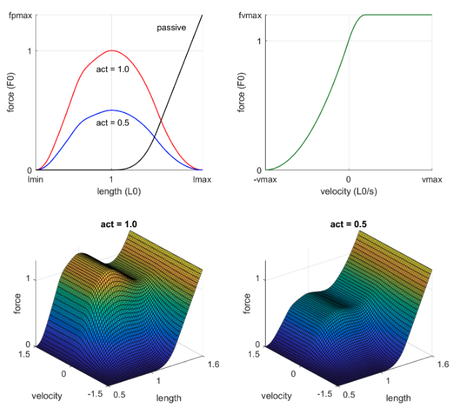  
関数の形式は次のとおりです。
$$ FLV(L,V,act) = FL(L) \times FV(V) \times act + FP(L) $$
マイナスのサインは、プラスの筋肉の活性化が引っ張り力を生成するためです。 定数F0は、速度0でのピーク有効力です。 これは、筋肉の厚さ（つまり、生理学的断面積またはPCSA）に関連しています。 わかっている場合は、要素の筋肉の属性forceで設定できます。 不明な場合は、デフォルトの-1に設定します。 その場合、より大きな筋肉はより多くの体重を動かす関節に作用する傾向があるという事実に依存しています。 属性スケールは、この関係を次のように定義します。
$$ F_0 = scale / actuator_{acc_0} $$
量アクチュエーター_acc0は、モデルコンパイラーによって事前に計算されます。 これは、アクチュエータのトランスミッションに作用する単位力によって引き起こされる関節加速度の標準です。 直感的に、スケールは筋肉の「平均」強度を決定しますが、実際の強度はモデル全体の幾何学的および慣性特性に依存します。
これまでのところ、個々の筋肉の特性を定義する3つの定数LT、L0、F0に遭遇しました。 さらに、関数FLV自体には、上図に示されているlmin、lmax、vmax、fpmax、fvmaxのパラメーターがいくつかあります。 これらはすべての筋肉で同じであると想定されていますが、異なる実験論文ではFLV関数の異なる形状が示唆されているため、その文献に精通しているユーザーは調整することをお勧めします。 上記の図を生成するために使用されたMATLAB関数FLV.mを提供し、FLV関数の計算方法を示します。 より正確なFLV機能を設計するというミッションに着手する前に、筋肉の動作範囲がFLV機能の形状よりも大きな影響を与え、多くの場合、このパラメーターが不明であるという事実を考慮してください。 以下は図解図です。
+ 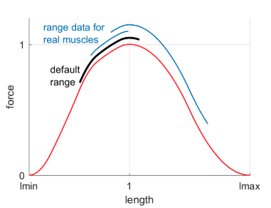    
この図の形式は、バイオメカニクスの文献では一般的であり、各筋肉の動作範囲が正規化されたFL曲線に重ねられています（垂直変位は無視します）。デフォルトの範囲は黒で表示されます。青い曲線は、2つの腕の筋肉の実験データです。小さな範囲、大きな範囲、FL曲線の上昇部分、下降部分、またはその両方にまたがる範囲の筋肉を見つけることができます。ここで、50個の筋肉を持つモデルがあるとします。筋肉がまたがるすべての関節を考慮して、誰かが慎重な実験を行い、モデル内のすべての筋肉の動作範囲を測定したと思いますか？そうでない場合は、筋骨格モデルは生物系と同じ一般的な挙動を持ち、一部の研究コミュニティにとって非常に興味深い詳細を含むさまざまな詳細が異なると考える方がよいでしょう。モデラーが一定で知られていると考えるほとんどの筋肉の特性については、いくつかの条件下で変化することを示す実験論文があります。これは、人々が正確なモデルを構築することを思いとどまらせるのではなく、人々が自分のモデルを強く信じることを思いとどまらせるためです。生物学のモデリングは、物理学や工学のモデリングとはまったく異なります。そのため、ロボット工学の人々が正確なロボットモデルの構築が難しいと不平を言うとき、皮肉を感じるのはこのためです。筋肉モデルに戻ると、筋肉の活性化作用があります。これは、入力が制御信号である1次非線形フィルターの状態です。フィルターダイナミクスは次のとおりです。
$$ \frac{d act}{dt} = (ctrl - act) / tau(ctrl, act) $$
内部では、アクチュエータに指定された制御範囲がない場合でも、制御信号は[0、1]にクランプされます。 属性timeconstで指定される2つの時定数があります。つまり、timeconst =（tau_act、tau_deact）がデフォルト（0.01、0.04）です。 有効時定数tauは、実行時に次のように計算されます。
$$ tau(ctrl, act) = tau_act \times (0.5 + 1.5 \times act), if:ctrl > act $$
$$ tau(ctrl, act) = tau_deact / (0.5 + 1.5 \ times act), if:ctrl <= act $$
次に、バイオメカニクスの文献に精通している特定のモデルに関する詳細な測定値の可用性に応じて、ユーザーが調整する可能性のある要素筋肉の属性を要約します。  
+ <font color="indianRed"> Defaults </font>
    + どこでも組み込みのデフォルトを使用します。 このセクションの冒頭に示すように、筋肉を腱に取り付けるだけです。 これにより、一般的かつ合理的なモデルが生成されます.
+ <font color="indianRed"> scale </font>
    + 個々の筋肉の強さはわからないが、すべての筋肉を強くしたり弱めたりしたい場合は、スケールを調整します。 これは各マッスルごとに個別に調整できますが、デフォルト要素で一度設定する方が合理的です。
+ <font color="indianRed"> force </font>
    + 個々の筋肉のピーク有効力F0がわかっている場合は、ここに入力します。 多くの実験論文にこのデータが含まれています。
+ <font color="indianRed"> range </font>
    + 縮尺の長さでの筋肉の動作範囲もいくつかの論文で利用可能です。 （筋肉が多くの関節に作用することを考えると）そのような測定がどれほど信頼できるかは明らかではありませんが、実際には存在します。 筋肉によって範囲が大幅に異なることに注意してください。
+ <font color="indianRed"> timeconst </font>
    + 筋肉は、遅筋と速筋の繊維で構成されています。 典型的な筋肉は混合されていますが、一部の筋肉はどちらかの繊維タイプの割合が高く、より速くまたは遅くなります。 これは、時定数を調整することでモデル化できます。 FLV関数のvmaxパラメーターもそれに応じて調整する必要があります。
+ <font color="indianRed"> lmin, lmax, vmax, fpmax, fvmax </font>
    + これらは、FLV関数の形状を制御するパラメーターです。 上級ユーザーはそれらを試すことができます。 MATLAB関数FLV.mを参照してください。 スケール設定と同様に、すべてのマッスルのFLVパラメーターを変更する場合は、デフォルト要素で変更します。
+ <font color="indianRed"> Custom, model </font>
    + ユーザーは、筋肉モデルのパラメーターを調整する代わりに、一般的なアクチュエーターのゲインタイプ、バイアスタイプ、およびダイナミックタイプを「ユーザー」に設定し、実行時にコールバックを提供することにより、異なるモデルを実装できます。 または、これらのタイプの一部を「筋肉」に設定したままにして、他のコンポーネントを置き換えながらモデルを使用します。 腱形状の計算は、ユーザーの筋肉モデルへの入力として、actuator_length、actuture_velocity、およびactuator_lengthrangeを提供する標準のMuJoCoパイプラインによって引き続き処理されることに注意してください。 その後、カスタムコールバックは、弾性腱または除外することを選択したその他の詳細をシミュレートできます。
## Relation to OpenSim
バイオメカニクスの研究者が使用する標準ソフトウェアはOpenSimです。可能な限りOpenSimモデルに類似するように筋肉モデルを設計し、同時に大幅に高速で安定したシミュレーションを実現する単純化を行いました。 MuJoCoユーザーがOpenSimモデルを変換できるように、ここで類似点と相違点をまとめます。アクティベーションダイナミクスモデルは、デフォルトの時定数を含め、OpenSimと同一です。 FLV関数は完全に同じではありませんが、MuJoCoとOpenSimはどちらも同じ実験データに近いため、非常に近いものです。 OpenSimモデルの説明と関連する実験データの要約については、Millard et al、 "Flexing computing muscle：Modeling and Simulation of musculotendon dynamics"、J Biomech Eng。 2013 2月; 135（2）OpenSimは腱の弾性をモデル化できますが、非弾性腱を想定しています。腱の弾性には高速平衡の仮定が必要であり、そのためにはさまざまな調整が必要であり、シミュレーションが不安定になる傾向があるため、ここではそれを行わないことにしました。実際には、腱は非常に硬く、その効果は、非弾性の場合に対応するFL曲線を引き伸ばすことでほぼ捉えることができます（Zajac 89）。これは、筋肉の動作範囲を短くすることにより、MuJoCoで実行できます。 Pennation angle（すなわち、筋肉と力の線の間の角度）はMuJoCoではモデル化されておらず、0と想定されています。この効果は、筋肉の力を縮小し、動作範囲を調整することで近似できます。 MuJoCoでは、腱のラッピングもより制限されています。球体と無限円柱をラッピングオブジェクトとして使用できます。2つのラッピングオブジェクトを腱経路の固定サイトで分離する必要があります。これは、腱経路の反復計算の必要性を回避するためです。 MuJoCo 2.0では、「サイドサイト」を球体または円柱の内側に配置することもできます。これにより、逆ラップが発生します。腱のパスは、オブジェクトを迂回するのではなく通過するように制限されます。これにより、OpenSimで使用されるトーラスラッピングオブジェクトを置き換えて、特定の領域内に腱のパスを保持できます。全体的に、腱のラッピングはOpenSimモデルをMuJoCoモデルに変換する上で最も困難な部分であり、手作業が必要です。明るい面では、少数の高品質のOpenSimモデルが使用されているため、変換が完了すると完了です。以下に、MuJoCo 2.0で利用できる4種類の腱のラッピングを示します。ラッピングテンドンの曲線部分は直線としてレンダリングされますが、ジオメトリパイプラインは実際の曲線と連携して、その長さとモーメントを分析的に計算します。
+ 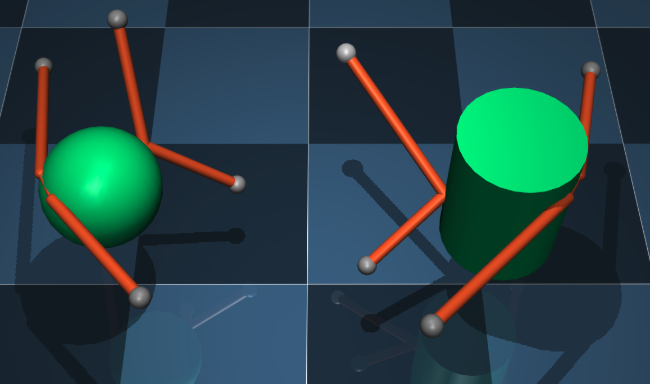  
## Sensors
MuJoCoは、以下のセンサー要素で説明するように、さまざまなセンサーをシミュレートできます。 ユーザーセンサータイプも定義でき、コールバックmjcb_sensorによって評価されます。 センサーはシミュレーションに影響しません。 代わりに、それらの出力は配列mjData.sensordataにコピーされ、ユーザー処理に使用できます。 ここでは、後の繰り返しを避けるために、すべてのセンサータイプに共通のXML属性について説明します。
+ <font color="indianRed"> name: steing, option </font>
    + センサーの名前
+ <font color="indianRed"> noise: real "0" </font>
    + フラグのsensornoise属性が有効な場合に、センサー出力に追加されるゼロ平均ガウスノイズの標準偏差。 センサーノイズはセンサーデータタイプを尊重します。クォータニオンと単位ベクトルは正規化されたままで、非負の量は非負のままです。
+ <font color="indianRed"> cutoff: real "0" </font>
    + この値が正の場合、センサー出力の絶対値が制限されます。 また、HAPTIXおよびsimulate.cppのセンサーデータプロットでセンサー出力を正規化するためにも使用されます。
+ <font color="indianRed"> user: real(nuser_senser),  "0 0 ... "</font>
    + See User parameters. 

## Composite objects
MuJoCo 2.0では、このようなオブジェクトのシミュレーションを高速化するソルバー最適化とともに、複合オブジェクトが導入されました。それらは新しいモデル要素ではありません。代わりに、パーティクルシステム、ロープ、布、およびソフトボディをシミュレートするために設計された既存の要素の（大）コレクションです。これらのコレクションは、モデルコンパイラによって自動的に生成されます。ユーザーは、XMLリファレンスの章で説明されているように、新しいXMLエレメントコンポジットとその属性およびサブエレメントを使用して、自動ジェネレータを高レベルで構成します。コンパイルされたモデルが保存されると、コンポジットは存在しなくなり、自動的に生成された通常のモデル要素のコレクションに置き換えられます。したがって、モデルコンパイラによって展開されるマクロと考えてください。複合オブジェクトは通常のMuJoCoボディで構成されており、このコンテキストでは「エレメントボディ」と呼びます。要素のボディは、コンポジットが表示されるボディの子として作成されます。したがって、複合オブジェクトは、通常の子ボディが定義されている可能性があるXMLの同じ場所に表示されます。自動的に生成された各要素の本体には、単一のgeomが接続されています。通常は球体ですが、カプセルまたは楕円体にすることもできます。したがって、複合オブジェクトは本質的にパーティクルシステムですが、パーティクルは、さまざまな柔軟なオブジェクトをシミュレートする方法で一緒に移動するように制限できます。要素本体の初期位置は、1D、2D、または3Dの規則的なグリッドを形成します。それらはすべて、親ボディ（ワールドまたは別の通常のボディである可能性があります;複合オブジェクトはネストできません）の子であり、親に対するモーションを許可するジョイントを持っているか、要素ボディ間のジョイントでキネマティックツリーを形成できます。また、腱の長さのソフトな等式制約で腱に接続し、必要な結合を作成できます。ジョイント等式制約もいくつかの場合に使用されます。これらの等式制約のsolrefおよびsolimp属性は、ユーザーが調整できるため、複合オブジェクトの柔らかさと柔軟性を調整できます。物理オブジェクトの設定に加えて、複合オブジェクトジェネレーターは適切なレンダリングを作成します。 2Dおよび3Dオブジェクトは、MuJoCo 2.0の新機能であるスキンとしてレンダリングできます。スキンは自動的に生成され、バイキュービック補間を使用してテクスチャ化および再分割することができます。実際の物理学、特に衝突検出は、要素本体とそのジオメトリに基づいていますが、スキンは純粋に視覚化オブジェクトです。しかし、ほとんどの場合、肌の表現を見ることを好みます。これを容易にするために、ジェネレーターはすべてのジオム、サイト、および腱をグループ3に配置します。グループ3の視覚化はデフォルトで無効になっています。したがって、たとえば2Dグリッドをロードすると、腱で接続された球体のコレクションではなく、連続した柔軟なサーフェスが表示されます。ただし、モデルを微調整し、その背後にある物理を理解しようとする場合、球と腱をレンダリングできると便利です。レンダリングスタイルを切り替えるには、スキンのレンダリングを無効にし、ジオムと腱のグループ3を有効にします（MuJoCo 2.0から、ジオムに加えてサイト、腱、およびジョイントにグループプロパティが追加されました）。可能な限り直感的な高レベルのコントロールを持つように複合オブジェクトジェネレーターを設計しましたが、同時に相互作用し、結果の物理に大きな影響を与える多数のオプションを公開しています。そのため、ある時点でユーザーはリファレンスドキュメントを注意深く読む必要があります。クイックスタートとして、MuJoCo 2.0には各複合オブジェクトタイプの例が付属しています。以下では、これらの例を調べて、あまり明らかでない側面について説明します。すべての例で、モデルに含まれる静的なシーンがあり、その後に単一の複合オブジェクトが続きます。静的なシーンには、マウスで動かしてシステムの動作を調べることができるモーションキャプチャボディ（大きなカプセル）があります。以下のXMLスニペットは、複合オブジェクトの単なる定義です。完全な例については、ディストリビューションのXMLモデルファイルを参照してください。
## Particle
+ 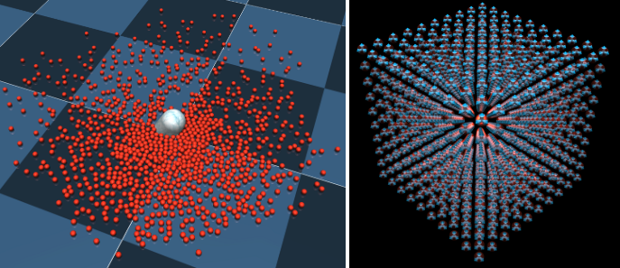  
```xml
<worldbody>
    <composite type="particle" count="10 10 10" spacing="0.07" offset="0 0 1">
        <geom size=".02" rgba=".8 .2 .1 1"/>
    </composite>
</worldbody>
```
上記のXMLは、10-10-10グリッド上の初期位置で1000個のパーティクルを含むシステムを作成し、パーティクルのサイズ、色、間隔、オフセットを設定するのに必要なすべてです。結果の要素ボディは、ワールドボディの子になります。コンタクトの柔らかさやジョイント属性など、他の多くのプロパティを調整できます。右側のプロットは、ジョイントを示しています。各要素本体には3つの直交するスライダージョイントがあり、平行移動することはできますが、回転はできません。考えは、粒子には位置はあるが方向はないはずだということです。 MuJoCoボディには常に方向がありますが、スライダージョイントのみを使用することで、方向を変更することはできません。 geomのデフォルトは自動的に調整されるため、互いにおよびモデルの残りの部分と摩擦なしで接触します。そのため、このシステムには1000個のボディ（それぞれがジオムを含む）、3000の自由度、約1000のアクティブなコンタクトがあります。ダイナミクスの評価には、最新のプロセッサのシングルコアで約1ミリ秒かかります。他のほとんどのMuJoCoモデルと同様に、ソフト制約により、はるかに大きなタイムステップでのシミュレーションが可能になります（このモデルは30ミリ秒のタイムステップで安定しており、さらに高速です）。
## 1D grid
+ 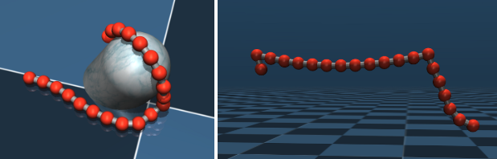  
```xml
<composite type="grid" count="20 1 1" spacing="0.045" offset="0 0 1">
    <joint kind="main" damping="0.001"/>
    <tendon kind="main" width="0.01"/>
    <geom size=".02" rgba=".8 .2 .1 1"/>
    <pin coord="1"/>
    <pin coord="13"/>
</composite>
```
グリッドタイプは、count属性に応じて1Dまたは2Dグリッドを作成できます。 ここでは、1Dグリッドを示します。 これらは、長さがソフト等式制約のある腱に接続された一連の球体です。 柔らかさを調整できます。 パーティクルと同様に、ここの要素ボディにはスライダージョイントがありますが、回転ジョイントはありません。 右側のプロットは固定を示しています。 pinサブ要素は、固定されたボディのグリッド座標を指定するために使用され、モデルコンパイラはこれらのボディのジョイントを生成せず、親ボディ（この場合はワールド）に固定します。 これにより、右側のプロットの文字列がスペースにハングアップします。 たとえば、同じメカニズムを使用してホイップをモデル化できます。 その場合、親ボディは移動し、最初の要素ボディは親に固定されます。
## 2D grid
+ 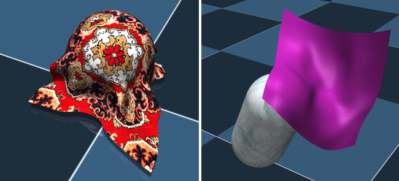  
```
<composite type="grid" count="9 9 1" spacing="0.05" offset="0 0 1">
    <skin material="matcarpet" inflate="0.001" subgrid="3" texcoord="true"/>
    <geom size=".02"/>
    <pin coord="0 0"/>
    <pin coord="8 0"/>
</composite>
```
2Dグリッドを使用して、布をシミュレートできます。 実際にシミュレートするのは、等値制約のある腱に接続された球体の2Dグリッドです（図示せず）。 モデルコンパイラは、上記のXMLのskinサブ要素で有効化されたスキンも生成できます。 1Dグリッドと同様ですが、2つのグリッド座標を使用して、要素本体の一部を固定することもできます。 右側のプロットは、2つのコーナーでワールドボディに固定され、カプセルプローブを覆う布を示しています。 右側のスキンはバイキュービック補間を使用して細分化されており、テクスチャがない場合に視覚的な品質が向上します。 テクスチャが存在する場合（左）、サブディビジョンの利点はあまり目立ちません。
## Rope and Loop
+ 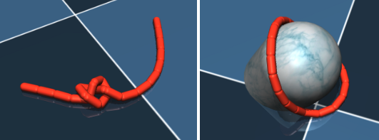  
```
<body name="B10" pos="0 0 1">
    <freejoint/>
    <composite type="rope" count="21 1 1" spacing="0.04" offset="0 0 2">
        <joint kind="main" damping="0.005"/>
        <geom type="capsule" size=".01 .015" rgba=".8 .2 .1 1"/>
    </composite>
</body>
```
残りの複合オブジェクトタイプは、要素ボディのキネマティックツリーを作成し、親ボディがツリーのルートになります。これが、パーティクルオブジェクトやグリッドオブジェクトのようにワールドボディの内部ではなく、動くボディの内部にコンポジットが表示される理由です。ワールドボディ内に表示された場合、複合オブジェクトのルートは移動しません。グリッドやパーティクルとは異なり、ここでの要素本体の向きは変更できます。キネマティックツリーは、（ほとんど）ヒンジジョイントを使用して構築されます。ここに示すロープおよびループオブジェクトの場合、ツリーはチェーンです。親ボディの名前に注意してください。この名前は、要素本体の自動生成された名前のいずれかに対応する必要があります。このメカニズムは、複合オブジェクトを親にアタッチする場所を指定するために使用されます。 1Dグリッドと比較して、ロープとループはジッターが少なく、球体に加えてカプセルと楕円体のジオメトリを使用できます（したがって、衝突検出のためにギャップを埋めます）。ただし、これには代償が伴います。長い運動連鎖があるため、結果の微分方程式は硬くなり、大きなタイムステップで積分できなくなります。提供する例は、モデルが安定している快適なタイムステップを示しています。左のプロットに示すように、マウスの摂動を使用してロープを結び目に簡単に結び付けることができます。多数の小さな要素を使用すると、ノットやその他の操作がさらに簡単になります。ループはロープに似ていますが、最初と最後の要素本体は等式制約で接続されています。
## Cloth
+ 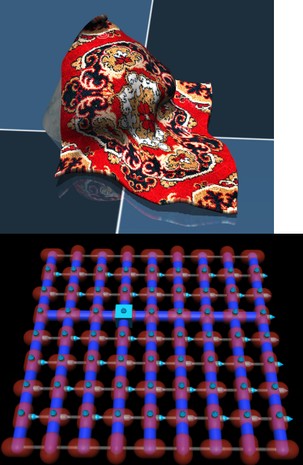  
```
<body name="B3_5" pos="0 0 1">
    <freejoint/>
    <composite type="cloth" count="9 9 1" spacing="0.05" flatinertia="0.01">
        <joint kind="main" damping="0.001"/>
        <skin material="matcarpet" texcoord="true" inflate="0.005" subgrid="2"/>
        <geom type="capsule" size="0.015 0.01" rgba=".8 .2 .1 1"/>
    </composite>
</body>   
```
布のタイプは2Dグリッドの代替であり、性質が多少異なります。ロープと1Dグリッドのように、布は2Dグリッドよりもジッターが少なく、衝突穴をよりよく埋めることができます。これは、カプセルまたは楕円体を使用して、右側に示すパターンで配置することによって行われます。ジオムカプセルは赤、キネマティックツリーは太い青、平等に拘束された腱は布地を薄いグレーで、ジョイントはシアンで表示されます。親ボディに対応する要素ボディには、立方体としてレンダリングされるフローティングジョイントがあり、ツリーの残りの部分は、ユニバーサルジョイントを形成するヒンジジョイントのペアを使用して構築されます。親ボディの名前に注意してください。ロープと同様に、複合オブジェクトで自動的に生成された要素ボディ名の1つと一致する必要があります。明示的な固定はできません。ただし、親が静的なボディである場合、布は基本的にピン留めされますが、1つのポイントのみです。ロープと同様に、クロスオブジェクトには、比較的小さなタイムステップと安定した統合のための減衰が必要な長い運動連鎖が含まれます。パラメーターは、ソフトウェア配布のXMLモデルファイルにあります。
## Box
+ 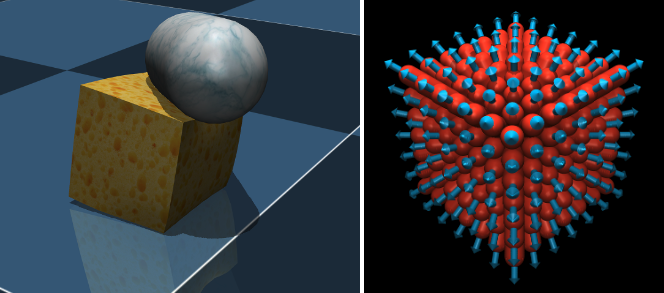
```
<body pos="0 0 1">
    <freejoint/>
    <composite type="box" count="7 7 7" spacing="0.04">
        <skin texcoord="true" material="matsponge" rgba=".7 .7 .7 1"/>
        <geom type="capsule" size=".015 0.05" rgba=".8 .2 .1 1"/>
    </composite>
</body>
```
ボックスタイプ、および以下の円柱および楕円体タイプは、ソフト3Dオブジェクトのモデリングに使用されます。要素本体は外側シェルに沿ってグリッドを形成するため、要素本体の数は長さの2乗に比例します。これは、3Dグリッドのシミュレーションよりもはるかに効率的です。コンポジットが表示される親ボディは、ソフトオブジェクトの中心にあります。すべての要素の本体は、親の子です。各要素の本体には、親から離れる方向を指す単一のスライドジョイントがあります。これらのジョイントにより、ソフトオブジェクトの表面を任意のポイントで圧縮および拡張できます。ジョイントは、形状を維持するために、初期位置に均等に拘束されます。さらに、各ジョイントは、隣接するジョイントと同等に拘束されているため、ソフトオブジェクトが変形すると、変形はスムーズになります。最後に、すべてのジョイントの合計が一定のままであることを指定する腱の等式制約があります。これにより、ソフトオブジェクトのボリュームをほぼ維持しようとします。オブジェクトがすべての側面から絞り出されると、圧縮されて体積が減少しますが、そうでない場合、他の部分の絞り込みを補うために一部の要素のボディが突き出ます。左側のプロットはこの効果を示しています。カプセルプローブを使用して1つの角を圧縮し、立方体の反対側を少し拡大しますが、変形は滑らかに保たれます。 count属性は各次元の要素本体の数を決定するため、カウントが異なる場合、結果のオブジェクトは立方体ではなく長方形のボックスになります。要素本体にアタッチされたジオメトリは、球体、カプセル、または楕円体です。球体は衝突検出では高速ですが、他のボディが柔らかいオブジェクトの「肌の下に潜る」ことができる薄いシェルになります。カプセルまたは楕円体を使用すると、長軸が外側を指すように自動的に方向付けられるため、より浸透しにくい厚いシェルが作成されます。
## Cylinder and ellipsoid

+ 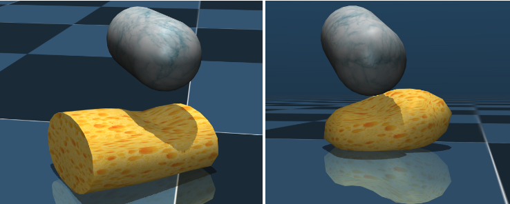
```
<body pos="0 0 1">
    <freejoint/>
    <composite type="ellipsoid" count="5 7 9" spacing="0.05">
        <skin texcoord="true" material="matsponge" rgba=".7 .7 .7 1"/>
        <geom type="capsule" size=".015 0.05" rgba=".8 .2 .1 1"/>
    </composite>
</body>
```
円柱と楕円体は、ボックスと同じように作成されます。唯一の違いは、要素本体の参照位置（親に対する）が円柱または楕円体に投影されることであり、サイズはcount属性によって暗示されます。自動スキンジェネレーターは滑らかな表面を認識し、それに応じてスキンの法線を調整します。プロットでは、カプセルプローブを使用して各ボディを押し、シミュレーションを一時停止してプローブを移動しました（プローブは物理学とは無関係に移動できるモーションキャプチャボディであるため可能です）。このようにして、プローブによって作られたくぼみと、結果として生じる体の残りの部分の変形を見ることができます。ソフトオブジェクトを一緒に保持する等式制約のsolref属性とsolimp属性を変更することにより、システムの動作を調整して、システムをより柔らかく、硬く、減衰または弾力性などにすることができます。運動連鎖、および粒子やグリッドに似た大きなタイムステップでシミュレートでき、ロープや布とは異なります。
## Inculuding files
MJCFファイルには、include要素を使用して他のXMLファイルを含めることができます。機械的には、パーサーは、マスターファイルのinclude要素に対応するDOMノードを、インクルードファイルの最上位要素の子であるXML要素のリストに置き換えます。最上位要素自体は破棄されます。これは、XML目的のグループ化要素であり、含まれているとMJCF形式に違反するためです。この機能により、モジュラーMJCFモデルが有効になります。モデルライブラリ内のモデルのMPLファミリを参照してください。モジュール性の1つの例は、ロボットのモデル（複雑になる傾向がある）を構築し、それを複数の「シーン」に含めることです。つまり、ロボットの環境内のオブジェクトを定義するMJCFモデルです。別の例は、一般的に使用されるアセット（たとえば、rgba値を慎重に調整した素材）を含むファイルを作成し、それらのアセットを参照する複数のモデルに含めることです。含まれるファイルは、有効なMJCFファイルである必要はありませんが、通常は有効です。実際、このメカニズムは、MJCFモデルを他のMJCFモデルに含めることができるように設計されています。これを可能にするために、単一のモデルのコンテキストで意味的に意味をなさない場合でも、繰り返されるMJCFセクションが許可されます。たとえば、パーマによって自動的にマージされる複数のルート（つまり、複数のワールドボディ要素）をキネマティックツリーに許可します。そうでなければ、ロボットをシーンに含めることは不可能です。繰り返されるMCJFセクションの柔軟性には代償が伴います。たとえば、コンパイラーの角度属性など、モデル全体に​​適用されるグローバル設定は複数回定義できます。 MuJoCoはこれを許可し、すべてのinclude要素が処理された後、複合モデルで最後に検出された定義を使用します。したがって、モデルAが度で定義され、モデルBがラジアンで定義され、AがBのコンパイラ要素の後にBに含まれる場合、複合モデル全体が度で定義されているかのように扱われ、この場合、望ましくない結果をもたらします。ユーザーは、この意味で相互に含まれるモデルに互換性があることを確認する必要があります。ローカル座標とグローバル座標は、別の互換性要件です。最後に、次に説明するように、要素名は同じタイプのすべての要素間で一意でなければなりません。たとえば、2つのモデルで同じgeom名が使用され、1つのモデルが他のモデルに含まれている場合、コンパイルエラーが発生します。同じXMLファイルを複数回インクルードすると、解析エラーになります。この制限の理由は、要素名の繰り返しや、包含による無限の再帰を避けたいからです。
## Naming elements
MJCFのほとんどのモデル要素には名前を付けることができます。 それらは、対応するXML要素の属性名で定義されます。 特定のモデル要素に名前を付ける場合、その名前は同じタイプのすべての要素間で一意でなければなりません。 名前は大文字と小文字が区別されます。 これらはコンパイル時に対応する要素を参照するために使用され、実行時のユーザーの便宜のためにmjModelに保存されます。 通常、名前はオプションの属性です。 定義する特別な理由がない限り、（モデルファイルを短くするために）未定義のままにすることをお勧めします。 そのような理由はいくつかあります。
+  一部のモデル要素は、作成の一部として他の要素を参照する必要があります。 たとえば、空間腱は、通過する経由点を指定するためにサイトを参照する必要があります。 参照は名前でのみ実行できます。 アセットは参照されるという唯一の目的で存在するため、名前を付ける必要がありますが、対応するファイル名から省略して暗黙的に設定することができます。
+ ビジュアライザーは、特定のタイプのすべてのモデル要素にラベルを付けるオプションを提供します。 名前が利用可能になると、3Dビューのオブジェクトの隣に名前が印刷されます。 それ以外の場合、「body 7」という形式の汎用ラベルが印刷されます。
+ 関数mj_name2idは、指定されたタイプと名前を持つモデル要素のインデックスを返します。 逆に、関数mj_id2nameは、インデックスが指定された名前を返します。 これは、XMLの名前で識別されるモデル要素を含むカスタム計算に役立ちます（モデルの編集時に変更される可能性のある固定インデックスに依存するのではなく）。
+ 原則として、特定の要素に名前を付けると、モデルファイルが読みやすくなります。 ただし、XML自体にはコメントメカニズムがあり、特にほとんどのテキストエディターはXMLコメントを検出する構文の強調表示を提供するため、このメカニズムは読みやすさを実現するのにより適しています。
## URDF extensions
統合ロボット記述形式（URDF）は、多くの既存のロボットがモデル化された一般的なXMLファイル形式です。これが、MuJoCoで利用可能なモデル要素のサブセットのみを表すことができるにもかかわらず、URDFのサポートを実装した理由です。標準のURDFファイルに加えて、MuJoCoは最上位要素ロボットの子としてカスタム（URDFの観点から）mujoco要素を持つファイルをロードできます。このカスタム要素には、MDFと同じ機能を持つサブ要素コンパイラ、オプション、サイズを含めることができますが、URDFモデリング規則に対応するためにデフォルトのコンパイラ設定が変更されます。特にコンパイラー拡張機能は非常に有用であることが証明されており、MuJoCoの組み込みコンパイラーが変更されない場合に拒否する非物理的なダイナミクスパラメーターが多数の既存のURDFモデルにあるため、実際にその属性のいくつかが導入されました。この拡張は、メッシュディレクトリを指定するためにも必要です。 MJCFモデルはパーサーによってカスタムXMLスキーマに対してチェックされますが、URDFモデルはチェックされないことに注意してください。 URDFファイルに埋め込まれたMuJoCo固有の要素もチェックされません。その結果、誤って入力された属性名は黙って無視され、タイプミスに気付かれないと大きな混乱を招く可能性があります。 URDFモデルの拡張セクションの例を次に示します。
```
<robot name="darwin">
    <mujoco>
        <compiler meshdir="../mesh/darwin/" balanceinertia="true"/>
    </mujoco>
    <link name="MP_BODY">
        ...
</robot>
```
上記の拡張機能により、URDFはより使いやすくなりましたが、依然として制限されています。 ユーザーがMuJoCoを最大限に活用してモデルを構築し、同時にURDFの互換性を維持したい場合は、次の手順をお勧めします。 必要に応じてURDFに拡張機能を導入し、ロードしてMJCFとして保存します。 次に、可能な限りinclude要素を使用してMJCFに情報を追加します。 このようにして、URDFが変更された場合、対応するMJCFを簡単に再作成できます。 ただし、経験上、URDFファイルは静的である傾向がありますが、MJCFファイルは頻繁に編集されます。 したがって、実際には、URDFをMJCFに変換するだけで通常は十分であり、その後はMJCFでのみ機能します。
# Tip and tricks
ここでは、いくつかの一般的なモデリングタスクを実行する方法に関するガイダンスを提供します。 このセクションのすべてが残りのドキュメントから推測できるという意味で、ここには新しい資料はありません。 それにもかかわらず、推論プロセスは常に明らかではないので、それを綴ることが有用であるかもしれません。
## backlash
バックラッシュは多くのロボット関節に存在します。 通常、ギアボックス内のギア間の小さな隙間が原因ですが、ジョイントメカニズムの多少のズレが原因の場合もあります。 その効果は、ジョイントが回転する前にモーターが小さな角度で回転できること、またはその逆（ジョイントに外力が加えられた場合）です。 バックラッシは、次のようにMuJoCoでモデル化できます。 ボディ内に単一のヒンジジョイントを持たせる代わりに、同じ位置と方向を持つ2つのヒンジジョイントを定義します。
```
<body>
    <joint name="J1" type="hinge" pos="0 0 0" axis="0 0 1" armature="0.01"/>
    <joint name="J2" type="hinge" pos="0 0 0" axis="0 0 1" limited="true" range="-1 1"/>
</body>
```

したがって、親に対する本体の全体的な回転はJ1 + J2です。ここで、J1のみで動作するアクチュエータを定義します。 J2の小さなジョイント範囲は0に近い値を維持しますが、J2に作用する力の方向に少し移動できるため、バックラッシュ効果が発生します。 J1のアーマチュア属性に注意してください。これがないと、2つのジョイントが慣性に遭遇することなく反対方向に加速する可能性があるため、ジョイント空間慣性マトリックスは特異になります。バックラッシの原因となる物理的なギアには実際に回転慣性（アーマチュアと呼ばれます）があるため、これは現実的なモデリング手法です。この例の数値は、目的の動作を得るために調整する必要があります。ジョイント制限制約のsolrefパラメーターとsolimpパラメーターも調整して、バックラッシュの回転をよりソフトまたはハードな制限で終了させることができます。 J2でジョイント制限を指定する代わりに、J2 = 0を維持するソフト等式制約を指定できます。制約インピーダンス関数は、J2 = 0付近で制約が弱くなり、0から遠ざかるように調整する必要があります。ソルバーパラメーターに示されているインピーダンス関数の新しいパラメーター化により、これが可能になります。共同制限と比較して、等式制約アプローチは、バックラッシュ体制と制限体制の間のより柔軟な移行を生成します。また、常にアクティブになります。これは、入力として制約違反または制約強制を必要とするユーザーコードで便利です。
## Damping
減衰は、速度に比例し、速度と反対の力を生成します。物理システムでは、ダンピングは常に安定性を高めます。しかしこれは、ユニバースに、時間の離散化によるエラーを蓄積しない理想的な連続時間積分器が装備されているためです。時間を離散化するコンピューターシミュレーションでは、大きな減衰により積分誤差のためにシステムが不安定になる可能性があります。これについては、計算の章ですでに説明しました。統合エラーを減らすための標準的なアプローチは、タイムステップを減らすか、Runge-Kuttaインテグレーターを使用することです。どちらも効果的ですが、シミュレーションは遅くなります。別のアプローチは、すべての減衰をジョイントに配置し、オイラー積分器を使用することです。その場合、減衰力は暗黙的に統合されます。これは、ユーザーに対して透過的な方法で、速度更新の一部として慣性行列が内部的に調整および再ファクタリングされることを意味します。暗黙的な統合は、明示的な統合よりもはるかに安定しており、大幅に大きな時間ステップを許可します。 Runge-Kutta積分器は明示的であり、減衰力を処理する方法を除いてオイラーも明示的であることに注意してください。理想的には完全に暗黙的な積分器がありますが、現在そのような積分器を持っている公的に利用可能な物理エンジンはありません。これは、MuJoCoの今後のリリースのToDoリストに含まれています。この状況を考えると、関節の減衰は、腱またはアクチュエータの減衰よりも優れています。後者は暗黙的に統合されていないためです。次に、速度サーボを生成する力を考えます。
$$ force = gain \times (desired_{velocity} - current_{velocity}) $$
これは速度アクチュエータとしてモデル化できますが、このようなアクチュエータはシステムに減衰を追加し、ゲインが高い場合に不安定性を引き起こす可能性があります。 代わりに、上記の力を2つの用語に分割できます。 最初の項では、desired_velocityを制御信号として扱うことにより、力=ゲイン* desired_velocityを生成するモーターを定義します。 2番目の項では、上記のサーボゲインに等しい減衰係数で、ジョイントに減衰を追加します。 現在、全体的な力は同じですが、力の減衰成分は暗黙的に統合されています。

## Resitution
MuJoCo 2.0では、ソルバーパラメーターで説明されているように、solrefを指定するための新しいメカニズムが導入されました。 両方の数値が正でない場合、それらは（-stiffness、-damping）として解釈され、制約インピーダンスによってスケーリングされます。 接触やその他の制約を完全に復元するには、剛性をある程度大きな値に設定し、減衰をゼロに設定します。 以下は、接触の前後のエネルギーがほぼ保存されるように、反発係数が1の平面上で跳ねる球体の例です。 接触自体が柔らかく、いくつかの時間ステップを要し、それらの時間ステップ中の（暗黙の）変形は正確にエネルギーを保存しないため、正確に保存されません。 しかし、全体的な効果は、目に見える方法でピークの高さを変えずにボールが非常に長い時間バウンドし、エネルギーがドリフトするのではなく初期値の周りで変動することです。

````xml
<worldbody>
    <geom type="plane" size="1 1 .1"/>

    <body pos="0 0 1">
        <freejoint/>
        <geom type="sphere" size="0.1" solref="-1000 0"/>
    </body>
</worldbody>
````
## Model sizes
MuJoCoは、実行時にmjDataに必要なすべてのメモリを事前に割り当て、モデル作成後にC / C ++メモリマネージャにアクセスしません。したがって、十分なメモリを割り当てることが不可欠です。割り当ては、サイズ要素で指定された3つのサイズパラメータ、つまりスタックサイズnstack、最大コンタクト数nconmax、および最大数のスカラー制約njmaxによって制御されます。デフォルトのサイズ設定では、ヒューリスティックを使用して十分なメモリを割り当てますが、特定のモデルに必要な実際のメモリは、シミュレーション中にのみ決定できます。 nstackが不十分な場合、シミュレータはmju_errorを呼び出して放棄します。 nconmaxまたはnjmaxが不十分な場合、残りの接触または他の制約は破棄され、シミュレーションは続行されますが、結果は期待どおりではありません。一方、割り当てが大きすぎる場合、mj_resetを使用してmjDataをクリアするのに時間がかかり、多数の大規模モデルを並行してシミュレートするマルチスレッドアプリケーションでは、マシンのメモリが不足したり、キャッシュのパフォーマンスが低下したりする可能性があります。そして、何も悪いことが起こらなかったとしても、必要以上に多くのメモリを割り当てるのはスタイルが悪いだけです。では、どのくらいのメモリを割り当てるかをどのようにして知るのでしょうか？ mjDataには、maxuse_stack、maxuse_con、maxuse_efcの各フィールドがあり、最後のリセット以降の各カテゴリの最大メモリ使用率を追跡します。 MuJoCo 2.0リリースのサンプルコードsimulate.cppは、このデータを最大割り当ての一部として表示します（左下隅の情報ウィンドウ）。したがって、デフォルトから始めてしばらくシミュレートし、小数部が小さすぎる場合はXMLに戻って割り当てサイズを明示的に設定できます。ただし、アクティブな制約の数や使用する制約ソルバーによっては、シミュレーション中にメモリ使用率が劇的に変化する可能性があることに注意してください。たとえば、スタックサイズがCGソルバーに十分な場合、NewtonおよびPGSソルバーはスタックを使い果たします。モデルを設計するとき、通常、モデルの調査中に遭遇する最悪のシナリオで50％の使用率を目指します。 CGソルバーのみを使用する場合は、スタックの割り当てを大幅に削減してください。
## Motion capture
モーションキャプチャボディは世界の静的な子であり（つまり、ジョイントがない）、モーションキャプチャ属性は「true」に設定されます。これらを使用して、モーションキャプチャデバイスからMuJoCoシミュレーションにデータストリームを入力できます。 VRコントローラー、またはモーションキャプチャマーカー（Viconなど）を装備したオブジェクトを保持していて、シミュレートされたオブジェクトを同じように移動させたいが、他のシミュレートされたオブジェクトとやり取りしたいとします。ここにはジレンマがあります。仮想オブジェクトは物理的な手を押すことができないため、あなたの手（およびそれによって制御しているオブジェクト）はシミュレートされた物理に違反する可能性があります。しかし同時に、結果のシミュレーションが合理的であることを望みます。これをどうやってやるの？最初のステップは、MJCFモデルでmocap本体を定義し、実行時にデータストリームを読み取り、mjModel.mocap_posとmjModel.mocap_quatをモーションキャプチャシステムから受け取った位置と方向に設定するコードを実装することです。 VRコードサンプルは、HTC Viveの場合にこのようなコードを記述する方法を示していますが、HATPIXは利用可能な場合にOptitrackシステムからデータを自動的にストリーミングします。 Simulate.cppコードサンプルでは、​​マウスをモーションキャプチャデバイスとして使用して、ユーザーがモーションキャプチャボディを移動できるようにします。モーションキャプチャボディについて理解する重要なことは、シミュレータがそれらを修正されたものとして扱うことです。位置と方向を直接更新することにより、シミュレーション時間ステップから次のステップに移動させていますが、物理モデルに関する限り、位置と方向は一定です。したがって、MuJoCo 2.0ディストリビューションで提供される複合オブジェクトの例のように、通常の動的ボディと接触するとどうなります（これらの例では、マウスで移動するモーションキャプチャボディであるカプセルプローブがあることを思い出してください）。 2つの通常の物体間の接触では、相対速度だけでなく貫通も発生しますが、シミュレーターは運動物体自体が動いていることを知らないため、運動物体との接触では相対速度成分が失われます。そのため、結果として生じる接触力は小さくなり、接触が動的オブジェクトを押し出すのに時間がかかります。また、より複雑なシミュレーションでは、物理学と矛盾する何かをしているという事実が不安定を引き起こす可能性があります。ただし、HAPTIXとVRコードサンプルの両方で使用される、より適切な動作があります。モーションキャプチャボディに加えて、2番目のレギュラーボディを含め、溶接等値拘束でモーションキャプチャボディに接続します。以下のプロットでは、ピンク色のボックスがモーションキャプチャ本体であり、手の付け根に接続されています。他の制約がない場合、制約は暗黙的に処理され、シミュレーションを不安定にせずに大きな力を生成できるため、手はモーションキャプチャボディをほぼ完全に追跡します（スプリングダンパーよりもはるかに優れています）。しかし、手がテーブルとの接触を強いられる場合（右のプロット）、接触の制約を同時に尊重し、モーションキャプチャボディを追跡することはできません。これは、モーションキャプチャボディがテーブルを自由に通過できるためです。それで、どの制約が勝ちますか？それは、接触拘束を考慮した溶接拘束の柔らかさに依存します。希望するトレードオフを達成するために、対応するsolrefおよびsolimpパラメーターを調整する必要があります。例については、HAPTIXディストリビューションおよびMuJoCoフォーラムで入手可能なModular Prosthetic Limb（MPL）ハンドモデルを参照してください。以下のプロットはそのモデルで生成されます。
+ 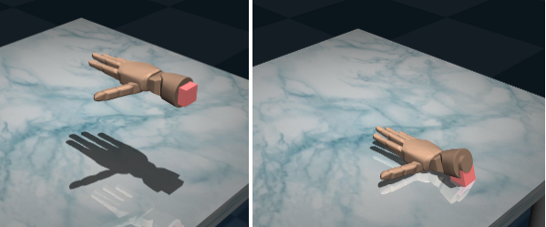
