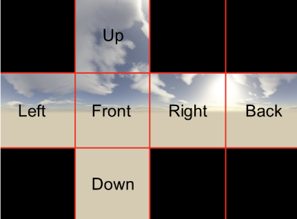
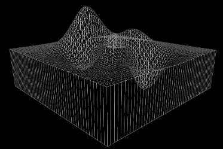
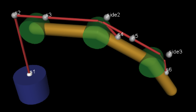

# introduction
この章は、MuJoCoで使用されるMJCFモデリング言語のリファレンスマニュアルです。
## XML schema
以下の表は、MJCFのXML要素とその属性をまとめたものです。 モデルファイルを検証するためにパーサーが使用するカスタムスキーマを出力する関数mj_printSchemaで自動的に生成されます。 同じ表は、HAPTIXの[ヘルプ]ダイアログで表示できます。 MJCFのすべての情報は、要素と属性を介して入力されることに注意してください。 要素内のテキストコンテンツは使用されません。 存在する場合、パーサーはそれを無視します。 表の2列目の記号には次の意味があります。
+ ！ 必須要素、1回のみ表示可能
+ ？ オプション要素、1回のみ表示可能
+ \* オプションの要素、何回も現れることができます
+ R オプション要素、再帰的に何度も出現可能

## Attribute types
各属性には、パーサーによって強制されるデータ型があります。 使用可能なデータ型は次のとおりです。
+ __string__   :通常、モデル要素のファイル名またはユーザー定義名を指定する任意の文字列
+ __int(N)__   :N個の整数の配列。 Nを省略すると、1になります。
+ __real(N)__  :N個の実数値の配列。 Nを省略すると、1になります。
+ __[...]__    :キーワード属性。 有効なキーワードのリストは括弧内に示されています。
配列タイプの属性の場合、配列の長さは、以下のリファレンスドキュメントで特に指定されていない限り、パーサーによって強制されます。

データ型を持つことに加えて、属性は必須またはオプションです。 オプションの属性には、内部デフォルトがある場合とない場合があります。 内部デフォルトを持たないオプション属性は、特別な未定義状態で初期化されます。 この状態は、XMLに入力できる有効な設定とは異なります。 このメカニズムにより、コンパイラは、ユーザーが明示的にまたはデフォルトで属性に「触れた」かどうかを判断し、適切なアクションを実行できます。 一部の属性には、コンパイラーによって実際に許可されていない内部デフォルト（通常は0）があります。 そのような属性が特定のコンテキストで関連するようになった場合、許可された値に設定する必要があります。
+ __requid__ この属性はパーサーに必要です。 存在しない場合、パーサーはエラーを生成します。
+ __optional 属性はオプションです。 内部デフォルトはありません。 属性は未定義状態で初期化されます。
+ "..."___ 属性はオプションです。 内部デフォルトは引用符で囲まれています。

以下のリファレンスドキュメントでは、属性名は太字で示され、その後にそのデータ型が続き、その後に必要に応じて内部デフォルトを含む必須/オプションのステータスが続きます。 たとえば、属性angleは、値が「ラジアン」または「度」であるキーワード属性です。 これはオプションの属性であり、内部にデフォルトの「度」があります。 したがって、参照ドキュメントに次のように表示されます。

<font color="IndianRed"> angle : [radian, degree], "degree" </font>

## MJCF Reference
MJCFファイルには、一意の最上位要素mujocoがあります。 次のレベルの要素はセクションと呼ばれます。 それらはすべてオプションです。 一部のセクションは単にグループ化に使用され、属性はありません。 include要素を介してモデルのマージを容易にするために、セクションを繰り返すことができます。

+ 要素内の属性の順序は任意です。 4つの例外を除き、親要素内の子要素の順序も任意です。ジョイント変換は順番に実行されるため、ボディ内のジョイント要素の順序は重要です。Fモデルファイルとして識別する一意の最上位要素。
+ 同じ属性が異なる値に複数回設定されている場合、繰り返されるセクションの順序は重要です。 その場合、最後の設定はモデル全体に有効になります。
+ 同じデフォルトクラス内の複数のアクチュエータショートカットの順序は重要です。各ショートカットは、そのデフォルトクラス内の単一の一般要素の属性を設定し、以前の設定を上書きするためです。

この章の残りの部分では、すべての有効なMJCF要素とその属性について説明します。 一部の要素は複数のコンテキストで使用できます。その場合、その意味は親要素に依存します。 これが、以下のドキュメントで常に親をプレフィックスとして表示する理由です。  

+ <font color="Blue"> include(*)  </font>  
	+ この要素は厳密にはMJCFに属していません。 代わりに、メタ要素であり、解析前に単一のドキュメントオブジェクトモデル（DOM）で複数のXMLファイルを組み立てるために使用されます。 含まれるファイルは、一意の最上位要素を持つ有効なXMLファイルである必要があります。 この最上位要素はパーサーによって削除され、その下の要素がinclude要素の場所に挿入されます。 この手順の結果として、少なくとも1つの要素を挿入する必要があります。 include要素は、MJFCファイルでXML要素が予想される場所で使用できます。 ネストされたインクルードは許可されますが、特定のXMLファイルはモデル全体に1回しかインクルードできません。 含まれるすべてのXMLファイルが単一のDOMにアセンブルされた後、有効なMJCFモデルに対応する必要があります。 それ以外は、インクルードの使用方法と、必要に応じて大きなファイルをモジュール化する方法を決定するのはユーザー次第です。
	+ <font color="IndianRed"> file : string, required </font>
		+ 空間腱の要素の順序は、腱が通過またはラップアラウンドするオブジェクトのシーケンスを決定するため重要です。  
+ <font color="blue"> Mujoco (!) </font> 
	+  空間腱の要素の順序は、腱が通過またはラップアラウンドするオブジェクトのシーケンスを決定するため重要です。
	+ <font color="IndianRed"> model : string, "MuJoCo Model" </font>	 
		+ モデルの名前。 この名前は、MuJoCo HAPTIXのタイトルバーに表示されます。
+ <font color="Blue"> compiler (*) </font>
	+ この要素は、組み込みのパーサーとコンパイラのオプションを設定するために使用されます。 解析およびコンパイル後、効果はなくなります。 ここでの設定はグローバルであり、モデル全体に適用されます。 
	</br>
	+ <font color="IndianRed"> boundmass : real, "0" </font> 
		+ この属性は、ワールドボディを除く各ボディの質量に下限を課します。 センサーを取り付けるためにURDFモデルでよく使用されるダミーボディなど、質量のない移動体を含む設計が不十分なモデルのクイックフィックスとして使用できます。 MuJoCoでは、ダミーボディを作成する必要がないことに注意してください。
	+ <font color="IndianRed"> boundinertia : real, "0" </font>
		+ この属性は、ワールドボディを除く各ボディの対角慣性成分に下限を課します。 その使用法は、上記のバウンドマスに似ています。
	+ <font color="IndianRed"> settotalmass : real, "-1" </font>
		+ この値が正の場合、コンパイラはモデル内のすべてのボディの質量と慣性をスケーリングし、総質量がここで指定された値と等しくなるようにします。 ワールドボディの質量は0であり、質量関連の計算には関与しません。 このスケーリングは、体重と慣性に影響する他のすべての操作の後、最後に実行されます。 関数mj_setTotalmassを使用して、コンパイル時にmjModelに同じスケーリング操作を適用できます。
	+ <font color="IndianRed"> balanceinertia : [false, true], "false" </font>
		+ 有効な対角慣性行列は、3つの対角要素のすべての順列に対してA + B> = Cを満たさなければなりません。 一部の設計が不十分なモデルは、この制約に違反しており、通常はコンパイルエラーになります。 この属性が「true」に設定されている場合、コンパイラは、上記の条件に違反するたびに、3つの対角要素すべてをそれらの平均値に静かに設定します。 
	+ <font color="IndianRed"> strippath : [false, true], "false" for MJCF, "true" for URDF </font>
		+ この属性は「true」で、パーサーはモデルで指定されたファイル名のパス情報を削除します。 これは、異なるディレクトリ構造を使用して異なるシステムで作成されたモデルをロードするのに役立ちます。
	+ <font color="IndianRed"> coordinate : [local, global], "local" for MJCF, always "local" for URDF </font>
		+ この属性は、MJCFモデルのフレームの位置と方向をローカル座標とグローバル座標のどちらで表現するかを指定します。 座標フレームを呼び出します。 コンパイラはグローバルをローカル座標に変換し、mjModelは常にローカル座標を使用します。 URDFモデルの場合、パーサーはXML設定に関係なく、この属性を内部的に「ローカル」に設定します。
	+ <font color="IndianRed"> angle : [radian, degree], "degree" for MJCF, always "radian" for URDF </font>
		+ この属性は、MJCFモデルの角度を度単位またはラジアン単位で表現するかどうかを指定します。 コンパイラは度をラジアンに変換し、mjModelは常にラジアンを使用します。 URDFモデルの場合、パーサーはXML設定に関係なく、この属性を内部的に「ラジアン」に設定します。
	+ <font color="IndianRed"> fitaabb : [false, true], "false" </font>
		+ コンパイラは、メッシュを、そのメッシュに適合した幾何学的プリミティブに置き換えることができます。 以下のgeomを参照してください。 この属性が「true」の場合、フィッティング手順はメッシュの軸に沿った境界ボックス（aabb）を使用します。 それ以外の場合は、メッシュの等価慣性ボックスを使用します。 フィッティングに使用される幾何プリミティブのタイプは、各ジオムに対して個別に指定されます。
	+ <font color="IndianRed"> eulerseq : string, "xyz" </font>
		+ この属性は、フレームの向きで説明されているように、空間フレームを持つ要素のすべてのオイラー属性のオイラー回転のシーケンスを指定します。 これは、セット{'x'、 'y'、 'z'、 'X'、 'Y'、 'Z'}から正確に3文字の文字列でなければなりません。 位置nの文字は、n番目の回転が実行される軸を決定します。 小文字はフレームとともに回転する軸を示し、大文字は親フレームに固定されたままの軸を示します。 URDFで使用される「rpy」規則は、MJCFのデフォルトの「xyz」に対応しています。
	+ <font color="IndianRed"> meshdir : string, optional </font>
		+ この属性は、メッシュおよび高さフィールドファイルを探す場所をコンパイラに指示します。 ファイルへのフルパスは次のように決定されます。 上記のstrippath属性が「true」の場合、ファイル名からすべてのパス情報が削除されます。 その後、次のチェックが順番に適用されます。（1）ファイル名に絶対パスが含まれる場合、それは変更なしで使用されます。 （2）この属性が設定され、絶対パスが含まれる場合、フルパスは、ここで指定された文字列にファイル名が追加されたものです。 （3）完全パスは、メインMJCFモデルファイルへのパスであり、指定されている場合はこの属性の値、ファイル名が追加されます。
	+ <font color="IndianRed"> texturedir : string, optional </font>
		+ この属性は、テクスチャファイルを探す場所をコンパイラに指示するために使用されます。 上記のmeshdirと同じように機能します。
	+ <font color="IndianRed"> discardvisual : [false, true], "false" for MJCF, "true" for URDF </font>
		+ この属性は、パーサーに、contype属性とconaffinity属性が両方とも0に設定されているジオムとして定義されている「ビジュアルジオム」を破棄するように指示します。 URDFモデルは通常、この方法で構築されることに注意してください。 特にMuJoCoは衝突に凸包を使用するため、モデルに2組のジオメトリを配置することはほとんど意味がないため、この機能を使用して冗長なジオメトリを破棄することをお勧めします。 ただし、上記の定義に従って視覚と見なされるジオメトリは、コンタクトペアの明示的なリストに表示される場合でも、衝突に関与する可能性があることに注意してください。 パーサーは、geomを破棄する前にこのリストをチェックしません。 決定を行うには、geom属性のみに依存します。
	+ <font color="IndianRed"> convexhull : [false, true], "true" </font>
		+ この属性が「true」の場合、コンパイラは、少なくとも1つの非ビジュアルジオメトリで使用されるすべてのメッシュに対して凸包を自動的に生成します（上記のdiscardvisual属性の意味で）。 これは、衝突検出を高速化するために行われます。 計算の章の衝突検出セクションを思い出してください。 メッシュが既に凸面である場合でも、ハルにはメッシュファイルには存在しないエッジ情報が含まれているため、構築する必要があります。 この機能を無効にする唯一の理由は、モデル編集中に大きなメッシュを持つモデルの再ロードを高速化することです（凸包計算はコンパイラによって実行される最も遅い操作であるため）。 ただし、モデルの設計が終了したら、この機能を有効にする必要があります。これは、凸包の可用性により、大きなメッシュでの衝突検出が大幅に高速化されるためです。
	+ <font color="IndianRed"> userthread : [false, true], "true" </font>
		+ この属性が「true」の場合、モデルコンパイラはマルチスレッドモードで実行されます。 Currenltyマルチスレッドは、アクチュエーターの長さ範囲を計算する場合にのみ使用されますが、将来、追加のコンパイラフェーズがマルチスレッド化される可能性があります。
	+ <font color="IndianRed"> fusestatic : [false, true], "false" for MJCF, "true" for URDF </font>
		+ この属性は、静的ボディがその親と融合され、それらのボディで定義された要素が親に再割り当てされるコンパイラ最適化機能を制御します。 この機能は、キネマティックツリー内に名前付き参照が可能な要素（スキン、接触ペア、除外、腱、アクチュエータ、センサー、タプル、カメラ、ライト）がないモデルでのみ使用できます。 モデルにこれらの要素がある場合、fusestaticは有効になっていても何もしません。 この最適化は、多くのダミーボディを持つURDFモデルをインポートするときに特に役立ちますが、MJCFモデルを最適化するためにも使用できます。 最適化後、新しいモデルは元のモデルと同じ運動学と動力学を持ちますが、シミュレーションは高速です。
	+ <font color="IndianRed"> inertiafromgeom : [false, true, auto], "auto" </font>
		+ DFモデルには、質量に比べて大きすぎると思われる任意の慣性があります。これにより、モデルの幾何学的境界をはるかに超える同等の慣性ボックスが作成されます。組み込みのOpenGLビジュアライザーは、同等の慣性ボックスをレンダリングできることに注意してください。
	+ <font color="IndianRed"> inertiagrouprange : int(2), "0 5" </font>
		+ この属性は、体重と慣性を推測するために使用されるgeomグループの範囲を指定します（そのような推測が有効な場合）。 geomのグループ属性は整数です。 この整数がここで指定された範囲内にある場合、geomは慣性計算で使用され、そうでない場合は無視されます。 この機能は、衝突と視覚化のために冗長なジオメトリのセットがあるモデルで役立ちます。 ワールドボディは慣性計算に関与しないため、ワールドボディにアタッチされたジオメトリは自動的に無視されます。 したがって、慣性計算からワールドジオムを除外するために、この属性とジオム固有のグループを調整する必要はありません。+
---
+ <font color="Blue"> compiler/ lengthrange (?) </font>
	+ この要素は、アクチュエータの長さの範囲の計算を制御します。 この機能の概要については、「長さの範囲」セクションを参照してください。 この要素を省略すると、以下に示すデフォルトが引き続き適用されることに注意してください。 長さの範囲の計算を完全に無効にするには、この要素を含めてmode = "none"を設定します。 

	+ <font color="IndianRed"> mode : [none, muscle, muscleuser, all], "muscle" </font>
		+ 長さの範囲の計算が適用されるアクチュエータのタイプを決定します。 「none」はこの機能を無効にします。 「all」は、すべてのアクチュエータに適用されます。 「muscle」は、ゲインタイプまたはバイアスタイプが「muscle」に設定されているアクチュエータに適用します。 「muscleuser」は、ゲインタイプまたはバイアスタイプが「muscle」または「user」に設定されているアクチュエータに適用します。 MuJoCoの筋肉モデルではアクチュエータの長さ範囲を定義する必要があるため、デフォルトは「筋肉」です。 
	+ <font color="IndianRed"> useexisting : [false, true], "true" </font>
		+ この属性が「true」で、特定のアクチュエータの長さ範囲がモデルですでに定義されている場合、既存の値が使用され、自動計算はスキップされます。 最初の数値が2番目の数値より小さい場合、範囲は定義済みと見なされます。 この属性を「false」に設定する唯一の理由は、アクチュエータの長さ範囲の再計算を強制することです。これは、モデルジオメトリが変更されたときに必要です。 自動計算はシミュレーションに依存しており、時間がかかる可能性があるため、モデルを保存し、可能な場合は既存の値を使用することをお勧めします。 
	+ <font color="IndianRed"> uselimit : [false, true], "false" </font>
		+  この属性が「true」で、アクチュエータが制限が定義されている関節または腱に取り付けられている場合、これらの制限はアクチュエータの長さ範囲にコピーされ、自動計算はスキップされます。 これは良い考えのように思えるかもしれませんが、複雑なモデルでは、腱アクチュエータの実行可能範囲はモデル全体に依存し、その腱のユーザー定義の制限よりも小さい場合があることに注意してください。 したがって、より安全なアプローチは、これを「false」に設定し、自動計算に実行可能範囲を検出させることです。
	+ <font color="IndianRed"> accel : real, "20" </font>
		+  この属性は、各アクチュエータを最小および最大の長さにプッシュするために、シミュレーションに適用される力をスケーリングします。 結果の関節空間加速度ベクトルがこの属性に等しいノルムを持つように、力の大きさが計算されます。
	+ <font color="IndianRed"> maxforce : real, "0" </font>
		+  アクチュエータのモーメントが非常に小さい場合、上記のaccel属性を介して計算される力は非常に大きくなる可能性があります。 そのような力は、依然として合理的な加速を生成しますが（構造上）、数値が大きいと数値の問題が発生する可能性があります。 このような問題は一度も確認されていませんが、現在の属性は安全対策として提供されています。 0より大きい値に設定すると、シミュレーション中に適用される力のノルムが制限されます。 デフォルト設定の0は、この保護を無効にします。
	+ <font color="IndianRed"> timeconst : real, "1" </font>
		+  シミュレーションは、不安定になるリスクなしにアクチュエータを限界まで押し上げるために、非物理的な方法で減衰されます。 これは、各タイムステップでジョイント速度を単純に縮小することによって行われます。 新しい加速度がない場合、このようなスケーリングは速度を指数関数的に減少させます。 timeconst属性は、この指数関数的な減少の時定数を秒単位で指定します。
	+ <font color="IndianRed"> timestep : real, "0.01" </font>
		+  内部シミュレーションに使用されるタイムステップ。 これを0に設定すると、モデルのタイムステップが使用されます。 後者はデフォルトではありません。なぜなら、不安定になる可能性のあるモデルは通常小さなタイムステップを持っているのに対し、ここでのシミュレーションは人為的に減衰され非常に安定しているからです。 長さの範囲の計算を高速化するために、ユーザーはこの値を大きくすることができます。
	+ <font color="IndianRed"> inttotal : real, "10" </font>
		+  各アクチュエータおよびアクチュエータの方向について、内部シミュレーションを実行するための合計時間間隔（秒単位）。 各シミュレーションはqpos0で初期化されます。 inttotal時間の経過後に落ち着くことが期待されます。
	+ <font color="IndianRed"> inteval : real, "2" </font>
		+  長さデータが収集および分析されるシミュレーションの終了時の時間間隔。 この間隔中に達成された最大（またはそれぞれ最小）長さが記録されます。 最大値と最小値の差も記録され、発散の尺度として使用されます。 シミュレーションが安定すると、この差は小さくなります。 小さくない場合は、シミュレーションがまだ解決していないため（この場合、上記の属性を調整する必要がある）、またはモデルに十分な関節と腱の制限がないため、アクチュエーターの範囲が事実上無制限である可能性があります。 これらの条件は両方とも同じコンパイラエラーを引き起こします。 このシミュレーションでは接触が無効になっていることを思い出してください。したがって、アクチュエータの無限の長さを防ぐことができるのは、関節と腱の制限、おã
	+ <font color="IndianRed"> tolrange : real, "0.05" </font>
		+ これにより、相違を検出してコンパイラエラーを生成するためのしきい値が決まります。 インターバル中に観察されるアクチュエータの長さの範囲は、シミュレーションで計算された全体の範囲で除算されます。 その値がtolrangeよりも大きい場合、コンパイラエラーが生成されます。 そのため、コンパイラエラーを抑制する1つの方法は、この属性を単純に大きくすることですが、その場合、結果は不正確になる可能性があります。 
	
---
+ <font color="Blue"> option(\*) </font>
	+ この要素は、mjModelのフィールドmjModel.optに含まれる低レベル構造mjOptionと1対1で対応しています。 これらはシミュレーションオプションであり、コンパイルプロセスには一切影響しません。 それらは単に低レベルモデルにコピーされます。 mjOptionは実行時にユーザーが変更できますが、XMLを使用して適切に調整することをお勧めします。 

	+ <font color="IndianRed"> timestep : real, "0.002" </font>
		+ 秒単位のシミュレーション時間ステップ。これは、すべての物理シミュレーションに固有の速度と精度のトレードオフに影響する単一の最も重要なパラメーターです。値が小さいほど、精度と安定性が向上します。リアルタイムのパフォーマンスを実現するには、タイムステップはステップあたりのCPU時間よりも大きくする必要があります（RK4インテグレーターを使用する場合は4倍）。 CPU時間は内部タイマーで測定されます。タイムステップを調整するときに監視する必要があります。 MuJoCoは、ほとんどのロボットシステムをリアルタイムよりもはるかに高速にシミュレーションできますが、多くの浮動オブジェクト（多くの接触が発生する）を含むモデルは、計算の負荷が高くなります。安定性は、タイムステップだけでなく、ソルバーパラメーターによっても決定されることに注意してください。特に、より緩やかな制約はより大きな時間ステップでシミュレートできます。難しいモデルを微調整するときは、両方の設定を組み合わせて実験することをお勧めします。最適化関連のアプリケーションでは、リアルタイムではもはや十分ではなく、代わりに、できるだけ速くシミュレーションを実行することが望ましいです。その場合、時間ステップはできるだけ大きくする必要があります。
	+ <font color="IndianRed"> apirate : real, "100" </font>
		+ このパラメーターは、HAPTIXのソケットAPIが更新機能の実行を許可するレート（Hz単位）を決定します。 このメカニズムは、通信帯域幅が制限されているデバイスをシミュレートするために使用されます。 物理シミュレーションではなく、ソケットAPIのみに影響します。  
	+ <font color="IndianRed"> impratio : real, "1" </font>
		+ この属性は、楕円摩擦円錐の摩擦に対する通常の拘束インピーダンスの比率を決定します。 solimpの設定により、すべての接点寸法の単一のインピーダンス値が決まり、この値はこの属性によって変調されます。 1より大きい設定では、摩擦力が通常の力よりも「硬く」なり、実際の摩擦係数を増加させることなく、スリップを防止する一般的な効果があります。 ピラミッド型摩擦円錐の場合、ピラミッド型近似では各基底ベクトル内で通常の次元と摩擦次元が混在するため、状況はより複雑です。 しかし、この属性の全体的な効果は質的に類似しています。
	+ <font color="IndianRed"> gravity : real(3), "0 0 -9.81" </font>
		+ 重力加速度ベクトル。 デフォルトの世界の向きでは、Z軸は上を向いています。 MuJoCo GUIはこの規則に基づいて編成されているため（カメラと摂動の両方のコマンドはこれに基づいています）、これから逸脱することはお勧めしません。
	+ <font color="IndianRed"> wind : real(3), "0 0 0" </font>
		+  媒体の速度ベクトル（風）。 このベクトルは、各物体の3D並進速度から差し引かれ、その結果は、物体に作用する粘性、揚力、および抗力を計算するために使用されます。 計算の章の受動部隊を思い出してください。 これらの力の大きさは、次の2つの属性の値に比例します。
	+ <font color="IndianRed"> magnetic : real(3), "0 -0.5 0" </font>
		+  グローバルな磁束。 このベクトルは、サイトとして定義され、サイトフレームで表されるサイト位置の磁束を返す磁力計センサーによって使用されます。
	+ <font color="IndianRed"> density : real, "0" </font>
		+  媒体の密度。質量と慣性を推測するために使用されるgeom密度と混同しないでください。 このパラメーターは、揚力と抗力をシミュレートするために使用され、速度に応じて二次的にスケーリングします。 SI単位では、空気の密度は約1.2ですが、水の密度は温度に応じて約1000です。 密度を0に設定すると、揚力と抗力が無効になります。
	+ <font color="IndianRed"> viscosity : real, "0" </font>
		+  媒体の粘度。 このパラメータは、速度に比例してスケーリングする粘性力をシミュレートするために使用されます。 SI単位では、空気の粘度は約0.00002ですが、水の粘度は温度に応じて約0.0009です。 粘度を0に設定すると、粘性力が無効になります。 オイラー積分器は、ジョイントの減衰を暗黙的に処理することに注意してください。これにより、安定性と精度が向上します。 現在、これは体の粘度では行われません。 したがって、目標が単に粘性の特定の効果をモデル化するのではなく、減衰シミュレーションを作成することである場合、体の粘性ではなくジョイントダンピングを使用することをお勧めします。 速度に完全に暗黙的な積分器を開発する計画があります。これにより、関節の減衰と体の粘性が等しく安定しますが、この機能はまだ利用できません。
	+ <font color="IndianRed"> o_margin : real, "0" </font>
		+  連絡先の上書きが有効になっている場合、この属性はすべてのアクティブな連絡先ペアのマージンパラメータを置き換えます。 それ以外の場合、MuJoCoは、コンタクトペアの生成方法に応じて、geomまたはペアの要素固有のマージン属性を使用します。 計算の章の衝突検出も参照してください。 関連するギャップパラメータには、グローバルオーバーライドはありません。
	+ <font color="IndianRed"> o_solref, o_solimp </font>
		+  これらの属性は、連絡先の上書きが有効になっている場合、すべてのアクティブな連絡先ペアのsolrefおよびsolimpパラメーターを置き換えます。 詳細については、ソルバーパラメーターを参照してください。
	+ <font color="IndianRed"> integrator : [Euler, RK4], "Euler" </font>
		+  この属性は、使用する数値積分器を選択します。 現在利用可能な積分器は、半陰的オイラー法と固定ステップ4次のルンゲクッタ法です。
	+ <font color="IndianRed"> collision : [all, predefined, dynamic], "all" </font>
		+  この属性は、衝突をチェックするジオムペアを指定します。 計算の章の衝突検出を思い出してください。 「事前定義」は、明示的に定義された連絡先ペアのみがチェックされることを意味します。 「動的」とは、動的に生成されたコンタクトペアのみがチェックされることを意味します。 「すべて」は、両方のソースからのコンタクトペアがチェックされることを意味します。
	+ <font color="IndianRed"> cone : [pyramidal, elliptic], "pyramidal" </font>
		+  接触摩擦コーンのタイプ。 楕円錐は物理的現実のより良いモデルですが、錐体錐はソルバーをより速く、より堅牢にすることがあります。
	+ <font color="IndianRed"> jacobian : [dense, sparse, auto], "auto" </font>
		+  制約ヤコビアンのタイプとそれから計算される行列。 自由度の数が最大60で、60を超えるまばらな場合、自動は密に解決されます。
	+ <font color="IndianRed"> solver : [PGS, CG, Newton], "Newton" </font>
		+  この属性は、計算の章で説明されている制約ソルバーアルゴリズムの1つを選択します。 ソルバーの選択とパラメーターの調整に関するガイドラインは、上記のアルゴリズムセクションで利用できます。
	+ <font color="IndianRed"> iterations : int, "100" </font>
		+  制約ソルバーの最大反復回数。 flagのwarmstart属性が有効になっている場合（デフォルト）、より少ない反復で正確な結果が得られます。 相互作用する多くの制約がある大規模で複雑なシステムでは、より多くの反復が必要です。 mjData.solverには、プロファイラーにも表示されるソルバー収束に関する統計が含まれていることに注意してください。
	+ <font color="IndianRed"> tolerance : real, "1e-8" </font>
		+  反復ソルバーの早期終了に使用される許容しきい値。 PGSの場合、2つの反復間のコスト改善にしきい値が適用されます。 CGとニュートンの場合、コスト改善と勾配ノルムの小さい方に適用されます。 早期終了を無効にするには、許容値を0に設定します。
	+ <font color="IndianRed"> noslip_iterations : int, "0" </font>
		+  Noslipソルバーの最大反復回数。 これは、メインソルバーの後に実行される後処理ステップです。 修正されたPGSメソッドを使用して、ソフト制約モデルに起因する摩擦寸法のスリップ/ドリフトを抑制します。 デフォルト設定の0は、この後処理ステップを無効にします。
	+ <font color="IndianRed"> noslip_tolerance : real, "1e-6" </font>
		+  Noslipソルバーの早期終了に使用される許容しきい値。
	+ <font color="IndianRed"> mpr_iterations : int, "50" </font>
		+  凸メッシュ衝突に使用されるMPRアルゴリズムの最大反復回数。 ジオムのアスペクト比が非常に大きい場合を除き、これを調整する必要はほとんどありません。
	+ <font color="IndianRed"> mpr_tolerance : real, "1e-6" </font>
		+  MPRアルゴリズムの早期終了に使用される許容しきい値。

---
+ <font color="Blue"> option/ flag (?) </font>
	+ この要素は、シミュレーションパイプラインのさまざまな部分を有効または無効にするフラグを設定します。 実行時に使用される実際のフラグは、mjModel.opt.disableflagsとmjModel.opt.enableflagsの2つの整数のビットとして表され、それぞれ標準機能を無効にし、オプション機能を有効にします。 この分離の理由は、両方の整数を0に設定するとデフォルトが復元されるためです。 XMLでは、デフォルトの属性値を除き、この分離を明示的にしていません。これは、標準機能に対応するフラグに対して「有効」、オプション機能に対応するフラグに対して「無効」です。 以下のドキュメントでは、設定がデフォルトと異なる場合に何が起こるかを説明しています。 

	+ <font color="IndianRed">  constraint : [disable, enable], "enable"</font>
		+  このフラグは、制約ソルバーに関連するすべての標準計算を無効にします。 その結果、拘束力は適用されません。 次の4つのフラグは、特定の種類の制約に関連する計算を無効にすることに注意してください。 特定の計算を実行するには、このフラグとタイプ固有のフラグの両方を「有効」に設定する必要があります。
	+ <font color="IndianRed">  equality : [disable, enable], "enable"</font>
		+  このフラグは、等式制約に関連するすべての標準計算を無効にします。
	+ <font color="IndianRed">  frictionloss : [disable, enable], "enable"</font>
		+  このフラグは、摩擦損失の制約に関連するすべての標準計算を無効にします。
	+ <font color="IndianRed">  limit : [disable, enable], "enable"</font>
		+  このフラグは、関節と腱の制限の制約に関連するすべての標準計算を無効にします。
	+ <font color="IndianRed">  contact : [disable, enable], "enable"</font>
		+  このフラグは、接触拘束に関連するすべての標準計算を無効にします。
	+ <font color="IndianRed">  passive : [disable, enable], "enable"</font>
		+  このフラグは、mjcb_passiveコールバックによって計算されたジョイントと腱のスプリングダンパー、流体力学の力、およびカスタムの受動的な力のシミュレーションを無効にします。 その結果、受動的な力は適用されません。
	+ <font color="IndianRed">  gravity : [disable, enable], "enable"</font>
		+  このフラグにより、mjOptionの重力加速度ベクトルは、mjOptionの値を変更せずに、実行時に（0 0 0）に置き換えられます。 フラグが再度有効になると、mjOptionの値が使用されます。
	+ <font color="IndianRed">  clampctrl : [disable, enable], "enable"</font>
		+  このフラグは、アクチュエータ固有の属性がクランプを有効にするように設定されている場合でも、すべてのアクチュエータへの制御入力のクランプを無効にします。
	+ <font color="IndianRed">  warmstart : [disable, enable], "enable"</font>
		+  このフラグは、制約ソルバーのウォームスタートを無効にします。 デフォルトでは、ソルバーは前のタイムステップからの解（つまり、拘束力）を使用して、反復最適化を初期化します。 軌道を形成しない状態の集合でダイナミクスを評価する場合、この機能は無効にする必要があります。この場合、ウォームスタートは意味がなく、ソルバーの速度が低下する可能性があります。
	+ <font color="IndianRed">  filterparent : [disable, enable], "enable"</font>
		+  このフラグは、2つのgeomが親と子のボディに属しているコンタクトペアのフィルタリングを無効にします。 計算の章で連絡先の選択を呼び出します。
	+ <font color="IndianRed">  actuation : [disable, enable], "enable"</font>
		+  このフラグは、アクチュエータのダイナミクスを含む、アクチュエータの力に関連するすべての標準計算を無効にします。 その結果、シミュレーションにアクチュエーターの力は適用されません。
	+ <font color="IndianRed">  refsafe : [disable, enable], "enable"</font>
		+ このフラグにより、solref [0]がシミュレーションタイムステップに比べて小さすぎることによる不安定性を防ぐ安全メカニズムが有効になります。 solref [0]は、制約の安定化に使用される仮想スプリングダンパーの剛性であることを思い出してください。 この設定が有効な場合、ソルバーは、アクティブな制約ごとに、solref [0]の代わりにmax（solref [0]、2 * timestep）を使用します。 
	+ <font color="IndianRed">  override : [disable, enable], "disable"</font>
		+  このフラグを使用すると、上記の連絡先オーバーライドメカニズムが有効になります。
	+ <font color="IndianRed">  energy : [disable, enable], "disable"</font>
		+  このフラグにより、運動エネルギーと位置エネルギーの計算が可能になり、mjData.energyに保存され、GUIに表示されます。 この機能はCPU時間をいくらか追加しますが、通常は無視できます。 エネルギーを節約することになっているシステムのエネルギーを監視することは、複雑なシミュレーションの精度を評価する最良の方法の1つです。
	+ <font color="IndianRed">  fwdinv : [disable, enable], "disable"</font>
		+ このフラグは、順動力学と逆動力学の自動比較を有効にします。 有効にすると、mj_forwardの後に（またはmj_step内で内部的に）逆ダイナミクスが呼び出され、適用された力の差がmjData.solver_fwdinv [2]に記録されます。 最初の値は関節空間の不一致の相対ノルムで、次は拘束空間の不一致です。 
	+ <font color="IndianRed">  sensornoise : [disable, enable], "disable"</font>
		+  このフラグは、センサーノイズのシミュレーションを有効にします。 無効（デフォルト）の場合、センサーがゼロ以外のノイズ振幅を指定していても、センサーデータにノイズは追加されません。 有効にすると、ゼロ平均ガウスノイズが基礎となる決定性センサーデータに追加されます。 その標準偏差は、各センサーのノイズパラメーターによって決まります。
---
+ <font color="Blue"> size( \* ) </font>
	+ この要素は、モデル内の要素の数から推測できないサイズパラメータを指定します。 実行時に変更できるmjOptionのフィールドとは異なり、サイズは構造パラメーターであり、コンパイル後に変更しないでください。

	+ <font color="IndianRed">  njmax : int, "-1"</font>
		+ この属性と次の2つの属性は、mjDataの動的配列、つまり実行時に有効な長さが変化する配列の最大サイズを指定します。この属性は、実行時に処理できるスカラー制約（または同等に、制約ヤコビアンの行）の最大数を指定します。アクティブな制約の数がこの最大値を超えようとしている場合（通常、アクティブになる連絡先が多すぎるため）、余分な制約は破棄され、警告が生成されます。アクティブな制約の数はmjData.nefcに保存されます。デフォルト設定の-1は、コンパイラーに割り振るスペースの量を推測するように指示します（改善可能なヒューリスティックを使用）。このデフォルトは事実上未定義の状態です。ユーザーが正の値を指定すると、コンパイラーのヒューリスティックは無効になり、指定された値が使用されます。最新のコンピューターには、非常に大きなモデル（通常、シミュレーションするのに耐えるよりも大きいモデル）を処理するのに十分なメモリがあるため、この設定を積極的に調整する必要はありません。サイズに関連する警告またはエラーが生成された場合、対応する属性の値を増やすだけです。
	+ <font color="IndianRed">  nconmax : int, "-1"</font>
		+ この属性は、実行時に処理できるコンタクトの最大数（摩擦と摩擦の両方）を指定します。 アクティブな連絡先の数がこの値を超えようとしている場合、余分な連絡先は破棄され、警告が生成されます。 連絡先の実際の数は、mjData.nconに保存されます。 この値が負の場合、コンパイラはヒューリスティックを使用して適切な数値を推測します。
	+ <font color="IndianRed">  nstack : int, "-1"</font>
		+ この属性は、mjDataの事前に割り当てられたスタックのサイズを、現在doubleとして定義されているsizeof（mjtNum）の単位で指定します。 したがって、バイト単位のサイズは8倍大きくなります。 カスタムスタックは、動的に割り当てられたメモリを必要とするすべてのMuJoCo関数で使用されます。 処理を高速化し、ヒープの断片化を回避するために、実行時にヒープメモリの割り当てを使用しません。 内部アロケータは、mjDataのフィールドmjData.maxstackuseで、これまでに使用されたスタックスペースの量を追跡していることに注意してください。 実行時にスタックサイズを超えると、MuJoCoはエラーを生成します。 この値が負の場合、コンパイラはヒューリスティックを使用して適切な数値を推測します。
	+ <font color="IndianRed">  nuserdata : int, "0"</font>
		+ mjDataのフィールドmjData.userdataのサイズ。 このフィールドは、カスタム動的変数を格納するために使用する必要があります。 ユーザーパラメータも参照してください。
	+ <font color="IndianRed">  nkey : int, "0"</font>
		+ mjModelに割り当てられたキーフレームの数は、この値と以下のキー要素の数の大きい方です。 インタラクティブシミュレータには、システム状態のスナップショットを作成し、キーフレームとして保存する機能があることに注意してください。
	+ <font color="IndianRed">  nuser_body : int, "0"</font>
		+ 各ボディの定義に追加されるカスタムユーザーパラメーターの数。 ユーザーパラメータも参照してください。 パラメーター値は、body要素のユーザー属性を介して設定されます。 これらの値には、MuJoCoはアクセスしません。 これらを使用して、ユーザーコールバックやその他のカスタムコードで必要な要素プロパティを定義できます。
	+ <font color="IndianRed">  nuser_jnt : int, "0"</font>
		+ 各ジョイントの定義に追加されるカスタムユーザーパラメーターの数。
	+ <font color="IndianRed">  nuser_geom : int, "0"</font>
		+ 各geomの定義に追加されるカスタムユーザーパラメーターの数。
	+ <font color="IndianRed">  nuser_site" : int, "0"</font>
		+ 各サイトの定義に追加されたカスタムユーザーパラメーターの数。
	+ <font color="IndianRed">  nuser_cam" : int, "0"</font>
		+ 各カメラの定義に追加されるカスタムユーザーパラメーターの数。
	+ <font color="IndianRed">  nuser_tendon : int, "0"</font>
		+ 各腱の定義に追加されるカスタムユーザーパラメーターの数。
	+ <font color="IndianRed">  nuser_actuator : int, "0"</font>
		+ 各アクチュエータの定義に追加されるカスタムユーザーパラメーターの数。
	+ <font color="IndianRed">  nuser_sensor : int, "0"</font>
		+ 各センサーの定義に追加されるカスタムユーザーパラメーターの数。
---
+ <font color="Blue"> visual(\*) </font>
	+ この要素は、mjModelのフィールドmjModel.visに含まれる低レベル構造mjVisualと1対1で対応しています。ここでの設定は、ビジュアライザー、より正確には視覚化の抽象的なフェーズに影響を与え、後続のレンダリングのために幾何学的エンティティのリストを生成します。ここでの設定は、要素固有の視覚設定とは対照的に、グローバルです。グローバルおよび要素固有の設定は、重複しないプロパティを参照します。一部のグローバル設定は、要素ごとに設定できない幾何学的プリミティブの三角形分割などのプロパティに影響します。他のグローバル設定は、装飾的なオブジェクト、つまりモデル要素に対応しない接触点や強制矢印などのオブジェクトのプロパティに影響します。視覚的な設定は、意味的にいくつかのサブセクションにグループ化されます。
	+ この要素は、ファイルインクルードメカニズムの適切な候補です。 「テーマ」に対応する調整された視覚設定でXMLファイルを作成し、このファイルを複数のモデルに含めることができます。

+ <font color="Blue"> visual/global(?) </font>
	+ mjVisualのすべての設定はグローバルですが、ここでの設定は他のサブセクションのいずれにも適合しません。 したがって、これは事実上さまざまなサブセクションです。

	+ <font color="IndianRed">  fovy : real, "45"</font>
		+ この属性は、フリーカメラの垂直方向の視野、つまり、カメラがモデルで明示的に定義されていない場合でもビジュアライザーで常に使用可能なカメラを指定します。 これは、コンパイラーの角度属性の設定に関係なく、常に度で表され、低レベルのモデルでも度で表されます。 これは、度を使用するOpenGLに渡すためです。 同じ規則が、以下のカメラ要素のfovy属性にも適用されます。
	+ <font color="IndianRed">  ipd : real, "0.068"</font>
		+ この属性は、フリーカメラの瞳孔間距離を指定します。 立体視モードでのレンダリングにのみ影響します。 左右の視点は、この値の半分だけ対応する方向にオフセットされます。
	+ <font color="IndianRed">  linewidth : real, "1"</font>
		+ この属性は、OpenGLの意味での線幅を指定します。 ワイヤフレームモードでのレンダリングに影響します。
	+ <font color="IndianRed">  glow : real, "0.3"</font>
		+ この属性の値は、選択したボディにアタッチされているすべてのジオメトリの放出係数に追加されます。 その結果、選択したボディが光って見えます。
	+ <font color="IndianRed">  offwidth : int, "640"</font>
		+ この属性と次の属性は、オフスクリーンOpenGLレンダリングバッファーのサイズをピクセル単位で指定します。 この属性は、バッファーの幅を指定します。 このバッファのサイズは実行時に調整することもできますが、通常はXMLで設定する方が便利です。
	+ <font color="IndianRed">  offheight : int, "480"</font>
		+ この属性は、OpenGLオフスクリーンレンダリングバッファーの高さをピクセル単位で指定します。

---
+ <font color="Blue"> visual/ quality (?) </font>
	+ この要素は、レンダリングの品質に影響する設定を指定します。 値を大きくすると品質は向上しますが、速度が低下する可能性があります。 HAPTIXとsimulate.cppの両方が1秒あたりのフレーム（FPS）を表示することに注意してください。 ターゲットFPSは60 Hzです。 ビジュアライザーに表示される数値が大幅に低い場合、これはGPUが過負荷になっていることを意味し、視覚化は何らかの方法で単純化する必要があります。
	+ <font color="IndianRed">  shadowsize : int, "1024"</font>
		+ この属性は、シャドウマッピングに使用される正方形のテクスチャのサイズを指定します。 値を大きくすると、シャドウが滑らかになります。 ライトが影を落とすことができる領域のサイズも滑らかさに影響するため、これらの設定は一緒に調整する必要があります。 ここでのデフォルトはやや保守的です。 最新のGPUのほとんどは、速度を落とすことなく非常に大きなテクスチャを処理できます。 Appleは必要な互換性コンテキストをサポートしていないため、MuJoCoのOSXバージョンは現在シャドウをレンダリングしません。 MuJoCoは、シャドウマッピング（またはその他の高度な機能）がビデオドライバーでサポートされていないことを検出すると、その機能を自動的に無効にします。
	+ <font color="IndianRed">  offsamples : int, "4"</font>
		+ この属性は、オフスクリーンレンダリング用のマルチサンプルの数を指定します。 値を大きくするとアンチエイリアスが向上しますが、GPUの速度が低下する可能性があります。 これを0に設定すると、マルチサンプリングが無効になります。 この属性はオフスクリーンレンダリングにのみ影響することに注意してください。 通常のウィンドウレンダリングでは、ウィンドウのOpenGLコンテキストが最初に作成されるときにマルチサンプリングがOS依存の方法で指定され、MuJoCo内から変更することはできません。
	+ <font color="IndianRed">  numslices : int, "28"</font>
		+ この属性と次の3つの属性は、幾何プリミティブの内部生成メッシュの密度を指定します。 このようなメッシュはレンダリングにのみ使用されますが、衝突検出器は基礎となる分析サーフェスで機能します。 この値は、GLUで使用される「スライス」パラメーターとして、さまざまなビジュアライザー関数に渡されます。 これは、経度線と同様に、Z軸の周りの細分化の数を指定します。
	+ <font color="IndianRed">  numstacks : int, "16"</font>
		+ この属性のこの値は、GLUで使用される「スタック」パラメーターとしてさまざまな視覚化機能に渡されます。 緯度線と同様に、Z軸に沿ったサブディビジョンの数を指定します。
	+ <font color="IndianRed">  numquads : int, "4"</font>
		+ この属性は、ボックスの面、自動生成されたプレーン（同じ機能を持つ要素固有の属性を持つgeomプレーンとは対照的）、および高さフィールドの側面をレンダリングするための長方形の数を指定します。 この値を1に設定することで幾何学的に正しいレンダリングが得られる場合でも、頂点ごとのイルミネーション（フラグメントごとではなく）を使用するため、イルミネーションは大きな値でより適切に機能します。

---
+ <font color="Blue"> visual/ headlight(?) </font>
	+ この要素は、ヘッドライトのプロパティを調整するために使用されます。 モデルで明示的に定義されたライトに加えて、常にビルトインヘッドライトがあります。 ヘッドライトは、現在のカメラを中心とし、カメラが見ている方向に向けられた指向性ライトです。 影を落としません（とにかく見えません）。 ライトは加算的であるため、明示的なライトがモデルで定義されている場合、通常、ヘッドライトの強度を下げる必要があります。
	
	+ <font color="IndianRed"> ambient : real(3), "0.1 0.1 0.1" </font>
		+  OpenGLの意味でのヘッドライトのアンビエントコンポーネント。 ここと次の2つの属性のアルファ成分は1に設定されており、調整できません。
	+ <font color="IndianRed"> diffuse : real(3), "0.4 0.4 0.4" </font>
		+  OpenGLの意味でのヘッドライトの拡散コンポーネント。
	+ <font color="IndianRed"> specular : real(3), "0.5 0.5 0.5" </font>
		+  OpenGLの意味でのヘッドライトの鏡面反射コンポーネント。
	+ <font color="IndianRed"> active : int, "1" </font>
		+ この属性は、ヘッドライトを有効または無効にします。 値0は無効を意味し、他の値は有効を意味します。 
---
+ <font color="Blue"> visual/ map(?) </font>
	+ この要素は、視覚化と組み込みのマウス摂動の両方に影響するスケーリング量を指定するために使用されます。 空間範囲に固有の次の要素のスケーリング量とは異なり、ここでの量はさまざまです。
	+ <font color="IndianRed">  stiffness : real, "100"</font>
		+ この属性は、マウスの摂動の強さを制御します。 内部摂動メカニズムは、ここで指定されたクリティカルダンピング、単位質量、および剛性を備えた質量ばねダンパーをシミュレートします。 値が大きいほど、選択したボディとマウスで制御されたターゲットとの間の同じ変位に対して、より大きな力が適用されます。
	+ <font color="IndianRed">  stiffnessrot : real, "500"</font>
		+ 上記と同じですが、並進摂動ではなく回転摂動に適用されます。 経験的に、回転マウスの摂動が効果を発揮するには、回転剛性を大きくする必要があります。
	+ <font color="IndianRed">  force : real, "0.005"</font>
		+ この属性は、接触力と摂動力の両方の視覚化を制御します。 レンダリングされた力ベクトルの長さは、力の大きさにこの属性の値を掛け、モデルの平均体重で割ったものに等しくなります（以下の統計要素を参照）。
	+ <font color="IndianRed">  torque : real, "0.1"</font>
		+ 上記と同じですが、力ではなく接触トルクと摂動トルクのレンダリングを制御します（現在は無効）。
	+ <font color="IndianRed">  alpha : real, "0.3"</font>
		+ ビジュアライザーで透明度をオンにすると、すべての移動体にアタッチされたジオメトリがより透明になります。 これは、geom固有のアルファ値にこの値を掛けることによって行われます。
	+ <font color="IndianRed">  fogstart : real, "3"</font>
		+ ビジュアライザーは、OpenGLの意味で線形フォグをシミュレートできます。 霧の開始位置は、モデルの範囲（以下の統計要素を参照）にこの属性の値を掛けたものです。
	+ <font color="IndianRed">  fogend : real, "10"</font>
		+ フォグの終了位置は、モデルの範囲にこの属性の値を掛けたものです。
	+ <font color="IndianRed">  znear : real, "0.01"</font>
		+ この属性と次の属性は、OpenGL投影のクリッピングプレーンを決定します。 ニアクリッピングプレーンは特に重要です。設定が近すぎると、深度バッファの解像度が（しばしば重大な）損失になり、遠すぎると、目的のオブジェクトがクリップされ、ズームインできなくなります。 クリッピングプレーンは、モデルの範囲にこの属性の値を掛けたものです。
	+ <font color="IndianRed">  zfar : real, "50"</font>
		+ ファークリッピングプレーンまでの距離は、モデルの範囲にこの属性の値を掛けたものです。
	+ <font color="IndianRed">  haze : real, "0.3"</font>
		+ ヘイズで覆われる水平距離の割合（ヘイズレンダリングが有効で、スカイボックスが存在する場合）。
	+ <font color="IndianRed">  shadowclip : real, "1"</font>
		+ 前述のように、シャドウの品質は、シャドウテクスチャのサイズと、特定のライトがシャドウを投影できる領域に依存します。 ディレクショナルライトの場合、何らかの方法で制限しない限り、エリアは無限になります。 この属性は、+ /-モデル範囲に現在値を掛けたものとして、制限を指定します。 これらの制限は、光の方向に直交する平面内の正方形を定義します。 影がこの仮想正方形の境界を越えると、それは突然消え、正方形の端が現れます。
	+ <font color="IndianRed">  shadowscale : real, "0.6"</font>
		+ この属性は前の属性と同様の役割を果たしますが、指向性ライトではなくスポットライトに適用されます。 スポットライトのカットオフ角度は、内部で80度に制限されています。 ただし、この角度は高品質の影を得るには大きすぎることが多く、影をより小さな円錐に制限する必要があります。 影を落とすことができる円錐の角度は、光のカットオフに現在の値を掛けたものです。
	+ <font color="IndianRed">  actuatortendon : real, "2"</font>
		+ 腱に取り付けられたアクチュエータをレンダリングするための、腱の幅に対するアクチュエータの幅の比率。
---
+ <font color="Blue"> visual/ scale(?) </font>
	+ この要素の設定は、さまざまな装飾オブジェクトの空間範囲を制御します。 すべての場合において、レンダリングされたサイズは、平均ボディサイズ（以下の統計要素を参照）に以下に記載されている属性の値を掛けた値に等しくなります。
	+ <font color="IndianRed">  forcewidth : real, "0.1"</font>
		+ 接触力と摂動力のレンダリングに使用される矢印の半径。
	+ <font color="IndianRed">  contactwidth : real, "0.3"</font>
		+ 接触点のレンダリングに使用される円柱の半径。 円柱の法線方向は接触法線と一致します。 円柱を短く広くすると、接平面の「パンケーキ」表現になります。
	+ <font color="IndianRed">  contactheight : real, "0.1"</font>
		+ 接点のレンダリングに使用される円柱の高さ。
	+ <font color="IndianRed">  connect : real, "0.2"</font>
		+ ボディとジョイントを接続するために使用されるカプセルの半径。これにより、スケルトンが自動生成されます。
	+ <font color="IndianRed">  com : real, "0.4"</font>
		+ キネマティックサブツリーの重心のレンダリングに使用される球体の半径。
	+ <font color="IndianRed">  camera : real, "0.3"</font>
		+ レンダリングでモデルカメラを表すために使用される装飾オブジェクトのサイズ。
	+ <font color="IndianRed">  light : real, "0.3"</font>
		+ レンダリングでモデルライトを表すために使用される装飾オブジェクトのサイズ。
	+ <font color="IndianRed">  selectpoint : real, "0.2"</font>
		+ 選択ポイント（つまり、ユーザーがボディを選択するためにダブルクリックしたポイント）のレンダリングに使用される球体の半径。 このポイントのローカル座標とグローバル座標は、対応するレンダリングフラグをアクティブにすることで3Dビューに印刷できることに注意してください。 この方法で、関心のあるポイントの座標を見つけることができます。
	+ <font color="IndianRed">  jointlength : real, "1.0"</font>
		+ ジョイント軸のレンダリングに使用される矢印の長さ。
	+ <font color="IndianRed">  jointwidth : real, "0.1"</font>
		+ ジョイント軸のレンダリングに使用される矢印の半径。
	+ <font color="IndianRed">  actuatorlength : real, "0.7"</font>
		+ スカラージョイントのみに作用するアクチュエータのレンダリングに使用される矢印の長さ。
	+ <font color="IndianRed">  actuatorwidth : real, "0.2"</font>
		+ スカラージョイントのみに作用するアクチュエータのレンダリングに使用される矢印の半径。
	+ <font color="IndianRed">  framelength : real, "1.0"</font>
		+ 座標フレームのレンダリングに使用されるシリンダーの長さ。 ワールドフレームは、この設定に対して自動的にスケーリングされます。
	+ <font color="IndianRed">  framewidth : real, "0.1"</font>
		+ 座標フレームのレンダリングに使用される円柱の半径。
	+ <font color="IndianRed">  constraint : real, "0.1"</font>
		+ 空間的制約の違反をレンダリングするために使用されるカプセルの半径。
	+ <font color="IndianRed">  slidercrank : real, "0.2"</font>
		+ スライダークランクメカニズムのレンダリングに使用されるカプセルの半径。 メカニズムの2番目の部分は、この設定に対して自動的にスケーリングされます。
---
+ <font color="Blue"> visual/ rgba (?) </font>
	+ この要素の設定は、さまざまな装飾オブジェクトの色と透明度（rgba）を制御します。 この結合された属性を「色」と呼び、以下の用語を簡略化します。 すべての値は[0 1]の範囲内でなければなりません。 アルファ値0は、対応するオブジェクトのレンダリングを無効にします。
	+ <font color="IndianRed">  fog : real(4), "0 0 0 1"</font>
		+ フォグを有効にすると、すべてのピクセルの色がここで指定した色に向かってフェードします。 フェーディングの空間範囲は、上記のマップ要素のfogstartおよびfogend属性によって制御されます。
	+ <font color="IndianRed">  haze : real(4), "1 1 1 1"</font>
		+ 無限の平面とスカイボックスの間をスムーズに移行するために使用される、地平線のH色。 デフォルトでは白濁が作成されます。 シームレスなトランジションを作成するには、地平線近くのスカイボックスの色が平面の色/テクスチャに似ていることを確認し、その色域のどこかにヘイズの色を設定します。
	+ <font color="IndianRed">  force : real(4), "1 0.5 0.5 1"</font>
		+ 摂動力のレンダリングに使用される矢印の色。
	+ <font color="IndianRed">  inertia : real(4), "0.8 0.2 0.2 0.6"</font>
		+ Color of the boxes used to render equivalent body inertias. This is the only rgba setting that has transparency by default, because it is usually desirable to see the geoms inside the inertia box.
	+ <font color="IndianRed">  joint : real(4), "0.2 0.6 0.8 1"</font>
		+ ジョイント軸のレンダリングに使用される矢印の色。
	+ <font color="IndianRed">  actuator : real(4), "0.2 0.25 0.2 1"</font>
		+ コントロールのニュートラル値のアクチュエーターの色。
	+ <font color="IndianRed">  actuatornegative : real(4), "0.2 0.6 0.9 1"</font>
		+ コントロールのほとんどの負の値のアクチュエーターの色。
	+ <font color="IndianRed">  actuatorpositive : real(4), "0.9 0.4 0.2 1"</font>
		+ コントロールの最も正の値のアクチュエーターの色。
	+ <font color="IndianRed">  com : real(4), "0.9 0.9 0.9 1"</font>
		+ サブツリーの重心のレンダリングに使用される球の色。
	+ <font color="IndianRed">  camera : real(4), "0.6 0.9 0.6 1"</font>
		+ レンダリングでモデルカメラを表すために使用される装飾オブジェクトの色。
	+ <font color="IndianRed">  light : real(4), "0.6 0.6 0.9 1"</font>
		+ レンダリングでモデルライトを表すために使用される装飾オブジェクトの色。
	+ <font color="IndianRed">  selectpoint : real(4), "0.9 0.9 0.1 1"</font>
		+ 選択ポイントのレンダリングに使用される球の色。
	+ <font color="IndianRed">  connect : real(4), "0.2 0.2 0.8 1"</font>
		+ ボディとジョイントを接続するために使用されるカプセルの色。これにより、スケルトンが自動生成されます。
	+ <font color="IndianRed">  contactpoint : real(4), "0.9 0.6 0.2 1"</font>
		+ 接触点のレンダリングに使用される円柱の色。
	+ <font color="IndianRed">  contactforce : real(4), "0.7 0.9 0.9 1"</font>
		+ 接触力のレンダリングに使用される矢印の色。 接触力の法線成分と接線成分への分割が有効になっている場合、この色を使用して法線成分をレンダリングします。
	+ <font color="IndianRed">  contactfriction : real(4), "0.9 0.8 0.4 1"</font>
		+ 分割が有効な場合のみ、接触接線力をレンダリングするために使用される矢印の色。
	+ <font color="IndianRed">  contacttorque : real(4), "0.9 0.7 0.9 1"</font>
		+ 接触トルクのレンダリングに使用される矢印の色（現在無効）。
	+ <font color="IndianRed">  contactgap : real(4), "0.5, 0.8, 0.9, 1"</font>
		+ 接触ギャップ内にある接触の色（および接触力の計算から除外される）。
	+ <font color="IndianRed">  rangefinder : real(4), "1 1 0.1 1"</font>
		+ 距離計センサーのレンダリングに使用されるラインジオメトリの色。
	+ <font color="IndianRed">  constraint : real(4), "0.9 0 0 1"</font>
		+ 空間的制約違反に対応するカプセルの色。
	+ <font color="IndianRed">  slidercrank : real(4), "0.5 0.3 0.8 1"</font>
		+ スライダークランク機構の色。
	+ <font color="IndianRed">  crankbroken : real(4), "0.9 0 0 1"</font>
		+ 指定されたロッドの長さを維持できない、つまり「壊れた」モデル構成で、スライドクランク機構のクランクをレンダリングするために使用される色。
---
+ <font color="Blue"> statistic(\*) </font>
	+ この要素は、コンパイラーによって計算されたモデル統計をオーバーライドするために使用されます。 これらの統計は情報提供だけでなく、レンダリングと摂動のさまざまなコンポーネントをスケーリングするためにも使用されます。 XMLにオーバーライドメカニズムを提供します。これは、多数の視覚的パラメーターよりも少数のモデル統計を調整する方が簡単な場合があるためです。 
	+ <font color="IndianRed">  meanmass : real, optional</font>
		+ この属性を指定すると、コンパイラーによって計算されたmjModel.stat.meanmassの値が置き換えられます。 計算された値は平均体重であり、質量のない世界の身体はカウントされません。 実行時に、この値は摂動力をスケーリングします。
	+ <font color="IndianRed">  meaninertia : real, optional</font>
		+ この属性を指定すると、コンパイラーによって計算されたmjModel.stat.meaninertiaの値が置き換えられます。 計算値は、モデルがqpos0にあるときの関節空間慣性行列の平均対角要素です。 実行時に、この値は、早期終了に使用されるソルバーのコストと勾配を調整します。
	+ <font color="IndianRed">  meansize : real, optional</font>
		+ この属性を指定すると、コンパイラーによって計算されたmjModel.stat.meansizeの値が置き換えられます。 計算された値は、平均体半径を表すヒューリスティックです。 ボディには空間プロパティを持つジオメトリが含まれていない可能性があるため、これは簡単には判断できません。 ヒューリスティックは、存在する場合のジオメトリサイズ、存在する場合のジョイント間の距離、および身体等価慣性ボックスのサイズに基づいています。 実行時に、この値に上記のスケール要素の属性が乗算されます。
	+ <font color="IndianRed">  extent : real, optional</font>
		+ この属性を指定すると、コンパイラーによって計算されたmjModel.stat.extentの値が置き換えられます。 計算された値は、初期構成のモデルの境界ボックスの半分の辺です。 実行時に、この値に上記のマップ要素の属性の一部が乗算されます。
	+ <font color="IndianRed">  center : real(3), optional</font>
		+ この属性を指定すると、コンパイラーによって計算されたmjModel.stat.centerの値が置き換えられます。 計算された値は、初期構成のモデル全体の境界ボックスの中心です。 この3Dベクトルは、モデルが最初にロードされるときに、フリーカメラのビューを中央に配置するために使用されます。
+ <font color="Blue"> default (R) </font>
	+ この要素は、新しいデフォルトクラスを作成するために使用されます。 上記のデフォルト設定を参照してください。 デフォルトクラスはネストでき、親からすべての属性値を継承します。 最上位のデフォルトクラスは常に定義されています。 省略した場合、「メイン」と呼ばれます。
	+ <font color="IndianRed">  class : string, required (except at the top level)</font>
		+  デフォルトクラスの名前。 すべてのデフォルトクラス間で一意である必要があります。 この名前は、実際のモデル要素を作成するときにクラスをアクティブにするために使用されます。
---
+ <font color="Blue"> default/ mesh (?) </font>
	+ この要素は、デフォルトクラスのダミーメッシュ要素の属性を設定します。
	+ ここで利用できる唯一のメッシュ属性はスケールです。

+ <font color="Blue">  default/ material (?)</font>
	+ この要素は、デフォルトクラスのダミーマテリアル要素の属性を設定します。
	+ ここでは、名前、クラスを除くすべての材料属性を使用できます。
+ <font color="Blue">  default/ joint (?)</font>
	+ この要素は、デフォルトクラスのダミージョイント要素の属性を設定します。
	+ ここでは、名前、クラスを除くすべてのジョイント属性を使用できます。
+ <font color="Blue">  default/ geom (?)</font>
	+ この要素は、デフォルトクラスのダミーgeom要素の属性を設定します。
	+ 名前、クラスを除くすべてのgeom属性がここで利用可能です。
+ <font color="Blue">  default/ site (?)</font>
	+ この要素は、デフォルトクラスのダミーサイト要素の属性を設定します。
	+ ここでは、名前、クラスを除くすべてのサイト属性を使用できます。
+ <font color="Blue">  default/ camera (?)</font>
	+ この要素は、デフォルトクラスのダミーカメラ要素の属性を設定します。
	+ ここでは、名前、クラスを除くすべてのカメラ属性を使用できます。
+ <font color="Blue">  default/ light (?)</font>
	+ この要素は、デフォルトクラスのダミーライト要素の属性を設定します。
	+ ここでは、名前、クラスを除くすべてのライト属性を使用できます。
+ <font color="Blue">  default/ pair (?)</font>
	+ この要素は、デフォルトクラスのダミーペア要素の属性を設定します。
	+ name、class、geom1、geom2を除くすべてのペア属性がここで利用可能です。
+ <font color="Blue">  default/ equality (?)</font>
	+ この要素は、デフォルトクラスのダミーの等価要素の属性を設定します。 実際の等式制約には、定義に使用されるサブ要素に応じたタイプがあります。 ただし、ここでは、すべての等式制約タイプに共通の属性を設定しているため、タイプを区別しません。
	+ ここで使用できる等価サブ要素属性は、active、solref、solimpです。
+ <font color="Blue">  default/ tendon (?)</font>
	+ この要素は、デフォルトクラスのダミーテンドン要素の属性を設定します。 等式制約と同様に、実際の腱にはタイプがありますが、ここではすべてのタイプに共通の属性を設定しています。
	+ 名前、クラスを除く、すべての腱サブ要素属性がここで利用可能です。
+ <font color="Blue">  default/ general (?)</font>
	+ この要素は、デフォルトクラスのダミーの一般要素の属性を設定します。
	+ ここでは、名前、クラス、ジョイント、jointinparent、サイト、腱、スライダーサイト、クランクサイトを除くすべての一般的な属性を使用できます。
+ <font color="Blue">  default/ motor (?)</font>
	+ この要素と次の3つの要素は、アクチュエータショートカットを使用して一般的な要素の属性を設定します。 同じデフォルトクラスでこのようなショートカットを複数使用することは意味がありません。これらのショートカットは、同じ基本属性を設定し、以前の設定を置き換えるためです。
	+ ここでは、名前、クラス、ジョイント、ジョイントインペアレント、サイト、腱、スライダーサイト、クランクサイトを除くすべてのモーター属性を使用できます。
+ <font color="Blue">  default/ position (?)</font>
	+ ここでは、名前、クラス、ジョイント、ジョイントインペアレント、サイト、腱、スライダーサイト、クランクサイトを除くすべての位置属性を使用できます。
+ <font color="Blue">  default/ velocity (?)</font>
	+ 名前、クラス、ジョイント、ジョイント親、サイト、腱、スライダーサイト、クランクセットを除くすべての速度属性がここで利用可能です。
+ <font color="Blue">  default/ cylinder (?)</font>
	+ ここでは、名前、クラス、ジョイント、ジョイントインペアレント、サイト、腱、スライダーサイト、クランクサイトを除くすべてのシリンダー属性を使用できます。
+ <font color="Blue">  default/ muscle (?)</font>
	+ ここでは、名前、クラス、ジョイント、ジョイントインペアレント、サイト、腱、スライダーサイト、クランクサイトを除く、すべての筋肉属性を使用できます。
+ <font color="Blue">  custom (\*)</font>
	+ これは、カスタム数値およびテキスト要素のグループ化要素です。 属性はありません。
+ <font color="Blue">  custom/ numeric (\*)</font>
	+ This element creates a custom numeric array in mjModel.
	+ <font color="IndianRed">  name : string, required</font>
		+ アレイの名前。 実行時に目的のカスタム要素を見つける唯一の方法はその名前を使用することであるため、この属性は必須です。
	+ <font color="IndianRed">  size : int, optional</font>
		+ 指定された場合、この属性はデータ配列のサイズをdoubleで設定します。 この属性が指定されていない場合、サイズは以下の実際のデータ配列から推測されます。
	+ <font color="IndianRed">  data : real(size), "0 0 ..."</font>
		+ mjModelにコピーされる数値データ。 サイズが指定されている場合、ここで指定された配列の長さは指定されたサイズを超えることはできません。 配列の長さが短い場合、欠落しているコンポーネントは0に設定されます。実行時に情報を格納するためのカスタム配列を作成できることに注意してください。これがデータの初期化がオプションである理由です。 配列サイズが省略された場合にのみ必要になります。
+ <font color="Blue">  custom/ text (\*)</font>
	+ この要素は、mjModelにカスタムテキストフィールドを作成します。 ユーザーコールバックやその他のカスタム計算用のキーワードコマンドを保存するために使用できます。
	+ <font color="IndianRed"> name : string, required </font>
		+ カスタムテキストフィールドの名前。
	+ <font color="IndianRed"> data : string, required </font>
		+ mjModelにコピーされるカスタムテキスト。
+ <font color="Blue"> custom/ tuple (\*) </font>
	+ この要素は、MuJoCoオブジェクトのリストであるカスタムタプルを作成します。 リストは、目的のオブジェクトを名前で参照することにより作成されます。
	+ <font color="IndianRed"> name : string, required </font>
		+ カスタムタプルの名前。 
+ <font color="Blue"> custom/ tuple (\*) </font>
	+ これにより、要素がタプルに追加されます。
	+ <font color="IndianRed">  objtype : (any element type that can be named), required</font>
		+ 追加されるオブジェクトのタイプ。
	+ <font color="IndianRed">  objname : string, required</font>
		+ 追加されるオブジェクトの名前。 タイプと名前は、モデル内のどこかで定義された名前付きMuJoCo要素を参照する必要があります。 タプルも参照できます（自己参照を含む）。
	+ <font color="IndianRed">  prm : real, "0"</font>
		+ タプルのこの要素に関連付けられた実数値パラメーター。 その使用はユーザー次第です。
+ <font color="Blue"> asset (\*)</font>
	+ これは、アセットを定義するためのグループ化要素です。 属性はありません。 アセットはモデル内に作成されるため、他のモデル要素から参照できます。 概要の章のアセットの説明を思い出してください。
+ <font color="Blue"> asset/ texture (\*)</font>
	+ この要素はテクスチャアセットを作成します。テクスチャアセットはマテリアルアセットから参照され、テクスチャアセットは最終的にテクスチャリングする必要のあるモデルエレメントから参照されます。 MuJoCoは、OpenGLのテクスチャマッピングメカニズムへのアクセスを提供します。テクスチャ座標は、2Dまたはキューブマッピングを使用して、GL_OBJECT_PLANEモードで自動的に生成されます。 MIPマップは、GL_LINEAR_MIPMAP_LINEARモードで常に有効になっています。 GL_MODULATEモードでは、テクスチャの色がオブジェクトの色と組み合わされます。テクスチャデータは、キューブおよびスカイボックステクスチャをロードするための規定を使用して、PNGファイルからロードできます。また、データはコンパイラーによって手続き型テクスチャーとして生成されます。テクスチャタイプごとに異なるパラメータが必要なため、特定のテクスチャには以下の属性のサブセットのみが使用されます。
	+ MuJoCo 2.0は、PNGに加えて、テクスチャをロードするための2番目のファイル形式を導入しました。ファイル名拡張子が.pngまたは.PNGと異なる場合、MuJoCoはテクスチャが新しい形式であると想定します。これは、次のデータを含むカスタムバイナリファイル形式です。
		+ （int32）幅
		+ （int32）高さ
		+ （バイト）rgb_data [3 * width * height]

	+ <font color="IndianRed"> name : string, optional </font>
		+ 他のすべてのアセットと同様に、テクスチャを参照するには名前が必要です。 ただし、ファイル属性を持つ単一のファイルからテクスチャがロードされる場合、明示的な名前は省略でき、ファイル名（パスと拡張子なし）がテクスチャ名になります。 解析後の名前が空で、テクスチャタイプが「skybox」ではない場合、コンパイラはエラーを生成します。
	+ <font color="IndianRed"> type : [2d, cube, skybox], "cube" </font>
		+ この属性は、テクスチャの表現方法とオブジェクトへのマッピング方法を決定します。 また、残りの属性のどれが関連するかを決定します。 キーワードの意味は次のとおりです。
		+ キューブタイプが最も一般的です。 これは、オブジェクト上にテクスチャキューブをシュリンクラッピングする効果があります。 マテリアルのtexuniform属性によって提供される調整とは別に、プロセスは自動です。 GPUは内部的に、オブジェクトの中心から各ピクセル（またはむしろフラグメント）に光線を構築し、この光線とキューブサーフェス（キューブとオブジェクトの中心が同じ）との交点を見つけ、対応するテクスチャカラーを使用します。 キューブを定義する6つの正方形の画像は、同じでも異なっていてもかまいません。 それらが同じ場合、1つのコピーのみがmjModelに格納されます。 テクスチャデータを指定するには、次の4つのメカニズムがあります。
			1. file属性で指定された単一のファイル（PNGまたはカスタム）。キューブの各辺で繰り返される正方形の画像を含みます。 これが最も一般的なアプローチです。 たとえば、木材の外観を作成することが目標である場合、すべての面で同じ画像を繰り返すだけで十分です。
			2. コンパイラによって6つの正方形が抽出される合成画像を含む単一ファイル。 合成画像のレイアウトは、グリッドサイズとグリッドレイアウト属性によって決まります。
			3. fileright、fileleftなどの属性で指定された6つの個別のファイル。それぞれに1つの正方形の画像が含まれています。
			4. 内部で生成される手続き型テクスチャ。 プロシージャテクスチャのタイプは、組み込み属性によって決定されます。 テクスチャデータは、以下で説明する多くのパラメータにも依存します。
		+ スカイボックスタイプはキューブマッピングに非常に似ており、実際にはテクスチャデータはまったく同じ方法で指定されます。 唯一の違いは、ビジュアライザーがモデルで最初に定義されたそのようなテクスチャを使用してスカイボックスをレンダリングすることです。 これは、カメラを中心とする大きなボックスであり、常に移動しながら移動します。サイズは、ファークリッピングプレーンから自動的に決定されます。 アイデアは、スカイボックス上の画像がまるで無限に遠くにあるかのように静止しているように見えることです。 このようなテクスチャが通常のオブジェクトに適用されたマテリアルから参照されている場合、効果はキューブマップに相当します。 ただし、スカイボックスに適した画像がオブジェクトのテクスチャリングに適していることはほとんどありません。
		+ 2dタイプはユーザーにとって最も馴染みがあるかもしれませんが、プレーンと高さフィールドにのみ適しています。 これは、テクスチャ座標ジェネレータが2D画像を3D空間にマップしようとしているため、同じテクスチャピクセルに対応するオブジェクトサーフェス上の曲線全体が存在するためです。 たとえば、ボックスジオムの場合、法線がローカルフレームのZ軸に揃えられている2つの面は法線に見え、他の4つの面は引き伸ばされて表示されます。 プレーンの場合、プレーンは常にローカルZ軸に垂直であるため、これは問題になりません。 高さフィールドの場合、テレインマップを囲む辺は引き伸ばされて表示されますが、その場合、効果は実際に望ましいものです。 2Dテクスチャは、正方形でなければならないキューブテクスチャの辺とは異なり、長方形にすることができます。 スケーリングは、マテリアルのtexrepeat属性で制御できます。 データは、単一ファイルからロードすることも、手順に従って作成することもできます。
	+ <font color="IndianRed"> file : string, optional </font>
		+ この属性が指定され、以下の組み込み属性が「なし」に設定されている場合、テクスチャデータは単一のファイルからロードされます。 ファイルパスについては、コンパイラのtexturedir属性を参照してください。
	+ <font color="IndianRed"> gridsize : int(2), "1 1" </font>
		+ キューブまたはスカイボックステクスチャが単一のファイルからロードされる場合、この属性と次の属性は、テクスチャキューブの6つの正方形の辺を単一の画像から取得する方法を指定します。 デフォルト設定の「1 1」は、キューブのすべての面で同じ画像が繰り返されることを意味します。 それ以外の場合、イメージは、6つの辺が抽出されるグリッドとして解釈されます。 ここでの2つの整数は、グリッド内の行と列の数に対応しています。 各整数は正でなければならず、2の積は12を超えることはできません。画像の行と列の数は、グリッドの行と列の数の整数倍でなければならず、これらの2つの倍数は等しくなければなりません。 抽出された画像は正方形です。
	+ <font color="IndianRed"> gridlayout : string, "............" </font>
		+ 単一のファイルからキューブまたはスカイボックステクスチャがロードされ、グリッドサイズが「1 1」と異なる場合、この属性は、使用されるグリッドセルとキューブのどちら側に対応するかを指定します。合成画像としてオンラインで利用できるスカイボックステクスチャは多数ありますが、同じ規則を使用していないため、それらをデコードするための柔軟なメカニズムを設計しました。ここで指定する文字列は、セット{'。'、 'R'、 'L'、 'U'、 'D'、 'F'、 'B'}の文字で構成する必要があります。文字数は、2つのグリッドサイズの積に等しくなければなりません。グリッドは行優先順でスキャンされます。 「。」文字は未使用のセルを示します。他の文字は、右、左、上、下、前、後ろの最初の文字です。座標フレームの説明については、以下を参照してください。特定の辺のシンボルが複数回現れる場合、最後の定義が使用されます。特定の辺が省略された場合、rgb1属性で指定された色で塗りつぶされます。たとえば、以下の砂漠の風景は、gridsize = "3 4"およびgridlayout = ".U..LFRB.D .."を使用して、スカイボックスまたはキューブマップとして読み込むことができます。マーキングのない完全な復元画像ファイルをダウンロードできますここに。
		+ 
	+ <font color="IndianRed"> fileright, fileleft, fileup, filedown, filefront, fileback : string, optional </font>
		+ これらの属性は、個別のファイルからキューブまたはスカイボックステクスチャの6辺をロードするために使用されますが、ファイル属性が省略され、ビルトイン属性が「なし」に設定されている場合のみです。これらの属性のいずれかが省略された場合、対応する辺はrgb1属性で指定された色で塗りつぶされます。ここの座標フレームは珍しいです。初期設定でデフォルトの無料カメラを使用してスカイボックスを表示すると、予想される場所に右、左、上、下の側面が表示されます。視聴者はボックスの中央にあり、その背面を向いているため、視聴者の前に背面が表示されます。ただし、複雑な問題があります。 MuJoCoでは、+ Z軸が上を向いていますが、既存のスカイボックステクスチャ（設計にとって重要なもの）は、+ Y軸が上を向いていると想定する傾向があります。ファイルの名前を変更するだけでは、座標の変更はできません。代わりに、画像の一部を転置および/またはミラーリングする必要があります。この複雑さを回避するために、慣例に違反して、スカイボックスを+ X軸を中心に90度回転させてレンダリングします。ただし、通常のオブジェクトに対して同じことはできません。したがって、通常のオブジェクトのスカイボックスおよびキューブテクスチャのマッピングは、オブジェクトのローカルフレームで表され、次のとおりです。
		+ 右= + X、左= -X、上= + Y、下= -Y、前= + Z、後ろ= -Z。 
	+ <font color="IndianRed"> builtin : [none, gradient, checker, flat], "none" </font>
		+ この属性と残りの属性は、手続き型テクスチャの生成を制御します。この属性の値が「none」と異なる場合、テクスチャは手続き型として扱われ、ファイル名は無視されます。キーワードの意味は次のとおりです。
		+ グラデーションタイプは、rgb1からrgb2へのカラーグラデーションを生成します。色空間での補間は、シグモイド関数を介して行われます。キューブおよびスカイボックステクスチャの場合、グラデーションは+ Y軸に沿って、つまりスカイボックスレンダリングでは上から下に向かっています。
		+ チェッカータイプは、rgb1からrgb2で指定される交互の色で2行2列のチェッカーパターンを生成します。これは、グランドプレーンのレンダリングや、回転対称のオブジェクトのマーキングに適しています。必要な回数だけパターンを繰り返すように、2Dテクスチャをスケーリングできることに注意してください。キューブおよびスカイボックステクスチャの場合、チェッカーパターンはキューブの両側にペイントされます。
		+ フラットタイプは、rgb2で満たされたキューブおよびスカイボックステクスチャの底面を除き、テクスチャ全体をrgb1で埋めます。
	+ <font color="IndianRed"> rgb1 : real(3), "0.8 0.8 0.8" </font>
		+ プロシージャルテクスチャの生成に使用される最初の色。 この色は、ファイルからロードされたキューブおよびスカイボックステクスチャの欠けている面を埋めるためにも使用されます。 このコンポーネントと他のすべてのRGB（A）ベクトルのコンポーネントは、[0 1]の範囲内にある必要があります。
	+ <font color="IndianRed"> rgb2 : real(3), "0.5 0.5 0.5" </font>
		+ プロシージャルテクスチャの生成に使用される2番目の色。
	+ <font color="IndianRed"> mark : [none, edge, cross, random], "none" </font>
		+ プロシージャルテクスチャは、組み込みタイプによって決定される色の上に、markrgb色でマークできます。 「エッジ」は、すべてのテクスチャ画像のエッジがマークされていることを意味します。 「十字」とは、各画像の中央に十字がマークされることを意味します。 「ランダム」は、ランダムに選択されたピクセルがマークされることを意味します。 すべてのマーキングは1ピクセル幅であるため、マーキングは小さいテクスチャで大きく表示されます。
	+ <font color="IndianRed"> markrgb : real(3), "0 0 0" </font>
		+ プロシージャルテクスチャマーキングに使用される色。
	+ <font color="IndianRed"> random : real, "0.01" </font>
		+ マーク属性が「ランダム」に設定されている場合、この属性は各ピクセルをオンにする確率を決定します。 テクスチャが大きいほどピクセルが多くなり、ここでの確率は各ピクセルに独立して適用されることに注意してください。したがって、テクスチャのサイズと確率を一緒に調整する必要があります。 グラデーションスカイボックステクスチャとともに、星のある夜空の外観を作成できます。
	+ <font color="IndianRed"> width : int, "0" </font>
		+ 手続き型テクスチャの幅、つまり画像の列数。 キューブおよびスカイボックスプロシージャルテクスチャでは、幅と高さが等しくなければなりません。 値が大きいほど画像の品質は高くなりますが、場合によっては（チェッカーパターンなど）小さな値で十分な場合もあります。
	+ <font color="IndianRed"> height : int, "0" </font>
		+ 手続き型テクスチャの高さ、つまり画像の行数。
	+ <font color="IndianRed"> hflip : [false, true], "false" </font>
		+ trueの場合、ファイルからロードされた画像は水平方向に反転します。 手続き型テクスチャには影響しません。
	+ <font color="IndianRed"> vflip : [false, true], "false" </font>
		+ trueの場合、ファイルからロードされた画像は垂直方向に反転します。 手続き型テクスチャには影響しません。
---
+ <font color="Blue"> asset/ hfield (\*) </font>
	+ この要素は、高さフィールドアセットを作成します。これは、「hfield」タイプのジオムから参照できます。 地形マップとも呼ばれる高さフィールドは、標高データの2Dマトリックスです。 データは、次の3つの方法のいずれかで指定できます。
		1. 標高データはPNGファイルから読み込むことができます。 画像は内部的にグレースケールに変換され、各ピクセルの強度は標高を定義するために使用されます。 白は高く、黒は低くなります。
		2. 標高データは、以下で説明するカスタム形式のバイナリファイルから読み込むことができます。 MuJoCoで使用される他のすべてのマトリックスと同様に、データの順序は、イメージのピクセルのように行優先です。 データサイズがnrow行ncolの場合、ファイルには4 *（2 + nrow * ncol）バイトが必要です。
    		+ (int32)   nrow
    		+ (int32)   ncol
    		+ (float32) data[nrow*ncol]
		3. 標高データの指定に使用する方法に関係なく、コンパイラは常に[0 1]の範囲に正規化します。 ただし、コンパイル時にデータが未定義のままで、後で実行時に生成される場合、データを正規化するのはユーザーの責任です。
	+ 高さフィールドの位置と方向は、それを参照するgeomによって決定されます。一方、空間範囲は、サイズ属性を介して高さフィールドアセット自体によって指定され、参照するジオムによって変更できません（この場合、ジオムサイズパラメーターは無視されます）。以下のメッシュにも同じアプローチが使用されます。ポジショニングはgeomによって行われ、サイジングはアセットによって行われます。これは、高さフィールドとメッシュには、他のジオムでは一般的ではないサイズ設定操作が含まれるためです。
	+ 衝突検出の場合、高さフィールドは三角プリズムの結合として扱われます。高さフィールドと他のジオメトリ（サポートされていない平面および他の高さフィールドを除く）の衝突は、最初に境界ボックスに基づいてジオムと衝突する可能性のあるプリズムのサブグリッドを選択し、次に一般的な凸型コライダーを使用して計算されます。高さフィールドとgeomの間の可能な連絡先の数は9に制限されています。それを超える連絡先は破棄されます。破棄された連絡先による侵入を避けるために、高さフィールドの空間的特徴は、衝突するジオムと比較して大きくする必要があります。
	+ <font color="IndianRed"> name : string, optional </font>
		+ 参照に使用される高さフィールドの名前。 名前が省略され、ファイル名が指定されている場合、高さフィールド名は、パスと拡張子を除いたファイル名に等しくなります。
	+ <font color="IndianRed"> file : string, optional </font>
		+ この属性を指定すると、指定したファイルから標高データがロードされます。 ファイル拡張子が「.png」で、大文字と小文字を区別しない場合、ファイルはPNGファイルとして扱われます。 それ以外の場合は、上記のカスタム形式のバイナリファイルとして扱われます。 データ内の行と列の数は、ファイルの内容から決定されます。 ファイルからデータをロードし、以下のnrowまたはncolをゼロ以外の値に設定すると、これらの設定がファイルの内容と一致していても、コンパイルエラーになります。
	+ <font color="IndianRed"> nrow : int, "0" </font>
		+ この属性と次の属性を使用して、mjModelに高さフィールドを割り当て、標高データを未定義のままにします（つまり、0に設定します）。 この属性は、標高データマトリックスの行数を指定します。 デフォルト値の0は、データがファイルからロードされることを意味し、マトリックスのサイズを推測するために使用されます。
	+ <font color="IndianRed"> ncol : int, "0" </font>
		+ この属性は、標高データマトリックスの列数を指定します。
	+ <font color="IndianRed"> size : real(4), required </font>
		+ ここの4つの数字は（radius_x、radius_y、elevation_z、base_z）です。高さフィールドは、参照しているgeomのローカルフレームの中心にあります。標高は+ Z方向です。最初の2つの数値は、高さフィールドが定義される長方形のXおよびY範囲（または「半径」）を指定します。これは長方形では不自然に見えるかもしれませんが、球体や他のgeomタイプでは自然であり、モデル全体で同じ規則を使用することを好みます。 3番目の数値は最大標高です。 [0-1]に正規化された標高データをスケーリングします。したがって、最小標高点はZ = 0にあり、最大標高点はZ = elevation_zにあります。最後の数字は、高さフィールドの「ベース」として機能する-Z方向のボックスの深さです。この自動生成ボックスがないと、正規化された標高データがゼロの場所では、高さフィールドの厚さがゼロになります。グローバルな一方的な制約を課す平面とは異なり、高さフィールドは通常のgeomの結合として扱われるため、高さフィールドの下にあるという概念はありません。代わりに、geomは高さフィールドの内側または外側にあります。これが内側の部分の厚さがゼロ以外でなければならない理由です。以下の例は、カスタムの高さフィールド形式で保存され、サイズ= "1 1 1 0.1"のアセットとしてロードされるMATLABの「ピーク」サーフェスです。ボックスの水平サイズは2で、最大標高と最小標高の差は1、最小標高ポイントの下に追加されるベースの深さは0.1です。
		+ 	
---
+ <font color="Blue"> asset/ mesh(\*) </font>
	+ この要素は、メッシュアセットを作成し、それをジオムから参照できます。参照するジオメトリタイプが「メッシュ」の場合、メッシュはモデル内でインスタンス化されます。そうでない場合は、ジオメトリプリミティブがそれに自動的に適合します。以下のgeom要素を参照してください。
	+ MuJoCoは、三角形メッシュに対応しています。これらは、バイナリSTLファイル、以下で説明するカスタム形式のバイナリMSHファイル、またはXMLで直接指定された頂点および面データからロードできます。 MeshLabなどのソフトウェアを使用して、他のメッシュ形式からSTLに変換できます。三角形のコレクションはメッシュとしてロードしてレンダリングできますが、衝突の検出は、計算の章の衝突検出で説明されているように、メッシュの凸包で動作します。凸包の自動生成を制御するコンパイラ要素のconvexhull属性も参照してください。メッシュの外観（テクスチャマッピングを含む）は、高さフィールドと同様に、参照するジオムのマテリアルとrgba属性によって制御されます。
	+ MuJoCo 2.0以降、メッシュは自動テクスチャマッピングメカニズムに依存する代わりに、明示的なテクスチャ座標を持つことができます。指定すると、これらの明示的な座標が優先されます。テクスチャ座標は、カスタムバイナリファイルで指定できるほか、texcoord属性を使用してXMLで明示的に指定できますが、STLファイルでは指定できないことに注意してください。これらのメカニズムを混在させることはできません。したがって、STLメッシュがある場合、テクスチャ座標を追加する唯一の方法は、サポートされている他の形式のいずれかに変換することです。
	+ バイナリMSHファイルは、頂点位置（nvertex）、頂点法線（nnormal）、頂点テクスチャ座標（ntexcoord）、および面を構成する頂点インデックス（nface）を指定する4つの整数で始まり、その後に数値データが続きます。 nvertexは少なくとも4でなければなりません。nnormalおよびntexcoordはゼロ（この場合、対応するデータが定義されていない）またはnvertexに等しいことができます。 nfaceはゼロにすることもできます。この場合、面は頂点位置の凸包から自動的に構築されます。バイト単位のファイルサイズは、16 + 12 *（nvertex + nnormal + nface）+ 8 * ntexcoordでなければなりません。ファイルの内容は次のとおりである必要があります。
    	+ (int32)   nvertex
    	+ (int32)   nnormal
    	+ (int32)   ntexcoord
    	+ (int32)   nface
    	+ (float)   vertex_positions[3*nvertex]
    	+ (float)   vertex_normals[3*nnormal]
    	+ (float)   vertex_texcoords[2*ntexcoord]
    	+ (int32)   face_vertex_indices[3*nface]
	+ メッシュの設計が適切でないと、レンダリングアーティファクトが表示される場合があります。特に、シャドウマッピングメカニズムは、前面と背面の三角形の面の間にある程度の距離があることに依存しています。各三角形の頂点の順序によって決定されるように反対の法線で面が繰り返される場合、これは影のエイリアシングを引き起こします。解決策は、繰り返される面を削除するか（MeshLabで実行可能）、またはより適切に設計されたメッシュを使用することです。
	+ メッシュのサイズは、メッシュファイル内の頂点データの3D座標に、以下のスケール属性のコンポーネントを掛けて決定されます。スケーリングは各座標軸に個別に適用されます。負のスケーリング値を使用してメッシュを反転できることに注意してください。これは正当な操作です。高さフィールドと同様に、参照するジオムのサイズパラメータは無視されます。 MuJoCo 2.0では、refposおよびrefquat属性を使用して、3D座標を変換および回転するメカニズムも提供しています。
	+ MuJoCo 2.0のもう1つの新機能は、面なしでメッシュを定義できることです（本質的に点群）。その場合、コンパイラの属性convexhullがfalseであっても、凸包は自動的に構築されます。これにより、単純な形状をXMLで直接簡単に構築できます。たとえば、ピラミッドは次のように作成できます。

        ```
        <asset>
            <mesh name="pyramid" vertex="0 0 0  1 0 0  0 1 0  0 0 1"/>
        </asset>
        ```

    + 多くの場合、頂点データは、メッシュの内部にない原点を持つ座標フレームに関連して設計されるため、位置決めと方向付けは複雑です。対照的に、MuJoCoは、geomのローカルフレームの原点が形状の幾何学的中心と一致することを期待しています。コンパイラでメッシュを前処理することでこの矛盾を解決し、メッシュが（0,0,0）を中心とし、慣性の主軸が座標軸になるようにします。また、このような配置を実現するために必要な平行移動と回転のオフセットも保存します。これらのオフセットは、参照するジオムの位置と方向に適用されます。以下のgeomのメッシュ属性も参照してください。幸い、ロボットモデルで使用されるほとんどのメッシュは、関節を中心とした座標フレームで設計されています。これにより、対応するMJCFモデルが直感的になります。ボディフレームをジョイントに設定し、ジョイント位置がボディフレーム内で（0,0,0）になるようにし、単にメッシュを参照します。以下は、前腕のMJCFモデルフラグメントで、メッシュを配置するのに必要なすべての情報が含まれています。体の位置は、親の体、つまり上腕（図示せず）に対して相対的に指定されます。これは、人間の上腕の典型的な長さである35 cmオフセットされています。メッシュの頂点データが上記の規則で設計されていない場合、geomの位置と方向（または新しいrefpos、refquatメカニズム）を使用して補正する必要がありますが、実際にはこれはほとんど必要ありません。

        ```
        <asset>
            <mesh file="forearm.stl"/>
        </asset>
        
        <body pos="0 0 0.35"/>
            <joint type="hinge" axis="1 0 0"/>
            <geom type="mesh" mesh="forearm"/>
        </body>
        ```  

+ 上記の慣性計算は、メッシュの中心と位置合わせだけでなく、メッシュが取り付けられている物体の質量と慣性を推測するために使用されるアルゴリズムの一部です。 これは、三角形の面の重心を計算し、各面を重心に接続して三角形のピラミッドを形成し、すべてのピラミッドの質量と慣性を計算し、それらを累積することによって行われます。 このアルゴリズムは、小惑星の慣性特性を推定するために使用される天文学から来ています。 凸メッシュでは正確ですが、非凸メッシュでは必ずしも正確ではありません。 実際、内部の概念が不明確な場合、正確なアルゴリズムはありません。 したがって、CADソフトウェアで設計された非凸モデル（通常は内部が何であるかを知っている）の場合、ソフトウェアにボディの慣性特性を計算し、慣性要素を介してMJCFファイルに明示的に入力するように依頼することをお勧めします。
+ コンパイラによって各メッシュに適用される処理ステップの完全なリストは次のとおりです。
    1. STLメッシュの場合、繰り返される頂点を削除し、必要に応じて面のインデックスを再作成します。 メッシュがSTLでない場合、目的の頂点と面が既に生成されていると仮定し、削除または再インデックス付けを適用しません。
    2. 頂点法線が提供されていない場合、周囲の面法線の加重平均を使用して、法線を自動的に生成します。 シャープなエッジが検出されると、smoothnormalがtrueでない限り、レンダラーはフェースの法線を使用してエッジに関する視覚情報を保持します。 STLメッシュでは法線を提供できないことに注意してください。
    3. 頂点と法線をスケーリング、変換、回転し、スケーリングの場合は法線を再正規化します。
    4. 指定されている場合、凸包を作成します。
    5. すべての三角形の面の重心を見つけて、ピラミッドの結合表現を構築します。 面積が小さすぎる三角形（1E-14のmjMINVAL値未満）は、コンパイルエラーになります。
    6. ピラミッドの結合の重心と慣性行列を計算します。 固有値分解を使用して、慣性主軸を見つけます。 メッシュを中央に揃えて配置し、後続のジオメトリ関連の計算のために並進および回転オフセットを保存します。

    + <font color="IndianRed"> name : string, optional </font>
		+ 参照に使用されるメッシュの名前。 省略すると、メッシュ名はパスと拡張子を除いたファイル名に等しくなります。
	+ <font color="IndianRed"> class : string, optional </font>
		+ 未指定の属性を設定するためのデフォルトクラス（この場合はスケールのみ）。
	+ <font color="IndianRed"> file : string, optional </font>
		+ メッシュのロード元のファイル。 パスは、コンパイラのmeshdir属性の説明に従って決定されます。 ファイル拡張子は、ファイルタイプを指定する「stl」または「msh」（大文字と小文字を区別しない）にする必要があります。 ファイル名を省略すると、頂点属性が必須になります。
	+ <font color="IndianRed"> scale : real(3), "1 1 1" </font>
		+ この属性は、各座標軸に沿って頂点データに適用されるスケーリングを指定します。 負の値が許可されているため、対応する軸に沿ってメッシュが反転します。
	+ <font color="IndianRed"> smoothnormal : [false, true], "false" </font>
		+ Controls the automatic generation of vertex normals when normals are not given explicitly. If true, smooth normals are generated by averaging the face normals at each vertex, with weight proportional to the face area. If false, faces at large angles relative to the average normal are excluded from the average. In this way, sharp edges (as in cube edges) are not smoothed.
	+ <font color="IndianRed"> vertex : real(3*nvert), optional </font>
		+ 頂点の3D位置データ。 この属性またはバイナリファイルを使用して、XMLでは位置データを指定できますが、両方はできません。
	+ <font color="IndianRed"> normal : real(3*nvert), optional </font>
		+ 頂点3D法線データ。 指定する場合、法線の数は頂点の数と等しくなければなりません。 モデルコンパイラは、法線を自動的に正規化します
	+ <font color="IndianRed"> texcoord : real(2*nvert), optional </font>
		+ 頂点2Dテクスチャ座標。0〜1の数値です。指定する場合、テクスチャ座標ペアの数は頂点の数と等しくなければなりません。
	+ <font color="IndianRed"> face : int(3*nface), optional </font>
		+ メッシュの面。 各面は、反時計回りの順序での3つの頂点インデックスのシーケンスです。 インデックスは0〜nvert-1の整数でなければなりません。
	+ <font color="IndianRed"> refpos : real(3), "0 0 0" </font>
		+ 3D頂点座標が定義される基準位置。 このベクトルは位置から減算されます。
	+ <font color="IndianRed"> refquat : real(4), "1 0 0 0" </font>
		+ 3D頂点座標と法線が定義される基準方向。 この四元数の共役は、位置と法線を回転させるために使用されます。 モデルコンパイラは、クォータニオンを自動的に正規化します。
+ <font color="blue"> asset/ skin (\*) </font> 
    + MuJoCo 2.0では、スキンメッシュ（またはスキン）が追加されました。これらは、モデルがレンダリングされるたびに頂点位置と法線が計算される変形可能なメッシュです。 MuJoCoスキンは視覚化にのみ使用され、物理に影響を与えません。特に、衝突には、スキン自体ではなく、スキンがアタッチされるボディのジオメトリが含まれます。ジオムから参照され、衝突に参加する通常のメッシュとは異なり、スキンはモデル内の他のどこからも参照されません。これは、シミュレータではなくレンダラーによって使用されるスタンドアロンのアセットです。
    + スキンには、実行時に更新される頂点位置と法線、および定義済みの三角形の面とオプションのテクスチャ座標があります。また、更新に使用される「ボーン」もあります。ボーンは、ボーンサブエレメントで参照される通常のMuJoCoボディです。各ボーンには、頂点のインデックスと対応する実数値の重みのリストがあり、ボーンの位置と方向が対応する頂点にどの程度影響するかを指定します。頂点には、影響を与えるすべてのボーンに関するローカル座標があります。ローカル座標は、各ボディのグローバル頂点座標とグローバルバインドポーズが与えられると、モデルコンパイラによって計算されます。バインドポーズは、モデル参照構成qpos0に対応する必要はありません。モデル自体がローカル座標で定義されている場合でも、スキン定義で提供される頂点位置とボーンバインドポーズは常にグローバルであることに注意してください。
    + 実行時に、それに影響を与える各ボーンに関する各頂点のローカル座標がグローバル座標に変換され、対応する重みに比例して平均化されて、各頂点の単一の3D座標セットが取得されます。その後、法線は、結果のグローバルな頂点の位置と面の情報を与えて自動的に計算されます。最後に、（計算された）法線に沿って各頂点位置にオフセットを適用することにより、スキンを膨張させることができます。
    + スキンは、レンダリングの目的で片面です。これは、シェーディングとエイリアシングのアーティファクトを回避するために、背面カリングが必要だからです。スキンが閉じた3Dシェイプの場合、裏面が見えないため、これは問題になりません。ただし、スキンが2Dオブジェクトの場合は、アーティファクトを回避するために両側を指定し、わずかにオフセットする必要があります。 MuJoCo 2.0で導入された複合オブジェクトは、スキンを自動的に生成することに注意してください。そのため、複合オブジェクトを使用してXMLモデルを保存し、XMLでスキンがどのように指定されているかの詳細な例を取得できます。
    + メッシュと同様に、スキンは、後で説明する属性を介してXMLで直接指定するか、カスタム形式のバイナリSKNファイルから読み込むことができます。スキンの仕様は、ボーンのサブ要素のため、メッシュよりも複雑です。ファイル形式は、4つの整数のヘッダー（nvertex、ntexcoord、nface、nbone）で始まります。最初の3つはメッシュの場合と同じで、スキンの頂点、テクスチャ座標のペア、および三角形の面の総数を指定します。 ntexcoordは、ゼロまたはnvertexに等しくすることができます。 nboneは、スキンのボーンとして使用されるMuJoCoボディの数を指定します。ヘッダーの後には、頂点、texcoord、およびfaceデータが続き、その後に各ボーンの仕様が続きます。ボーンの仕様には、対応するモデル本体の名前、3Dバインド位置、4Dバインド四元数、ボーンの影響を受ける頂点の数、および頂点インデックス配列とウェイト配列が含まれます。ボディ名は固定長の文字配列として表され、0で終わることが期待されています。最初の0の後の文字は無視されます。 SKNファイルの内容は次のとおりです。
        + (int32)   nvertex
        + (int32)   ntexcoord
        + (int32)   nface
        + (int32)   nbone
        + (float)   vertex_positions[3*nvertex]
        + (float)   vertex_texcoords[2*ntexcoord]
        + (int32)   face_vertex_indices[3*nface]
        + for each bone:
            + (char)    body_name[40]
            + (float)   bind_position[3]
            + (float)   bind_quaternion[4]
            + (int32)   vertex_count
            + (int32)   vertex_index[vertex_count]
            + (float)   vertex_weight[vertex_count]
    + MuJoCoで使用される他のカスタムバイナリ形式と同様に、バイト単位のファイルサイズはモデルコンパイラによって厳密に適用されます。 スキンファイル形式にはサブ要素があるため、全体的なファイルサイズの式を書き留めるのは困難ですが、上記の仕様から明確にする必要があります。 
    + <font color="IndianRed">  name : string, optional</font> 
        + スキンの名前。
    + <font color="IndianRed"> file : string, optional </font> 
        + スキンのロード元のSKNファイル。 パスは、コンパイラのmeshdir属性の説明に従って決定されます。 ファイルを省略する場合は、以下の属性を使用してスキン仕様をXMLで提供する必要があります。
    + <font color="IndianRed"> vertex : real(3*nvert), optional </font> 
        + スキンが定義されているグローバルバインドポーズの頂点3D位置。
    + <font color="IndianRed"> texcoord : real(2*nvert), optional </font> 
        + 0〜1の頂点2Dテクスチャ座標。スキンとジオムのテクスチャリングは多少異なることに注意してください。 Geomsは自動テクスチャ座標生成を使用できますが、スキンは使用できません。 これは、スキンデータがグローバル座標で直接計算されるためです。 したがって、マテリアルがテクスチャを参照する場合、この属性を使用してスキンの明示的なテクスチャ座標を指定する必要があります。 そうしないと、スキンが動き回る間、テクスチャは世界で静止しているように見えます（興味深い効果を作成しますが、おそらく意図したとおりではありません）。
    + <font color="IndianRed"> face : int(3*nface), optional </font> 
        + 三角形のスキンフェース。 各面は頂点インデックスのトリプルであり、ゼロとncert-1の間の整数です。
    + <font color="IndianRed"> inflate : real, "0" </font> 
        + この数がゼロでない場合、更新中の頂点の位置は頂点の法線に沿ってオフセットされますが、この属性で指定された距離です。 これは、柔軟な2D形状を表すスキンに特に役立ちます。
    + <font color="IndianRed"> material : string, optional </font> 
        + 指定すると、この属性はマテリアルをスキンに適用します。
    + <font color="IndianRed"> rgba : real(4), "0.5 0.5 0.5 1" </font> 
        + マテリアルアセットを作成して参照する代わりに、この属性を使用して色と透明度のみを設定できます。 これは、材料メカニズムほど柔軟ではありませんが、より便利であり、しばしば十分です。 この属性の値が内部デフォルトと異なる場合、マテリアルよりも優先されます。

+ <font color="Blue"> asset/skin/ bone (\*)</font>
    + This element defines a bone of the skin. The bone is a regular MuJoCo body which is referenced by name here.
    + <font color="IndianRed"> body : string, required </font>
        + このボーンに対応するボディの名前。
    + <font color="IndianRed"> bindpos : real(3), required </font>
        + バインドポーズに対応するグローバルボディ位置。
    + <font color="IndianRed"> bindquat : real(4), required </font>
        + バインドポーズに対応するグローバルな体の向き。
    + <font color="IndianRed"> vertid : int(nvert), required </font>
        + このボーンの影響を受ける頂点の整数インデックス。 頂点インデックスは、スキンメッシュの頂点の順序に対応しています。 ここで指定される頂点インデックスの数（nvert）は、次の属性で指定される頂点の重みの数と等しくなければなりません。 同じ頂点は複数のボーンの影響を受ける場合があり、各頂点は少なくとも1つのボーンの影響を受ける必要があります。
    + <font color="IndianRed"> vertweight : real(nvert), required </font>
        + このボーンの影響を受ける頂点のウェイト。頂点インデックスと同じ順序で。 負のウェイトは許可されます（たとえば、キュービック補間に必要です）が、特定の頂点のすべてのボーンウェイトの合計は正でなければなりません。

+ <font color="Blue"> asset/ material (\*)</font>
    + この要素は、材料資産を作成します。 スキン、ジオム、サイト、腱から参照して、外観を設定できます。 これらのすべての要素にはローカルrgba属性もあり、マテリアルを作成して参照する必要がないため、色のみを調整する必要がある場合により便利です。 マテリアルは、色以外の外観プロパティを調整するのに役立ちます。 ただし、マテリアルが作成されたら、マテリアルを使用して色を指定する方が自然です。これにより、すべての外観プロパティがグループ化されます。
    + <font color="IndianRed"> name: string, required </font>
        +  参照に使用されるマテリアルの名前。
    + <font color="IndianRed">  class : string, optional</font>
        +  未指定の属性を設定するためのデフォルトクラス。
    + <font color="IndianRed">  texture : string, optional</font>
        +  この属性が指定されている場合、マテリアルにはテクスチャが関連付けられています。 モデル要素からマテリアルを参照すると、その要素にテクスチャが適用されます。 この属性の値は、テクスチャファイル名ではなく、テクスチャアセットの名前であることに注意してください。 テクスチャはマテリアル定義にロードできません。 代わりに、テクスチャ要素を介して明示的にロードし、ここで参照する必要があります。
    + <font color="IndianRed">  texrepeat : real(2), "1 1"</font>
        +  この属性は、タイプ「2d」のテクスチャに適用されます。 次の属性によって決定されるオブジェクトサイズまたは空間単位のいずれかに対して、テクスチャイメージが繰り返される回数を指定します。
    + <font color="IndianRed">  texuniform : [false, true], "false"</font>
        +  キューブテクスチャの場合、この属性はキューブマッピングの適用方法を制御します。 デフォルト値「false」は、オブジェクトの実際のサイズを使用して、キューブマッピングを直接適用することを意味します。 値「true」は、テクスチャを実際のサイズにスケーリングする前にユニットオブジェクトにマッピングします（幾何プリミティブはレンダラーによってユニットオブジェクトとして作成され、スケーリングされます）。 場合によっては、これによりテクスチャの外観がより均一になりますが、一般に、どの設定がより良い結果を生むかは、テクスチャとオブジェクトによって異なります。 2Dテクスチャの場合、この属性は上記のtexrepeatと相互作用します。 texrepeatをNとします。デフォルト値「false」は、2Dテクスチャがオブジェクト（のZ側）でN回繰り返されることを意味します。 値「true」は、オブジェクトのサイズに関係なく、2dテクスチャが1つの空間単位でN回繰り返されることを意味します。
    + <font color="IndianRed">  emission : real, "0"</font>
        +  OpenGLの放出にはRGBA形式がありますが、スカラー設定のみを提供します。 OpenGL発光ベクトルのRGBコンポーネントは、マテリアルカラーのRGBコンポーネントに、ここで指定された値を掛けたものです。 アルファ成分は1です。
    + <font color="IndianRed">  specular : real, "0.5"</font>
        +  OpenGLの鏡面反射はRGBA形式ですが、スカラー設定のみを提供します。 OpenGL鏡面反射ベクトルのRGBコンポーネントはすべて、ここで指定された値に等しくなります。 アルファ成分は1です。この値の範囲は[0 1]です。
    + <font color="IndianRed">  shininess : real, "0.5"</font>
        +  OpenGLの光沢は0〜128の数値です。ここで指定された値は、OpenGLに渡す前に128で乗算されるため、[0 1]の範囲内にある必要があります。 値を大きくすると、鏡面反射ハイライトが強くなります（したがって、ハイライトの全体的な量は減りますが、視覚的に目立ちます）。 これは鏡面反射設定と相互作用します。 詳細については、OpenGLのドキュメントを参照してください。
    + <font color="IndianRed">  reflectance : real, "0"</font>
        +  この属性の範囲は[0 1]でなければなりません。 値が0より大きく、マテリアルが平面またはボックスジオメトリに適用される場合、レンダラーは反射率をシミュレートします。 値が大きいほど、反射率は強くなります。 ボックスの場合、ローカル+ Z軸の方向の面のみが反射します。 反射率を適切にシミュレートするには、リアルタイムで（まだ）実行できないレイトレーシングが必要です。 代わりにステンシルバッファーと適切な投影法を使用しています。 モデルの最初の反射ジオメトリのみがそのようにレンダリングされます。 これにより、各シャドウキャスティングライトによって追加される追加のレンダリングパスに加えて、すべてのジオムに1つの追加のレンダリングパスが追加されます。
    + <font color="IndianRed">  rgba : real(4), "1 1 1 1"</font>
        +  素材の色と透明度。 すべてのコンポーネントは[0 1]の範囲内にある必要があります。 テクスチャはGL_MODULATEモードで適用されることに注意してください。つまり、テクスチャの色とここで指定された色はコンポーネントごとに乗算されます。 したがって、デフォルト値の「1 1 1 1」には、テクスチャを変更しないという効果があります。 マテリアルが独自のローカルrgba属性を定義するモデル要素に適用される場合、ローカル定義が優先されます。 この「ローカル」定義は、実際にはデフォルトクラスからのものであることに注意してください。 残りの材料特性は常に適用されます。
---
+ <font color="Blue"> (world)body (R)</font>
    + この要素は、ネストを介してキネマティックツリーを構築するために使用されます。 要素worldbodyはトップレベルのボディに使用され、要素bodyは他のすべてのボディに使用されます。 最上位のボディは制限されたタイプのボディです：慣性およびジョイントの子要素を持つことはできず、属性を持つこともできません。 これは、運動学的ツリーの残りの部分が定義されているワールドフレームの原点に対応します。 そのボディ名は自動的に「world」として定義されます。
    + <font color="IndianRed">  name : string, optional </font>
        +  ボディの名前。
    + <font color="IndianRed">  childclass : string, optional </font>
        +  この属性が存在する場合、デフォルトクラスを許可するすべての子孫要素は、独自のクラスを指定するか、ネストされたボディのチェーンに沿ってchildclass属性を持つ別のボディを検出しない限り、ここで指定されたクラスを使用します。 デフォルト設定を呼び出します。
    + <font color="IndianRed">  mocap : [false, true], "false" </font>
        +  この属性が「true」の場合、本文はmocap本文としてラベル付けされます。 これは、ワールドボディの子であり、ジョイントを持たないボディに対してのみ許可されます。 このようなボディはダイナミクスの観点から固定されていますが、それでもフォワードキネマティクスは各タイムステップでフィールドmjData.mocap_posおよびmjData.mocap_quatから位置と向きを設定します。 これらの配列のサイズは、モデル内のモーションキャプチャボディの数と一致するようにコンパイラによって調整されます。 このメカニズムを使用して、モーションキャプチャデータをシミュレーションにストリーミングできます。 MuJoCo HAPTIXの組み込みモーションキャプチャ機能のサンプルアプリケーション。 ダイナミックシミュレーションモードであっても、インタラクティブなビジュアライザーでマウスの摂動を介してモーションキャプチャボディを移動することもできます。 これは、位置と向きを調整できる小道具を作成するのに役立ちます。 flagのmocap属性も参照してください。
    + <font color="IndianRed">  pos : real(3), optional </font>
        +  コンパイラの座標属性によって決定されるローカルまたはグローバル座標での、本体フレームの3D位置。 座標フレームのローカルおよびグローバル座標の以前の議論を思い出してください。 ローカル座標では、ボディ位置が未定義のままの場合、デフォルトは（0,0,0）になります。 グローバル座標では、未定義のボディ位置はコンパイラーによって次の手順で推測されます。
            1. 慣性フレームが慣性要素を介して定義されていない場合は、ボディにアタッチされたジオメトリから推測されます。 ジオメトリがない場合、慣性フレームは未定義のままになります。 このステップは、ローカル座標とグローバル座標の両方に適用されます。
            2. ボディフレームと慣性フレームの両方が未定義の場合、コンパイルエラーが生成されます。
            3. これらの2つのフレームの一方が定義され、もう一方が定義されていない場合、定義されたフレームは未定義のものにコピーされます。 この時点で、両方のフレームがグローバル座標で定義されます。
            4. 慣性フレームおよびボディで定義されたすべての要素は、ボディフレームを基準としたローカル座標に変換されます。
        + フレームが定義されているかどうかは、pos属性によって決まります。pos属性は、デフォルトでは特別な未定義状態になっています。 オリエンテーションは内部デフォルト（ユニットクォータニオン）があるため、この決定に使用できません。
    + <font color="IndianRed">  quat, axisangle, xyaxes, zaxis, euler </font>
        +  フレームの向きを参照してください。 位置と同様に、ここで指定された方向は、コンパイラの座標属性によって決定されるローカルまたはグローバル座標で解釈されます。 ローカル座標で必要な位置とは異なり、方向はデフォルトで単位四元数になります。したがって、ローカル座標でもオプションの指定はオプションです。 上記のルールに従ってボディ慣性フレームからボディフレームがコピーされた場合、コピー操作は位置と方向の両方に適用され、方向に関連する属性の設定は無視されます。
    + <font color="IndianRed">  user : real(nbody_user), "0 0 ..." </font>
        +  [ユーザーパラメータ](http://mujoco.org/book/modeling.html#CUser)を参照してください。
---
+ <font color="Blue"> body/ inertial (?) </font>
    + この要素は、ボディの質量特性と慣性特性を指定します。 この要素が特定のボディに含まれていない場合、慣性プロパティはボディにアタッチされたジオメトリから推測されます。 コンパイルされたMJCFモデルを保存すると、XMLライターは、慣性からプロパティを明示的に保存します（たとえジオメトリから推測された場合でも）。 慣性フレームは、その中心が体の重心と一致し、その軸が体の慣性の主軸と一致するようなものです。 したがって、このフレームでは慣性行列は対角線になります。
    + <font color="IndianRed"> pos : real(3), required</font>  
        + 慣性フレームの位置。 この属性は、慣性プロパティをジオムから推測できる場合でも必要です。 これは、慣性要素自体が存在すると自動推論メカニズムが無効になるためです。
    + <font color="IndianRed"> quat, axisangle, xyaxes, zaxis, euler</font>  
        + 慣性フレームの方向。 フレームの向きを参照してください。
    + <font color="IndianRed"> mass : real, required</font>  
        + 体の質量。 負の値は許可されていません。 MuJoCoでは、一般化された座標の慣性行列が正定値であることが必要です。これは、一部の物体の質量がゼロの場合でも達成できる場合があります。 ただし、一般に、質量のないボディを使用する理由はありません。 このようなボディは、ジョイントを結合できないという制限を回避したり、センサーやカメラを取り付けるために、他のエンジンでよく使用されます。 MuJoCoでは、プリミティブジョイントタイプを組み合わせることができ、より効率的なアタッチメントメカニズムであるサイトがあります。
    + <font color="IndianRed"> diaginertia : real(3), optional</font>  
        + 慣性フレームに対する身体慣性を表す対角慣性行列。 この属性を省略すると、次の属性が必須になります。
    + <font color="IndianRed"> fullinertia : real(6), optional</font>  
        + 完全慣性行列M。Mは3行3列で対称なので、次の順序で6つの数値のみを使用して指定されます。 （1,2）、M（1,3）、M（2,3）。 コンパイラーはMの固有値分解を計算し、それに応じてフレームの方向と対角慣性を設定します。 非正の固有値が検出された場合（つまり、Mが正定でない場合）、コンパイルエラーが生成されます。
---
+ <font color="Blue">  body/ joint (\*)</font>
    + この要素はジョイントを作成します。 キネマティックツリーで説明したように、ジョイントは、定義されているボディとボディの親の間にモーションの自由度を作成します。 同じボディに複数のジョイントが定義されている場合、対応する空間変換（親フレームに対するボディフレームの）が順番に適用されます。 ジョイントが定義されていない場合、ボディはその親に溶接されます。 ジョイントは、ワールドボディでは定義できません。 実行時に、モデルで定義されたすべてのジョイントの位置と方向は、キネマティックツリーに表示される順序で、ベクトルmjData.qposに保存されます。 線速度と角速度は、ベクトルmjData.qvelに保存されます。 これらの2つのベクトルは、フリージョイントまたはボールジョイントが使用されている場合、回転が単位クォータニオンとして表されるため、異なる次元を持ちます。</br>
    + <font color="IndianRed"> name : string, optional</font>  
        + ジョイントの名前。 
    + <font color="IndianRed"> class : string, optional</font>  
        + 未指定の属性を設定するためのデフォルトクラス。
    + <font color="IndianRed"> type : [free, ball, slide, hinge], "hinge"</font>  
        + ジョイントのタイプ。キーワードの意味は次のとおりです。
            + freeタイプは、3つの並進自由度の後に3つの回転自由度が続く自由な「ジョイント」を作成します。言い換えれば、それは体を浮遊させます。回転は単位四元数として表されます。このジョイントタイプは、ワールドボディの子であるボディでのみ許可されます。フリージョイントが定義されている場合、他のジョイントはボディに定義できません。残りのジョイントタイプとは異なり、フリージョイントはボディフレーム内に位置を持ちません。代わりに、関節の位置は車体フレームの中心と一致すると想定されます。したがって、実行時に、フリージョイントの位置と方向のデータは、ボディフレームのグローバルな位置と方向に対応します。フリージョイントには制限がありません。
            + ボールタイプは、3つの回転自由度を持つボールジョイントを作成します。回転は単位四元数として表されます。クォータニオン（1,0,0,0）は、モデルが定義される初期構成に対応します。その他のクォータニオンは、この初期構成に対する3D回転として解釈されます。回転は、下のpos属性で定義された点を中心にしています。ボディにボールジョイントがある場合、他の回転ジョイント（ボールまたはヒンジ）を持つことはできません。同じボディ内でボールジョイントとスライドジョイントを組み合わせることができます。
            + スライドタイプは、1つの並進自由度を持つスライドジョイントまたはプリズムジョイントを作成します。このようなジョイントは、位置とスライド方向によって定義されます。シミュレーションの目的には、方向のみが必要です。ジョイントの位置は、レンダリングの目的で使用されます。
            + ヒンジタイプは、1つの回転自由度を持つヒンジジョイントを作成します。回転は、指定された位置を介して指定された軸を中心に行われます。これは最も一般的なタイプのジョイントであるため、デフォルトです。ほとんどのモデルは、ヒンジとフリージョイントのみに接触します。
    + <font color="IndianRed"> group : int, "0"</font>  
        + ジョイントが属する整数グループ。 この属性は、カスタムタグに使用できます。 また、ビジュアライザーによって使用され、ジョイントグループ全体のレンダリングを有効または無効にします。
    + <font color="IndianRed"> pos : real(3), "0 0 0"</font>  
        + コンパイラの座標属性によって決定されるローカルまたはグローバル座標で指定されたジョイントの位置。 フリージョイントの場合、この属性は無視されます。
    + <font color="IndianRed"> axis : real(3), "0 0 1"</font>  
        + この属性は、ヒンジジョイントの回転軸とスライドジョイントの移動方向を指定します。 フリージョイントとボールジョイントでは無視されます。 ここで指定されたベクトルは、その長さが10E-14より大きい限り、自動的に単位長に正規化されます。 そうでない場合、コンパイルエラーが生成されます。
    + <font color="IndianRed"> springdamper : real(2), "0 0"</font>  
        + 両方の数値が正の場合、コンパイラは以下の属性で指定された剛性と減衰の値をオーバーライドし、代わりに、このジョイントの結果の質量ばねダンパーが希望の時定数（最初の値）と減衰を持つように自動的に設定します 比率（2番目の値）。 これは、モデル参照構成のジョイント慣性を考慮して行われます。 形式は、制約ソルバーのsolrefパラメーターと同じであることに注意してください。
    + <font color="IndianRed"> limited : [false, true], "false"</font>  
        + この属性は、ジョイントに制限があるかどうかを指定します。 以下の範囲属性と相互作用します。 両方を設定して、共同制限を有効にする必要があります。 この属性が「false」の場合、ジョイント範囲データは無視されます。
    + <font color="IndianRed"> solreflimit, solimplimit</font>  
        + ジョイント制限をシミュレートするための制約ソルバーパラメーター。 ソルバーパラメーターを参照してください。
    + <font color="IndianRed"> solreffriction, solimpfriction</font>  
        + 乾燥摩擦をシミュレートするための制約ソルバーパラメーター。 ソルバーパラメーターを参照してください。
    + <font color="IndianRed"> stiffness : real, "0"</font>  
        + 関節の剛性。 この値が正の場合、以下のspringrefによって与えられる平衡位置でスプリングが作成されます。 バネの力は、他の受動的な力とともに計算されます。
    + <font color="IndianRed"> range : real(2), "0 0"</font>  
        + 共同制限。 フリージョイントを除くすべてのジョイントタイプに制限を課すことができます。 ヒンジおよびボールジョイントの場合、範囲はコンパイラの座標属性に応じて度またはラジアンで指定されます。 ボールジョイントの場合、回転軸に関係なく、回転角度に制限が課せられます（参照構成と比較）。 2番目の範囲パラメーターのみがボールジョイントに使用されます。 最初の範囲パラメーターは0に設定する必要があります。詳細については、「計算」の章の「制限」セクションを参照してください。
    + <font color="IndianRed"> margin : real, "0"</font>  
        + これを下回ると制限がアクティブになる距離のしきい値。 Constraintソルバーは、通常、制約がアクティブになるとすぐに力を生成することを思い出してください。 この属性とsolreflimitおよびsolimplimitを使用して、ソフトジョイントの制限をモデル化できます。
    + <font color="IndianRed"> ref : real, "0"</font>  
        + ジョイントの基準位置または角度。 この属性は、スライドおよびヒンジジョイントにのみ使用されます。 初期モデル構成に対応するジョイント値を定義します。 実行時にジョイントが適用する空間変換の量は、mjData.qposに格納されている現在のジョイント値からmjModel.qpos0に格納されているこの参照値を引いた値に等しくなります。 これらのベクトルの意味については、概要の章のスタンドアロンセクションで説明しました。
    + <font color="IndianRed"> springref : real, "0"</font>  
        + ジョイントスプリング（存在する場合）が平衡を達成するジョイントの位置または角度。 上記のref属性で指定されたすべてのジョイント参照値を保存するベクトルmjModel.qpos0と同様に、この属性で指定されたすべてのスプリング参照値はベクトルmjModel.qpos_springに保存されます。 mjModel.qpos_springに対応するモデル構成は、mjModel.tendon_lengthspringに格納されているすべての腱のばね基準長の計算にも使用されます。 これは、腱にもスプリングを使用できるためです。
    + <font color="IndianRed"> armature : real, "0"</font>  
        + このジョイントによって作成されるすべての自由度の電機子慣性（またはロータ慣性、または反射慣性）。 これらは、一般化された座標の慣性行列の対角に追加される定数です。 それらはシミュレーションをより安定させ、しばしば物理的なリアリズムを向上させます。 これは、モーターの力をcで増幅するトランスミッションを備えたシステムにモーターを取り付けた場合、ローター（モーターの可動部）の慣性がc * cで増幅されるためです。 同じことは、遊星ギアボックスの初期段階のギアにも当てはまります。 これらの余分な慣性は、モデルで明示的に表されるロボット部品の慣性を支配することが多く、アーマチュア属性はそれらをモデル化する方法です。
    + <font color="IndianRed"> damping : real, "0"</font>  
        + このジョイントによって作成されたすべての自由度に適用される減衰。 制約ソルバーによって計算される摩擦損失とは異なり、減衰は速度が直線的な力です。 それは受動的な力に含まれています。 この単純さにもかかわらず、減衰値を大きくすると数値積分器が不安定になる可能性があるため、オイラー積分器は暗黙的に減衰を処理します。 計算の章の統合を参照してください。
    + <font color="IndianRed"> frictionloss : real, "0"</font>  
        + 乾燥摩擦による摩擦損失。 この値は、このジョイントによって作成されるすべての自由度で同じです。 意味的に摩擦損失は自由なジョイントには意味がありませんが、コンパイラーはそれを許可します。 摩擦損失を有効にするには、この属性を正の値に設定します。
    + <font color="IndianRed"> user : real(njnt_user), "0 0 ..."</font>  
        + ユーザーパラメータを参照してください。

+ <font color="Blue"> body/ freejoint(\*) </font>
    + この要素は、属性のみが名前であるフリージョイントを作成します。 ジョイントエレメントでも同じ効果が得られますが、その場合、作動ジョイントを対象としたデフォルト設定もフリージョイントに影響する場合があり（デフォルトクラスの指定方法によって異なります）、通常は望ましくありません。 この複雑さを避けるために、freejoint要素が導入されました。 これは単なるXMLショートカットです。 コンパイラは、それをmjModelの通常のジョイントに変換します。 XMLモデルを保存すると、「free」タイプの通常のジョイントとして表示されます。
    + <font color="IndianRed"> name : string, optional</font>  
        +  ジョイントの名前。
    + <font color="IndianRed"> group : int, "0"</font>  
        + ジョイントが属する整数グループ。 この属性は、カスタムタグに使用できます。 また、ビジュアライザーによって使用され、ジョイントグループ全体のレンダリングを有効または無効にします。

+ <font color="Blue"> body/ geom(\*) </font>
	+ この要素は、geomを作成し、geomが定義されている本体に剛体を付加します。複数のジオメトリを同じボディにアタッチできます。実行時に、ボディの外観と衝突のプロパティを決定します。コンパイル時に、慣性要素の存在とコンパイラの慣性fromgeom属性の設定に応じて、ボディの慣性特性を決定することもできます。これは、コンパイラーの慣性グループ範囲属性で指定された範囲のジオムグループを使用して、ボディにアタッチされているすべてのジオムの質量と慣性を合計することによって行われます。 geomの質量と慣性は、geomの形状、指定された密度、または密度を意味するgeomの質量、および均一な密度の仮定を使用して計算されます。
	+ 物理シミュレーションでは、ジオメトリは厳密には必要ありません。ボディとジョイントのみを持つモデルを作成およびシミュレートできます。このようなモデルは、ボディを表すために同等の慣性ボックスを使用して視覚化することもできます。このようなシミュレーションでは、接触力のみが失われます。このようなモデルを使用することはお勧めしませんが、これが可能であることを知っていると、MuJoCoでのボディとジオムの役割を明確にするのに役立ちます。
    + <font color="IndianRed"> name : string, optional</font>  
        + ジオムの名前。
    + <font color="IndianRed"> class : string, optional</font>  
        + 未指定の属性を設定するためのデフォルトクラス。
    + <font color="IndianRed"> type : [plane, hfield, sphere, capsule, ellipsoid, cylinder, box, mesh], "sphere"</font>  
        + 幾何学的形状のタイプ。キーワードの意味は次のとおりです。
		+ プレーンタイプは、衝突検出のために無限のプレーンを定義します。ワールドボディまたは静的なワールドの子にのみアタッチできます。平面は、pos属性で指定されたポイントを通過します。これは、geomのローカルフレームのZ軸に垂直です。 + Z方向は空のスペースに対応します。したがって、位置と方向のデフォルトの（0,0,0）および（1,0,0,0）は、Z = 0の高さで地面を作成します。+ Zは世界の垂直方向です（MuJoCoの慣習です） ）。平面は無限であるため、平面内の他のポイントを使用して定義できます。ただし、指定された位置には、レンダリングに関して追加の意味があります。最初の2つのサイズパラメータのいずれかが正の場合、平面は有限サイズの長方形として（正の寸法で）レンダリングされます。この長方形は、指定された位置の中央に配置されます。 3つのサイズパラメータが必要です。最初の2つは、X軸とY軸に沿った長方形の半分のサイズを指定します。 3番目のサイズパラメータは通常とは異なります。レンダリングの目的で、プレーンのグリッドサブディビジョン間の間隔を指定します。サブディビジョンはワイヤフレームレンダリングモードで表示されますが、一般に地表のグリッドをペイントするために使用するべきではありません（そのためにテクスチャを使用する必要があります）。代わりに、それらの役割は、ボックスのレンダリングに使用されるサブディビジョンと同様に、照明と影を改善することです。平面を背面から見ると、自動的に半透明になります。ジオメトリに適用されたマテリアルに正の反射がある場合、平面とボックスの+ Z面のみが反射を表示できるサーフェスです。無限平面をレンダリングするには、最初の2つのサイズパラメーターをゼロに設定します。
		+ hfield型は、高さフィールドのgeomを定義します。 geomは、以下のhfield属性で目的の高さフィールドアセットを参照する必要があります。 geomの位置と方向は、高さフィールドの位置と方向を設定します。ジオムのサイズは無視され、代わりに高さフィールドアセットのサイズパラメータが使用されます。 hfield要素の説明を参照してください。プレーンと同様に、高さフィールドジオメトリは、ワールドボディまたはワールドの静的な子にのみアタッチできます。
		+ 球体タイプは球体を定義します。これと次の4つのタイプは、組み込みの幾何プリミティブに対応します。これらのプリミティブは、多くの場合、カスタムのペアワイズコリジョンルーチンに依存して、衝突検出の目的で分析サーフェスとして扱われます。平面、球、カプセル、ボックスのみを含むモデルは、衝突検出の観点から最も効率的です。他のgeomタイプは、汎用の凸型コライダーを呼び出します。球は、geomの位置の中心にあります。球の半径を指定する1つのサイズパラメーターのみが使用されます。幾何学的プリミティブのレンダリングは、品質によって密度を調整できる自動生成されたメッシュで行われます。球体メッシュは緯度と経度の線に沿って三角形分割され、Z軸は北極と南極を通過します。これは、フレームの方向を視覚化するためのワイヤフレームモードで役立ちます。
		+ カプセルタイプは、2つの半球で覆われた円柱であるカプセルを定義します。これは、geomのフレームのZ軸に沿って配置されます。ジオムフレームを通常の方法で指定する場合、2つのサイズパラメータが必要です。カプセルの半径と、それに続く円柱部分の半分の高さです。ただし、カプセルだけでなくシリンダーもコネクタと見なすことができ、以下のfromto属性を使用した代替仕様が可能です。その場合、必要なサイズパラメータは1つだけです。つまり、カプセルの半径です。
		+ 楕円体タイプは、楕円体を定義します。これは、ローカルフレームのX、Y、Z軸に沿って個別にスケーリングされた球体です。 3つの半径に対応する3つのサイズパラメータが必要です。楕円体は滑らかですが、その衝突は汎用の凸型コライダーによって処理されることに注意してください。唯一の例外は、解析的に計算される平面楕円衝突です。
		+ シボックスタイプはボックスを定義します。 geomのフレームのX、Y、Z軸に沿ったボックスの半分のサイズに対応する3つのサイズパラメーターが必要です。ボックス間衝突は、構成に応じて最大8個の多数の接点を生成できる唯一のペアワイズ衝突タイプであることに注意してください。接触生成自体は高速ですが、これにより制約ソルバーが遅くなる可能性があります。別の方法として、フラグでboxconvex属性を提供します。これにより、代わりに汎用凸コライダーが使用され、geomペアごとに最大1つの接点が生成されます。
		+ メッシュタイプはメッシュを定義します。 geomは、mesh属性で目的のメッシュ資産を参照する必要があります。メッシュアセットは他のgeomタイプからも参照できるため、プリミティブシェイプがフィットすることに注意してください。下記参照。サイズはメッシュアセットによって決定され、geomサイズパラメータは無視されます。他のすべてのジオムとは異なり、コンパイル後のメッシュジオムの位置と方向は、ここでの対応する属性の設定と等しくありません。代わりに、メッシュアセットを独自の座標フレームにセンタリングして整列させるために必要な平行移動と回転によってオフセットされます。メッシュ要素のセンタリングとアライメントの説明を思い出してください。リンダータイプはシリンダーを定義します。シリンダーの半径とハーフハイトの2つのサイズパラメーターが必要です。円柱は、geomのフレームのZ軸に沿って配置されます。または、以下のfromto属性で指定することもできます。
    + <font color="IndianRed"> contype : int, "1"</font>  
        + この属性と次の属性は、動的に生成されたコンタクトペアのコンタクトフィルタリングに使用される32ビット整数ビットマスクを指定します。 計算の章の衝突検出を参照してください。 1つのgeomの同型が他のgeomのconffininityと互換性がある場合、またはその逆の場合、2つのgeomは衝突する可能性があります。 互換性とは、2つのビットマスクの共通ビットが1に設定されていることを意味します。
    + <font color="IndianRed"> conaffinity : int, "1"</font>  
        + 連絡先フィルタリングのビットマスク。 上記のcontypeを参照してください。
    + <font color="IndianRed"> condim : int, "3"</font>  
        + 動的に生成された接触ペアの接触空間の次元は、2つの関与するジオメトリのcondim値の最大値に設定されます。 計算の章の連絡先を参照してください。 許可される値とその意味は次のとおりです。

            | condim | Description                                                                                                                                                          |
            |--------|----------------------------------------------------------------------------------------------------------------------------------------------------------------------|
            | 1      | 摩擦のない接触。                                                                                                                                                     |
            | 3      | 規則的な摩擦接触、正接面でのスリップに対抗します。                                                                                                                   |
            | 4      | 摩擦接触、接平面での反対の滑り、接触法線の周りの回転。 これは、ソフトコンタクトのモデリングに便利です（コンタクトの貫通とは無関係）。                                |
            | 6      | 摩擦接触、接平面での反対のスリップ、接触法線の周りの回転、および接平面の2つの軸の周りの回転。 後者の摩擦効果は、オブジェクトが無限に回転するのを防ぐのに役立ちます。 |

    + <font color="IndianRed"> group : int, "0"</font>  
        + この属性は、geomが属する整数グループを指定します。 物理学に対する唯一の効果は、グループに基づいて選択されたジオムから体重と慣性が推定されるコンパイル時です。 コンパイラの慣性グループ範囲属性を参照してください。 実行時に、この属性はビジュアライザーによって使用され、geomグループ全体のレンダリングを有効または無効にします。 また、カスタム計算のタグとして使用することもできます。
    + <font color="IndianRed"> priority : int, "0"</font>  
        + geomの優先度は、2つの衝突するgeomのプロパティを組み合わせて、連絡先のプロパティを形成する方法を決定します。 これは、solmix属性と相互作用します。 連絡先パラメーターを参照してください。
    + <font color="IndianRed"> size : real(3), "0 0 0"</font>  
        + ジオメトリサイズパラメータ。 必須パラメーターの数とその意味は、type属性の下に文書化されているgeomタイプによって異なります。 ここでは概要のみを提供します。 必要なサイズパラメータはすべて正でなければなりません。 内部デフォルトは無効な設定に対応しています。 メッシュではないgeomタイプがメッシュを参照する場合、そのタイプの幾何プリミティブはメッシュに適合します。 その場合、サイズはメッシュから取得され、geomサイズパラメータは無視されます。 したがって、以下の表の必要なサイズパラメータの数と説明は、メッシュを参照しないジオムにのみ適用されます。

            | Type      | Number | Description                                                                                                                                                        |
            |-----------|--------|--------------------------------------------------------------------------------------------------------------------------------------------------------------------|
            | plane     | 3      | Xハーフサイズ; Yハーフサイズ。 レンダリング用の正方形グリッド線の間隔。 XまたはYのハーフサイズが0の場合、プレーンは0サイズの次元で無限としてレンダリングされます。 |
            | hfield    | 0      | geomサイズは無視され、代わりにheightフィールドサイズが使用されます。                                                                                               |
            | sphere    | 1      | 球の半径。                                                                                                                                                         |
            | capsule   | 1 or 2 | カプセルの半径; from to仕様を使用しない場合のシリンダー部分の半分の長さ。                                                                                          |
            | ellipsoid | 3      | X半径; Y半径; Z半径。                                                                                                                                              |
            | cylinder  | 1 or 2 | シリンダーの半径。 fromto仕様を使用しない場合のシリンダーの半分の長さ。                                                                                            |
            | box       | 3      | Xハーフサイズ; Yハーフサイズ。 Zハーフサイズ。                                                                                                                     |
            | mesh      | 0      | geomサイズは無視され、代わりにメッシュサイズが使用されます。                                                                                                       |

    + <font color="IndianRed"> material : string, optional</font>  
        + 指定されている場合、この属性はマテリアルをgeomに適用します。 マテリアルは、geomの視覚プロパティを決定します。 唯一の例外は色です。以下のrgba属性が内部のデフォルトと異なる場合、残りのマテリアルプロパティが適用されている間、それが優先されます。 同じマテリアルが複数のジオム（およびサイトと腱）から参照され、ユーザーが実行時にそのプロパティの一部を変更すると、これらの変更はそのマテリアルを参照するすべてのモデル要素にすぐに反映されることに注意してください。 これは、コンパイラがマテリアルとそのプロパティをmjModelの個別の要素として保存し、このマテリアルを使用する要素がそれへの参照のみを保持するためです。
    + <font color="IndianRed"> rgba : real(4), "0.5 0.5 0.5 1"</font>  
        + マテリアルアセットを作成して参照する代わりに、この属性を使用して色と透明度のみを設定できます。 これは、材料メカニズムほど柔軟ではありませんが、より便利であり、しばしば十分です。 この属性の値が内部デフォルトと異なる場合、マテリアルよりも優先されます。
    + <font color="IndianRed"> friction : real(3), "1 0.005 0.0001"</font>  
        + 動的に生成された接触ペアの接触摩擦パラメーター。 最初の数値はスライド摩擦であり、接平面の両方の軸に沿って作用します。 2番目の数値はねじれ摩擦で、接触法線の周りに作用します。 3番目の数値は転がり摩擦で、接平面の両方の軸の周りに作用します。 接触ペアの摩擦パラメーターは、接触パラメーターで説明されているように、solmixおよびpriority属性に応じて組み合わされます。
    + <font color="IndianRed"> mass : real, optional</font>  
        + この属性が指定されている場合、以下の密度属性は無視され、geom形状と均一密度の仮定を使用して、geom密度が指定された質量から計算されます。 次に、計算された密度を使用して、geom慣性が取得されます。 必要に応じてボディマスと慣性を推測するために、geomマスとイナータはコンパイル時にのみ使用されることを思い出してください。 実行時には、ボディ慣性特性のみがシミュレーションに影響します。 geomの質量と慣性はmjModelにも保存されません。
    + <font color="IndianRed"> density : real, "1000"</font>  
        + ジオムの質量と慣性の計算に使用される材料密度。 計算は、geomの形状と均一な密度の仮定に基づいています。 内部デフォルトの1000は、SI単位の水の密度です。 この属性は、上記の質量属性が指定されていない場合にのみ使用されます。
    + <font color="IndianRed"> solmix : real, "1"</font>  
        + この属性は、連絡先パラメーターの平均化に使用される重みを指定し、priority属性と相互作用します。 連絡先パラメーターを参照してください。
    + <font color="IndianRed"> solref, solimp</font>  
        + 接触シミュレーションの制約ソルバーパラメーター。 ソルバーパラメーターを参照してください。
    + <font color="IndianRed"> margin : real, "0"</font>  
        + 連絡先が検出され、グローバル配列mjData.contactに含まれる距離のしきい値。 ただし、これは接触力が生成されることを意味するものではありません。 2つのgeomサーフェス間の距離がmargin-gap未満である場合にのみ、コンタクトはアクティブと見なされます。 ソルバーのパラメーターで説明されているように、制約インピーダンスは距離の関数になる可能性があることを思い出してください。 この関数が適用される量は、2つのgeom間の距離からマージンにギャップを加えたものです。
    + <font color="IndianRed"> gap : real, "0"</font>  
        + この属性は、非アクティブな連絡先、つまり、制約ソルバーによって無視されるが、カスタム計算のためにmjData.contactに含まれる連絡先の生成を有効にするために使用されます。 この値が正の場合、marginとmargin-gapの間のgeom距離は、このような非アクティブな連絡先に対応します。
    + <font color="IndianRed"> fromto : real(6), optional</font>  
        + この属性は、カプセル、円柱、楕円、およびボックスジオメトリでのみ使用できます。 ジオムの長さとフレームの位置と方向の代替仕様を提供します。 6つの数字は、1つのポイントの3D座標と、それに続く別のポイントの3D座標です。 geomの細長い部分は、これら2つのポイントを接続し、geomのフレームの+ Z軸が最初のポイントから2番目のポイントに向けられています。 フレームの方向は、フレームの方向で説明されているzaxis属性と同じ手順で取得されます。 フレームの位置は、2つのポイントの中間にあります。 この属性が指定されている場合、残りの位置および方向関連の属性は無視されます。
    + <font color="IndianRed"> pos : real(3), "0 0 0"</font>  
        + コンパイラの座標属性によって決定されるローカルまたはグローバル座標での、geomフレームの位置。
    + <font color="IndianRed"> quat, axisangle, xyaxes, zaxis, euler</font>  
        + geomフレームの方向。 フレームの向きを参照してください。
    + <font color="IndianRed"> hfield : string, optional</font>  
        + この属性は、geomタイプが「hfield」の場合にのみ指定する必要があります。 geomフレームの位置と方向にインスタンス化される高さフィールドアセットを参照します。
    + <font color="IndianRed"> mesh : string, optional</font>  
        + geomタイプが「mesh」の場合、この属性は必須です。 インスタンス化されるメッシュアセットを参照します。 この属性は、geomタイプが幾何プリミティブ、つまり「sphere」、「capsule」、「cylinder」、「ellipsoid」、「box」のいずれかに対応する場合にも指定できます。 その場合、プリミティブはここで参照されるメッシュアセットに自動的に適合します。 適合手順は、コンパイラの属性fitaabbによって決定される、メッシュの同等の慣性ボックスまたは軸に合わせた境界ボックスのいずれかを使用します。 フィットされたgeomの結果のサイズは通常、予想されるものですが、そうでない場合は、以下のfitscale属性でさらに調整できます。 コンパイルされたmjModelでは、geomは指定されたプリミティブ型の通常のgeomとして表され、フィッティングに使用されるメッシュへの参照はありません。
    + <font color="IndianRed"> fitscale : real, "1"</font>  
        + この属性は、プリミティブジオメトリタイプがメッシュアセットに適合している場合にのみ使用されます。 ここで指定されるスケールは、自動フィッティング手順の出力に関連しています。 デフォルト値の1は結果を変更せず、2の値はフィットされたgeomのすべてのサイズを2倍にします。
    + <font color="IndianRed"> user : real(nuser_geom), "0 0 ..."</font>  
        + ユーザーパラメータを参照してください。
---
+ <font color="Blue"> body/ site (\*) </font>
    + この要素はサイトを作成します。これは、単純化され制限された種類のgeomです。 geom属性の小さなサブセットがここで利用可能です。 詳細なドキュメントについては、geom要素を参照してください。 意味的にサイトは、ボディフレームに関連する関心のある場所を表します。 サイトは、衝突や体重と慣性の計算には関与しません。 サイトのレンダリングに使用できる幾何学的形状は、使用可能なgeomタイプのサブセットに制限されています。 ただし、ジオムが許可されていない場所では、サイトを使用できます。センサーの取り付け、空間腱の経由点の指定、アクチュエーターのスライダークランクトランスミッションの構築。
    + <font color="IndianRed"> name : string, optional</font>  
        + サイトの名前。
    + <font color="IndianRed"> class : string, optional</font>  
        + 未指定の属性を設定するためのデフォルトクラス。
    + <font color="IndianRed"> type : [sphere, capsule, ellipsoid, cylinder, box], "sphere"</font>  
        + 幾何学的形状のタイプ。 これはレンダリングに使用され、タッチセンサーのアクティブセンサーゾーンも決定します。
    + <font color="IndianRed"> group : int, "0"</font>  
        + サイトが属する整数グループ。 この属性は、カスタムタグに使用できます。 また、サイトグループ全体のレンダリングを有効または無効にするためにビジュアライザーによって使用されます。
    + <font color="IndianRed"> material : string, optional</font>  
        + サイトの視覚的プロパティを指定するために使用される材料。
    + <font color="IndianRed"> rgba : real(4), "0.5 0.5 0.5 1"</font>  
        + 色と透明度。 この値が内部のデフォルトと異なる場合、対応する材料特性が上書きされます。
    + <font color="IndianRed"> size : real(3), "0.005 0.005 0.005"</font>  
        + サイトを表す幾何学的形状のサイズ。
    + <font color="IndianRed"> fromto : real(6), optional</font>  
        + この属性は、カプセル、円柱、楕円、および箱のサイトでのみ使用できます。 これは、サイトの長さとフレームの位置と方向の代替仕様を提供します。 6つの数字は、1つのポイントの3D座標と、それに続く別のポイントの3D座標です。 サイトの細長い部分はこれらの2つのポイントを接続し、サイトのフレームの+ Z軸は最初のポイントから2番目のポイントに向けられます。 フレームの方向は、フレームの方向で説明されているzaxis属性と同じ手順で取得されます。 フレームの位置は、2つのポイントの中間にあります。 この属性が指定されている場合、残りの位置および方向関連の属性は無視されます。
    + <font color="IndianRed"> pos : real(3), "0 0 0"</font>  
        + Position of the site frame.
    + <font color="IndianRed"> quat, axisangle, xyaxes, zaxis, euler</font>  
        + サイトフレームの方向。 フレームの向きを参照してください。
    + <font color="IndianRed"> user : real(nuser_site), "0 0 ..."</font>  
        + ユーザーパラメータを参照してください。
---
+ <font color="Blue"> body/ camera(\*) </font>
    + この要素はカメラを作成し、カメラはそれが定義されているボディとともに移動します。 固定カメラを作成するには、ワールドボディで定義します。 ここで作成されたカメラは、常に定義され、視覚要素を介して調整されるデフォルトの無料カメラに追加されます。 内部的にMuJoCoは柔軟なカメラモデルを使用します。このモデルでは、仮想環境に必要な斜めの投影を取得するために、視点と投影面が個別に調整されます。 ただし、この機能はMJCFからはアクセスできません。 代わりに、この要素で作成されたカメラ（およびフリーカメラ）には、常に投影面の前に中心がある視点があります。 視点はカメラフレームの中心と一致します。 カメラは、フレームの-Z軸に沿って見ています。 + X軸は右を指し、+ Y軸は上を指します。 したがって、フレームの位置と方向は、ここで行う必要がある重要な調整です。
    + <font color="IndianRed"> name : string, optional</font>  
        + カメラの名前。
    + <font color="IndianRed"> class : string, optional</font>  
        + 未指定の属性を設定するためのデフォルトクラス。
    + <font color="IndianRed"> class : string, optional</font>  
        + この属性は、世界座標でのカメラの位置と方向を順運動学で計算する方法を指定します（順運動学はカメラが見るものを決定します）。 「固定」とは、以下で指定される位置と方向が親（つまり、カメラが定義されているボディ）に対して固定されていることを意味します。 「トラック」とは、カメラの位置がワールド座標で親から一定のオフセットにある一方、カメラの向きがワールド座標で一定であることを意味します。これらの定数は、qpos0で順運動学を適用し、カメラを固定として扱うことによって決定されます。追跡は、たとえば、カメラを体の上に置き、体を見るためにカメラを下に向け、体がどのように移動および回転しても、常に体の上に残るようにするために使用できます。 「trackcom」は「track」に似ていますが、一定の空間オフセットは、親ボディから始まる運動学的サブツリーの質量中心に対して定義されます。これは、メカニズム全体を表示するために使用できます。ワールドボディのサブツリーの重心は、モデル全体の重心であることに注意してください。したがって、カメラがモード「trackcom」のワールドボディで定義されている場合、モデル全体が追跡されます。 「targetbody」は、カメラの位置が親ボディで固定され、カメラの向きが常にターゲットボディ（以下のターゲット属性で指定される）を指すように調整されることを意味します。これは、たとえば、移動するオブジェクトを固定する目をモデル化するために使用できます。オブジェクトがターゲットになり、カメラ/目が頭に対応するボディで定義されます。 「targetbodycom」は「targetbody」と同じですが、カメラはターゲット本体から始まるサブツリーの質量中心に向けられています。
    + <font color="IndianRed"> target : string, optional</font>  
        + カメラモードが「ターゲットボディ」または「ターゲットボディコン」の場合、この属性は必須になります。 どのボディをカメラのターゲットにするかを指定します。 他のすべてのモードでは、この属性は無視されます。
    + <font color="IndianRed"> fovy : real, "45"</font>  
        + グローバルな角度設定に関係なく、度単位で表されるカメラの垂直視野。 水平方向の視野は、ウィンドウサイズと垂直方向の視野が与えられると自動的に計算されます。
    + <font color="IndianRed"> ipd : real, "0.068"</font>  
        + 瞳孔間距離。 この属性は、立体視レンダリング中にのみ効果があります。 左右の視点間の距離を指定します。 各視点は、カメラフレームのX軸に沿って、ここで指定した距離の+/-半分だけシフトします。
    + <font color="IndianRed"> pos : real(3), "0 0 0"</font>  
        + カメラフレームの位置。
    + <font color="IndianRed"> quat, axisangle, xyaxes, zaxis, euler</font>  
        + カメラフレームの方向。 フレームの向きを参照してください。
    + <font color="IndianRed"> user : real(nuser_cam), "0 0 ..."</font>  
        + ユーザーパラメータを参照してください。
---
+ <font color="Blue">  </font>
    + この要素はライトを作成し、それが定義されているボディとともに移動します。 固定ライトを作成するには、ワールドボディで定義します。 ここで作成されたライトは、常に定義され、視覚要素を介して調整されるデフォルトのヘッドライトに追加されます。 MuJoCoは、シャドウマッピングで強化されたOpenGL（固定機能）の標準照明モデルに依存しています。 ライトの効果は加算的であるため、ライトを追加すると常にシーンが明るくなります。 同時にアクティブにできるライトの最大数は8です。ヘッドライトをカウントします。 ライトは、dir属性で指定された方向に沿って輝いています。 3つの直交軸を持つ完全な空間フレームはありません。
    + <font color="IndianRed"> name : string, optional</font>  
        + ライトの名前。
    + <font color="IndianRed"> class : string, optional</font>  
        + 未指定の属性を設定するためのデフォルトクラス。
    + <font color="IndianRed"> mode : [fixed, track, trackcom, targetbody, targetbodycom], "fixed"</font>  
        + これは、上記のカメラのターゲット属性と同じです。 「targetbody」および「targetbodycom」モードでターゲットとするボディを指定します。
    + <font color="IndianRed"> target : string, optional</font>  
        + この属性が「true」の場合、ライトは指向性です。それ以外の場合、スポットライトです。
    + <font color="IndianRed"> directional : [false, true], "false"</font>  
        + この属性が「true」の場合、ライトは指向性です。それ以外の場合、スポットライトです。
    + <font color="IndianRed"> castshadow : [false, true], "true"</font>  
        + この属性が「true」の場合、ライトは影を落とします。より正確には、ライトで照らされたジオムは影を落としますが、これはジオムではなくライトのプロパティです。各シャドウキャスティングライトにより、すべてのジオメトリを1つの余分なレンダリングパスが通過するため、この属性の使用には注意が必要です。シャドウの品質を高めるには、qualityのshadowsize属性の値を大きくするだけでなく、シャドウが表示されるサーフェスの近くにスポットライトを配置し、シャドウが投影されるボリュームを制限します。スポットライトの場合、このボリュームは円錐で、その角度は、下のカットオフ属性にマップのシャドウスケール属性を掛けたものです。指向性ライトの場合、このボリュームはボックスです。ライトに直交する方向の半分のサイズは、モデルの範囲にマップのshadowclip属性を掛けたものです。モデル範囲はコンパイラーによって計算されますが、統計の範囲属性を指定することによってオーバーライドすることもできます。内部的に、シャドウマッピングメカニズムは、シーンをライトビューポイント（カメラのように）から深度テクスチャにレンダリングし、深度カメラを使用して深度テクスチャを使用してシャドウを作成します。内部レンダリングパスは、通常のレンダリングと同じニアおよびファークリッピングプレーンを使用します。つまり、これらのクリッピングプレーンは、ライト方向でコーンまたはボックスシャドウボリュームをバインドします。その結果、一部のシャドウ（特にライトに非常に近いシャドウ）がクリップされる場合があります。
    + <font color="IndianRed"> active : [false, true], "true"</font>  
        + この属性が「true」の場合、ライトはアクティブです。 これは、実行時にライトをオンまたはオフにするために使用できます。
    + <font color="IndianRed"> pos : real(3), "0 0 0"</font>  
        + ライトの位置。 この属性はスポットライトのレンダリングにのみ影響しますが、カメラを装飾的な要素としてレンダリングするため、指向性ライトにも定義する必要があります。
    + <font color="IndianRed"> dir : real(3), "0 0 -1"</font>  
        + 光の方向。
    + <font color="IndianRed"> attenuation : real(3), "1 0 0"</font>  
        + これらは、OpenGLの定数、線形、および2次減衰係数です。 デフォルトは減衰なしに対応します。 このプロパティおよびその他のすべてのOpenGL関連プロパティの詳細については、OpenGLのドキュメントを参照してください。
    + <font color="IndianRed"> cutoff : real, "45"</font>  
        + グローバルな角度設定に関係なく、常に度単位のスポットライトのカットオフ角度。
    + <font color="IndianRed"> exponent : real, "10"</font>  
        + スポットライトの指数。 この設定は、スポットライトのカットオフの柔らかさを制御します。
    + <font color="IndianRed"> ambient : real(3), "0 0 0"</font>  
        + ライトの周囲の色。
    + <font color="IndianRed"> diffuse : real(3), "0.7 0.7 0.7"</font>  
        + ライトの拡散色。
    + <font color="IndianRed"> specular : real(3), "0.3 0.3 0.3"</font>  
        + ライトの鏡面反射色。
---
+ <font color="Blue">  body/ composite (\*)</font>
    + これはモデル要素ではなく、複合オブジェクトを表す複数のモデル要素に展開されるマクロです。これらの要素は、マクロを含む親ボディの子となるボディ（独自のジョイント、ジオム、およびサイト）、および対応するモデルセクションに追加された腱と等式の制約です。自動生成されたボディは、オブジェクトタイプとカウント属性に応じて、1D、2D、または3Dの通常のグリッドに配置されます。マクロ展開は、モデルコンパイラによって行われます。結果のモデルが保存されると、マクロは実際のモデル要素に置き換えられます。親ボディにchildclass属性が定義されている場合でも、残りのMJCFで使用されるデフォルトのメカニズムはここでは適用されません。代わりに、各複合オブジェクトタイプに対して自動的に調整される内部デフォルトがあります。複合オブジェクトは、モデルがローカル座標にある場合にのみ定義できます。グローバル座標でそれらを使用すると、コンパイラエラーが発生します。詳細な説明については、モデリングガイドの複合オブジェクトを参照してください。
    + <font color="IndianRed"> prefix : string, optional</font>  
        + 自動生成されたすべてのモデル要素には、要素タイプとインデックスを示す名前が付いています。 たとえば、2Dグリッドの座標（2、0）にある本体には、デフォルトで「B2_0」という名前が付けられます。 prefix = "C"が指定されている場合、同じ本文の名前は "CB2_0"です。 同じモデルで複数の複合オブジェクトを使用する場合、名前の競合を避けるためにプレフィックスが必要です。
    + <font color="IndianRed"> type : [particle, grid, rope, loop, cloth, box, cylinder, ellipsoid], required</font>  
        + この属性は、複合オブジェクトのタイプを決定します。 残りの属性とサブ要素は、タイプに従って解釈されます。 デフォルト設定もタイプに応じて調整されます。
            + パーティクルタイプは、等間隔のボディの1D、2D、または3Dグリッドを作成します。 各ボディには単一の球体ジオメトリと3つの直交スライドジョイントがあり、平行移動は可能ですが、回転はできません。 geom condimおよびpriority属性は、デフォルトで1に設定されています。 これにより、球体は他のすべてのジオムと摩擦なしで接触します（摩擦ジオムの優先度がより高い場合を除く）。
            + グリッドタイプは、1次元または2次元のボディグリッドを作成します。各グリッドには、デフォルトで、球体、球体サイト、3つの直交スライドジョイントがあります。 pinサブ要素を使用して、一部のボディにジョイントを持たず、代わりに親ボディに固定することを指定できます。 粒子タイプとは異なり、ここでは、2つの隣接する各ボディは、長さがその初期値に等しく制約されている空間腱で接続されています（腱を定義するにはサイトが必要です）。 「メイン」腱は、グリッドの軸に平行です。 さらに、腱サブ要素を使用して、斜めの「せん断」腱を作成できます。 このタイプは、布だけでなくストリングのシミュレーションにも適しています。
            + ロープタイプは、ユーザー定義タイプ（球体、カプセル、または楕円体）のジオメトリとグリッドに直交する軸を持つ2つのヒンジジョイントを持つボディの1Dグリッドを作成し、前のボディとのユニバーサルジョイントを作成します。これは、曲げることはできますが、伸びたりねじったりすることのできない運動連鎖に対応しています。さらに、ジョイントサブ要素でストレッチジョイントとツイストジョイント（それぞれスライドとヒンジ）を指定できます。指定した場合、これらの追加ジョイントは等値拘束されますが、デフォルトでは拘束がソフトであるため、ある程度の伸縮が可能です。ロープは、親体から一方向または両方向に伸びることができます。ロープの原点を指定するには、自動命名規則に適合するように親ボディに名前を付ける必要があります。たとえば、親をチェーンの最初のボディにし、prefix = "C"があると仮定すると、親ボディの名前は "CB0"になります。親が最後にない場合、ロープは、親から始まり反対方向に伸びる2つの運動連鎖で構成されます。
            + ループタイプは、要素が円形に配置されることを除いてロープタイプと同じであり、最初と最後の要素は接続を維持するために等式制約されます（「接続」制約タイプを使用）。 この等式制約の柔らかさは、属性solrefsmoothおよびsolimpsmoothで調整されます。
            + 布のタイプは、type = "grid"を超えて、布をモデル化する別の方法です。ここで、要素はユニバーサルジョイントで接続され、運動学的スパニングツリーを形成します。ツリーのルートは親ボディであり、グリッド内の座標はその名前から推測されます-ロープに似ていますが、ここでの命名形式は「CB2_0」です。ジョイントで接続されていない隣接するボディは、均等に制約された空間腱で接続されます。腱の等式制約がソフトである間、運動学的制約に違反することはできないため、結果のクロスは不均一です。ストレッチジョイントとツイストジョイント（ロープに似ています）を追加し、それらの等式制約の強度を調整することにより、より均質にすることができます。せん断腱も追加できます。さまざまな物理学に加えて、布は2Dグリッドではできないことを実行できます。これは、クロスの要素には位置と方向の両方があるのに対し、グリッドの要素は平行移動しかできないためです。クロスで使用されるジオムは、球体に加えて楕円体とカプセルにすることができます。細長いジオメトリを使用すると、回転して、穴を埋めるパターンでインターリーブされ、オブジェクトが布を貫通するのを防ぎます。さらに、クロス要素の慣性はflatinertiaアトリビュートで変更でき、それから揚力と抗力で使用してリップル効果をシミュレートできます。
            + ボックスタイプは、（ソフト）ボックスの外側シェルを形成するボディの3D配置を作成します。親ボディはボックスの中央にあります。各要素の本体には、geom（球、楕円、またはカプセル）と、ボックスの中心から離れる方向を指す単一のスライドジョイントがあります。スライディングジョイントは、初期値に等値拘束されます。さらに、ボックスの側面のスムーズな変形を実現するために、各ジョイントは、隣接するジョイントと同じままになるように等値制約されています。ソフトボックスのボリュームをほぼ維持するために、固定腱を使用して、すべてのジョイントの合計が一定になるように制限します。ユーザーが細長いジオメトリ（カプセルまたは楕円体）を指定すると、それらの長軸はスライドするジョイント軸に揃えられます。これにより、衝突検出のためにシェルが厚くなり、オブジェクトがボックスを貫通するのを防ぎます。ボックスの要素間の連絡先を無効にすることが重要です。これは、デフォルトのgeom contypeを0に設定することによって行われます。ユーザーはもちろん変更できますが、ソフトボックスを構成するgeomが互いに連絡することを許可されている場合、モデルは意図したとおりに動作しません。
            + 円柱と楕円体のタイプは、要素が楕円体または円柱の表面にそれぞれ投影されることを除いて、boxと同じです。 したがって、複合ソフトボディの形状は異なりますが、他のすべてはボックスタイプと同じです。
    + <font color="IndianRed"> count : int(3), required</font>  
        + グリッドの各次元の要素数。 これには、1、2、または3つの数字を使用して、親の本体フレームのX、Y、Z軸に沿った要素数を指定できます。 欠落している数値はデフォルトで1になります。これらの数値のいずれかが1である場合、後続のすべての数値も1でなければなりません。これにより、グリッドの先行ディメンションが使用されます。 これは、たとえば、1Dグリッドが常にX軸に沿って延びることを意味します。 異なる方向を実現するには、親ボディのフレームを回転させます。 一部のタイプは特定の次元のグリッドを意味するため、この属性の要件は指定されたタイプに依存することに注意してください。
    + <font color="IndianRed"> spacing : real, required</font>  
        + グリッド要素の中心間の間隔。 この間隔は、すべての次元で同じです。 通常、geomサイズよりも大きい値に設定する必要があります。そうしないと、参照モデル構成に多くの連絡先が存在します（許可されますが、めったに望ましくありません）。
    + <font color="IndianRed"> offset : real(3), "0 0 0"</font>  
        + この属性はパーティクルおよびグリッドタイプに影響し、他のすべてのタイプでは無視されます。 親ボディの中心から要素のグリッドの中心までの3Dオフセットを指定します。 オフセットは、親ボディのローカル座標フレームで表されます。
    + <font color="IndianRed"> flatinertia : real, "0"</font>  
        + この属性はクロスタイプに影響し、他のすべてのタイプでは無視されます。 デフォルト値0は、このメカニズムを無効にします。 値が正の場合、修正された対角慣性の小軸と大軸の比を指定します。 アイデアは、0.01などの小さな値に設定することです。この場合、ボディ要素の慣性は、布に沿って配置されたフラットボックスに対応します（これは揚力に使用できます）。 これにより、ジオムの形状は変更されませんが、代わりにボディの慣性が直接設定され、複合ボディのみのジオムの形状からの慣性の自動計算が無効になります。
    + <font color="IndianRed"> solrefsmooth, solimpsmooth</font>  
        + これらは、ループタイプのループ閉鎖等式制約のsolrefおよびsolimp属性、およびボックス、シリンダー、楕円体タイプの平滑性を保持する等式制約です。 他のすべてのタイプでは、効果はありません。 これらは、MJCFの他のすべてのsolrefおよびsolimp属性と同じルールに従いますが、ここでのデフォルトは複合タイプに応じて調整されます。 ソルバーパラメーターを参照してください。
---
+ <font color="Blue"> body/composite/ joint (\*) </font>
    + 複合タイプに応じて、一部のジョイント（たとえば、ロープのユニバーサルジョイント）は自動的に作成されますが、他のジョイントはオプションです（たとえば、ロープのストレッチジョイントとツイストジョイント）。 このサブ要素は、自動ジョイントとオプションジョイントの両方の属性を調整するだけでなく、作成するオプションジョイントを指定するために使用されます。
    + <font color="IndianRed"> kind : [main, twist, stretch], required</font>  
        + ここのジョイントの種類は、MJCFの他の部分のジョイントタイプに直交しています。関節の種類とは、複合体を構成する機構内の関節の機能を指し、関節の種類（ヒンジまたはスライド）は、関節の種類と複合体の種類によって暗示されます。
        + 主な種類は、各複合タイプを形成する主要なジョイントに対応します。これらのジョイントは、ジョイントサブエレメントが欠落している場合でも、モデルに自動的に含まれます。主なジョイントは、パーティクルとグリッド用の3Dスライダーです。ボックス、シリンダー、ロープ用の1Dスライダー。布、ロープ、ループ用のユニバーサルジョイント。メインジョイントは自動的に含まれますが、このサブ要素は属性の調整に役立ちます。
        + ねじれの種類は、ロープ、ループ、および布のオブジェクトをねじることができるヒンジジョイントに対応します。これらはオプションのジョイントであり、このサブ要素が存在する場合にのみ作成されます。このサブ要素は、オプションのツイストジョイントの属性を調整するためにも使用されます。他の複合オブジェクトタイプの場合、このサブ要素は効果がありません。
        + ストレッチの種類は、ロープ、ループ、布のオブジェクトをストレッチできるスライドジョイントに対応します。これらはオプションのジョイントであり、このサブ要素が存在する場合にのみ作成されます。このサブ要素は、オプションのストレッチジョイントの属性を調整するためにも使用されます。他の複合オブジェクトタイプの場合、このサブ要素は効果がありません。
    + <font color="IndianRed"> solreffix, solimpfix</font>  
        + これらは、ジョイントの等値拘束に使用されるsolrefおよびsolimp属性です。 特定のジョイントの品質が制約されるかどうかは、上記で説明したように、ジョイントの種類と複合オブジェクトのタイプによって異なります。 等式拘束されていないジョイントの場合、この属性は効果がありません。 デフォルトは、複合タイプに応じて調整されます。 それ以外の場合、これらの属性は、MJCFの他のすべてのsolrefおよびsolimp属性と同じ規則に従います。 ソルバーパラメーターを参照してください。
    + <font color="IndianRed"> group, stiffness, damping, armature, limited, range, margin, solreflimit, solimplimit, frictionloss, solreffriction, solimpfriction</font>  
        + 通常の[ジョイント](http://mujoco.org/book/XMLreference.html#joint)属性と同じ意味。
---
+ <font color="Blue"> body/composite/ tendon (\*) </font>
    + 腱は、複合オブジェクトのジョイントと同様に扱われます。 ここで指定された腱の種類は、複合体の種類とともに、MJCFの残りの部分で使用されている腱の種類を意味します。 このサブ要素は、オプションの腱の作成と、自動およびオプションの腱の属性の調整の両方に使用されます。 ジョイントとの1つの違いは、複合オブジェクトで使用されるすべての腱が等式制約されていることです。
    + <font color="IndianRed"> kind : [main, shear], required</font>  
        + 主な種類は、複合体を一緒に保持する腱に対応します。 これらは、グリッドと布で隣接する物体を接続する空間腱であり、箱、円柱、楕円体の体積を維持するために使用される固定腱です。 他の複合タイプの場合、このサブ要素は効果がありません。
        + せん断の種類は、せん断を防止する斜めの腱に対応します（オプションのジョイントの機能である有効化とは対照的です）。 このような腱は、2Dグリッドオブジェクトと布オブジェクトで作成できます。 他のすべての複合オブジェクトタイプでは、このサブ要素は効果がありません。
    + <font color="IndianRed"> solreffix, solimpfix</font>  
        + これらは、腱を平等に拘束するために使用されるsolrefおよびsolimp属性です。 デフォルトは、複合タイプに応じて調整されます。 それ以外の場合、これらの属性は、MJCFの他のすべてのsolrefおよびsolimp属性と同じ規則に従います。 ソルバーパラメーターを参照してください。
    + <font color="IndianRed"> group, stiffness, damping, limited, range, margin, solreflimit, solimplimit, frictionloss, solreffriction, solimpfriction, material, rgba, width</font>  
        + 通常の腱属性と同じ意味。 
---
+ <font color="Blue"> body/composite/ geom (?) </font>
    + このサブ要素は、複合オブジェクト内のジオムの属性を調整します。 デフォルトの属性は、MJCFの他の部分と同じです（ただし、ユーザー定義のデフォルトはここでは効果がありません）。 複数回表示される可能性のあるジョイントおよび腱のサブ要素とは異なり、geomサブ要素は1回しか表示されないことに注意してください。 これは、異なる種類のジョイントと腱には異なる属性セットがあり、複合オブジェクトのすべてのジオメトリは同一であるためです。
    + <font color="IndianRed"> type, contype, conaffinity, condim, group, priority, size, material, rgba, friction, mass, density, solmix, solref, solimp, margin, gap</font>  
        + 通常のgeom属性と同じ意味。
---
+ <font color="Blue"> body/composite/ site (?) </font>
    + このサブ要素は、複合オブジェクト内のサイトの属性を調整します。 それ以外の場合、上記のgeomと同じです。
    + <font color="IndianRed"> group, size, material, rgba</font>  
        + 通常のサイト属性と同じ意味。
---
+ <font color="Blue"> body/composite/ skin (?) </font>
    + この要素が含まれている場合、モデルコンパイラはスキンメッシュアセットを生成し、それを複合オブジェクトの要素本体にアタッチします。 スキンは、2Dグリッド、布、箱、円柱、楕円に取り付けることができます。 他の複合タイプの場合、効果はありません。 ここで作成されたスキンは、ファイルからロードされたスキンではなく、XMLで直接指定されたスキンと同等であることに注意してください。 そのため、モデルがXMLとして保存される場合、自動的に生成されるスキンを説明する大きなセクションが含まれます。
    + <font color="IndianRed"> texcoord : [false, true], "false"</font>  
        + これが真の場合、明示的なテクスチャ座標が生成され、スキンがテクスチャ空間の単位正方形にマッピングされます。 これは、マテリアルがテクスチャを指定するときに必要です。 texcoordがfalseで、スキンにテクスチャがある場合、テクスチャはスキンではなくワールドに固定されて表示されます。 そもそもこの属性を持つ理由は、テクスチャが後で適用されなくても、テクスチャ座標を持つスキンがこれらの座標をGPUにアップロードするためです。 したがって、マテリアル属性を介してテクスチャが適用されない場合は、この属性をfalseに設定する必要があります。
    + <font color="IndianRed"> material, rgba</font>  
        + geomと同じ意味。
    + <font color="IndianRed"> inflate : real, "0"</font>  
        + デフォルト値の0は、自動生成されたスキンが複合オブジェクトを構成するボディ要素の中心を通過することを意味します。 正の値は、各スキン頂点を指定された量だけ、その頂点の（膨張していない）スキンに垂直な方向にオフセットします。 これには2つの用途があります。 まず、2Dオブジェクトでは、エイリアシングアーティファクトを回避するために、小さな正の膨張係数が必要です。 第二に、2Dオブジェクトであっても、ある程度の厚さを作成するジオメトリとの衝突が行われます。 geomサイズに等しい値でスキンを膨らませると、実際の衝突ジオメトリをよりよく表現する「マットレス」としてスキンがレンダリングされます。 この属性の値は、作成中のスキンアセットの対応する属性にコピーされます。
    + <font color="IndianRed"> subgrid : int, "0"</font>  
        + これは、布と2Dグリッドタイプにのみ適用され、他の複合タイプには効果がありません。 デフォルト値の0は、スキンに要素本体の数と同じ数の頂点があることを意味します。 正の値を指定すると、指定した数の（追加の）グリッド線で細分割されます。 この場合、モデルコンパイラはバイキュービック補間を使用して、より密度の高いスキンを生成します。 これにより、レンダリングの品質は向上しますが（特にテクスチャがない場合）、レンダラーの速度も低下するため、注意して使用してください。 3を超える値が必要になることはほとんどありません。
---
+ <font color="Blue"> body/composite/ pin (\*) </font>
    + このサブ要素は、グリッドオブジェクト（1Dと2Dの両方）の要素本体の一部を固定するために使用できます。 ピン留めとは、対応するボディにジョイントがないため、親ボディに固定されていることを意味します。 親が世界である場合、これはひもまたは布を空間にぶら下げる効果があります。 親ボディが移動している場合、これを使用して、複合オブジェクトがアタッチされているハンドルをモデル化できます。 他の複合タイプの場合、このサブ要素は効果がありません。
    + <font color="IndianRed"> coord : int(2), required</font>  
        + 固定する必要のある要素本体のグリッド座標。 座標はゼロベースです。 1Dグリッドの場合、この属性に指定できる数値は1つだけです。その場合、2番目の数値は自動的に0に設定されます。
---
+ <font color="Blue"> contact (\*) </font>
    + これはグループ化要素であり、属性はありません。 衝突チェックのための候補接触ペアの生成を調整するために使用される要素をグループ化します。 衝突検出については、「計算」の章で詳しく説明されているため、ここでの説明は簡単です。

+ <font color="Blue"> contact/ pair(\*) </font>
    + この要素は、オプションの衝突属性が「all」または「predefined」に設定されている場合、衝突をチェックする事前定義されたgeomペアを作成します。 プロパティが対応するgeomプロパティから推測される動的に生成されたペアとは異なり、ここで作成されたペアはすべてのプロパティを明示的にまたはデフォルトで指定し、個々のgeomのプロパティは使用されません。 異方性摩擦は、この要素でのみ作成できます。 
    + <font color="IndianRed"> name : string, optional</font>  
        + この連絡先ペアの名前。
    + <font color="IndianRed"> class : string, optional</font>  
        + 未指定の属性を設定するためのデフォルトクラス。
    + <font color="IndianRed"> geom1 : string, required</font>  
        + ペアの最初のgeomの名前。
    + <font color="IndianRed"> geom2 : string, required</font>  
        + ペアの2番目のgeomの名前。 ソルバーによって計算され、mjData.efc_forceに格納されている接触力ベクトルは、慣例により、最初のジオメトリから2番目のジオメトリに向かっています。 システムに適用される力はもちろん等しく反対であるため、geomの順序は物理学に影響しません。
    + <font color="IndianRed"> condim : int, "3"</font>  
        + このgeomペアによって生成された連絡先の次元。
    + <font color="IndianRed"> friction : real(5), "1 1 0.005 0.0001 0.0001"</font>  
        + このgeomペアによって生成された接触の摩擦係数。 最初の2つの係数を異ならせると、異方性の接線摩擦が生じます。 最後の2つの係数を異なるものにすると、異方性の転がり摩擦が生じます。 この配列の長さはパーサーによって強制されず、5より小さくすることができます。これは、接触の次元によっては、一部の係数が使用されない可能性があるためです。 指定されていない係数は、デフォルトのままです。
    + <font color="IndianRed"> solref, solimp</font>  
        + 接触シミュレーションの制約ソルバーパラメーター。 ソルバーパラメーターを参照してください。
    + <font color="IndianRed"> margin : real, "0"</font>  
        + 連絡先が検出され、グローバル配列mjData.contactに含まれる距離のしきい値。
    + <font color="IndianRed"> gap : real, "0"</font>  
        + この属性は、非アクティブな連絡先、つまり、制約ソルバーによって無視されるが、カスタム計算のためにmjData.contactに含まれる連絡先の生成を有効にするために使用されます。 この値が正の場合、marginとmargin-gapの間のgeom距離は、このような非アクティブな連絡先に対応します。
--- 
+ <font color="Blue"> contact/ exclude (\*) </font>
    + この要素は、ボディのペアを衝突チェックから除外するために使用されます。 ジオメトリを参照する他のすべての接触関連要素とは異なり、この要素はボディを参照します。 経験から、身体のレベルでは除外がより有用であることが示されています。 最初のボディで定義されたgeomと2番目のボディで定義されたgeomの間の衝突は除外されます。 ここで定義された除外ルールは、オプションの衝突属性が「すべて」または「動的」に設定されている場合にのみ適用されます。 この属性を「事前定義」に設定すると、除外メカニズムが無効になり、上記のペア要素で定義されたgeomペアの衝突がチェックされます。
    + <font color="IndianRed"> name : string, optional</font>  
        + この除外ペアの名前。
    + <font color="IndianRed"> body1 : string, required</font>  
        + ペアの最初のボディの名前。
    + <font color="IndianRed"> body2 : string, required</font>  
        + ペアの2番目のボディの名前。
---
+ <font color="Blue"> equality (\*) </font>
    + これは、等式制約のグループ化要素です。 属性はありません。 等式制約の詳細については、「計算」の章の「等式」セクションを参照してください。 いくつかの属性はすべての等式制約タイプに共通であるため、connect要素の下に一度だけ文書化します。
+ <font color="Blue">  equality/ connect (\*)</font>
    + この要素は、2つのボディをポイントで接続する等式制約を作成します。 ポイントは、必ずしもどちらかのボディのgeomsボリューム内にあるとは限りません。 この制約を使用して、キネマティックツリーの外側のボールジョイントを定義できます。
    + <font color="IndianRed"> name : string, optional</font>  
        + 等式制約の名前。
    + <font color="IndianRed"> class : string, optional</font>  
        + 未指定の属性を設定するためのデフォルトクラス。
    + <font color="IndianRed"> active : [false, true], "true"</font>  
        + この属性が「true」に設定されている場合、制約はアクティブであり、制約ソルバーはそれを強制しようとします。 mjModelの対応するフィールドはmjData.eq_activeです。 このフィールドを実行時に使用して、特定の制約をオフにできます。
    + <font color="IndianRed"> solref, solimp</font>  
        + 等式制約シミュレーションの制約ソルバーパラメーター。 ソルバーパラメーターを参照してください。
    + <font color="IndianRed"> body1 : string, required</font>  
        + 制約に参加している最初のボディの名前。
    + <font color="IndianRed"> body2 : string, optional</font>  
        + 制約に参加している2番目のボディの名前。 この属性を省略すると、2番目のボディはワールドボディになります。
    + <font color="IndianRed"> anchor : real(3), required</font>  
        + 2つのボディが接続されている3Dアンカーポイントの座標。 コンパイルされたmjModelでは、アンカーは各本体のローカルフレームに対して2回保存されます。 実行時に、これにより、順運動学によって計算された2つのグローバルポイントが生成されます。 制約ソルバーは、これらのポイントを相互にプッシュします。 ただし、MJCFモデルでは1つのポイントのみが指定されています。 モデルが定義されている構成で等式制約が正確に満たされていると仮定します（これは他のすべての制約タイプにも当てはまります）。 コンパイラは、MJCFモデルで指定された単一のアンカーを使用して、mjModelの2つのボディ相対アンカーポイントを計算します。 コンパイラの座標属性によって決定されるように、MJCFモデルがグローバル座標にある場合、アンカーはグローバル座標で指定されます。 それ以外の場合、アンカーは最初のボディのローカル座標フレームを基準にして指定されます。

+ <font color="Blue"> equality/ weld (\*)</font>
    + この要素は、溶接の等式拘束を作成します。 2つのボディを互いに接続し、それらの間のすべての相対的な自由度を削除します（もちろん、MuJoCoの他のすべての制約と同様に）。 2つのボディは互いに近接している必要はありません。 制約ソルバーによって適用される相対的な身体の位置と方向は、モデルが定義されたものです。 1つのボディを他のボディの子として定義することにより、2つのボディをしっかりと溶接することもできます。子ボディにジョイント要素はありません。 
    + <font color="IndianRed"> </font>  
        + connect要素と同じです。
    + <font color="IndianRed"> </font>  
        + 最初の本文の名前。
    + <font color="IndianRed"> </font>  
        + 2番目の本文の名前。 この属性を省略すると、2番目のボディはワールドボディになります。 ボディをワールドに溶接し、実行時にmjModel.eq_activeの対応するコンポーネントを変更すると、ボディを一時的に修正できます。
    + <font color="IndianRed"> </font>  
        + この属性は、body1に対するbody2の相対的なポーズ（3D位置とそれに続く4D四元数方向）を指定します。 デフォルト設定のように、クォータニオン部分（つまり、ベクトルの最後の4つのコンポーネント）がすべてゼロの場合、この属性は無視され、相対姿勢はqpos0のモデル参照姿勢に対応します。 珍しいデフォルトは、すべての等式制約タイプがそれらの数値パラメータに対して同じデフォルトを共有するためです。
---
+ <font color="Blue"> equality/ joint (\*) </font>
    + この要素は、あるジョイントの位置または角度を別のジョイントの4次多項式に制限します。 スカラージョイントタイプ（スライドとヒンジ）のみを使用できます。
    + <font color="IndianRed"> name, class, active, solref, solimp</font>  
        + connect要素と同じです。
    + <font color="IndianRed"> joint1 : string, required</font>  
        + 最初のジョイントの名前。
    + <font color="IndianRed"> joint2 : string, optional</font>  
        + 2番目のジョイントの名前。 この属性を省略すると、最初のジョイントは定数に固定されます。
    + <font color="IndianRed"> polycoef : real(5), "0 1 0 0 0"</font>  
        + 4次多項式の係数a0 ... a4。 2つのジョイント値がyおよびxであり、それらの参照位置（初期モデル構成のジョイント値に対応）がy0およびx0である場合、制約は次のとおりです。
            $$ y - y_0 = a_0 + a_1 \times (x - x_0) + a_2 \times (x - x_0)^2 + a_3 \times (x - x_0)^3 + a_4 \times (x - x_0)^4 $$
---
+ <font color="Blue">  equality/ tendon (\*)</font>
    + この要素は、1つの腱の長さを別の腱の4次多項式に制限します。
    + <font color="IndianRed"> </font>  
        + connect要素と同じです。
    + <font color="IndianRed"> </font>  
        + 最初の腱の名前。
    + <font color="IndianRed"> </font>  
        + 2番目の腱の名前。 この属性を省略すると、最初の腱は定数に固定されます。
    + <font color="IndianRed"> </font>  
        + 上記の等価/ジョイント要素と同じですが、ジョイント位置ではなく腱の長さに適用されます。
---
+ <font color="Blue">  equality/ distance (\*)</font>
    + この要素は、2つのジオメトリ間の最近接距離を制限します。 distance属性が0に設定されている場合、2つのgeomサーフェスは相互にスライドします。そうでない場合、指定された距離に等しい深さの仮想クッション上をスライドします。 このメカニズムは、衝突検出器の修正として実装されます。 汎用の凸型コライダーによって処理されるgeomペアの場合、基礎となる衝突アルゴリズムの性質により、この制約の大きな距離値はほぼ処理されます。
    + <font color="IndianRed"> name, class, active, solref, solimp</font>  
        + connect要素と同じです。
    + <font color="IndianRed"> geom1 : string, required</font>  
        + 最初のgeomの名前。
    + <font color="IndianRed"> geom2 : string, required</font>  
        + 2番目のgeomの名前。
    + <font color="IndianRed"> distance : real, "0"</font>  
        + 2つのgeomサーフェス間の望ましい距離。 制約ソルバーは、この距離をソフトに強制します。

+ <font color="Blue"> tendon (\*) </font>
    + 腱定義のグループ化要素。 固定腱の属性は、空間腱の属性のサブセットであるため、空間腱の下で一度だけ文書化します。 腱を使用して、長さ制限を課し、ばね、減衰、および乾燥摩擦力をシミュレートし、アクチュエータをそれらに取り付けることができます。 平等の制約で使用される場合、腱はさまざまな形式の機械的結合を表すこともできます。
+ <font color="Blue"> tendon/ spatial (\*) </font>
    + この要素は、空間腱を作成します。空間腱は、指定された経由点を通過し、指定された障害物ジオムを囲む最小長のパスです。 パスに沿ったオブジェクトは、下のサブ要素siteおよびgeomで定義されます。 パスを複数の分岐に分割するプーリーを定義することもできます。 腱パスの各ブランチはサイトで始まり、サイトで終了する必要があります。複数の障害物ジオメトリがある場合、サイトごとに分離する必要があります。これにより、腱レベルで反復ソルバーが不要になります。 以下の例は、アクチュエータの代わりにカウンターウェイトを備えた指伸筋として機能する多分岐腱を示しています。
    + MuJoCo 2.0では、2番目の形式のラッピングが導入されました。この場合、腱は、ジオムをラップするのではなく、ジオムを通過するように制限されます。 これは、サイドサイトが指定され、その位置が障害物ジオムのボリューム内にあるときに自動的に有効になります。
    +  
    + <font color="IndianRed"> name : string, optional</font>  
        + 腱の名前。
    + <font color="IndianRed"> class : string, optional</font>  
        + 未指定の属性を設定するためのデフォルトクラス。
    + <font color="IndianRed"> group : int, "0"</font>  
        + 腱が属する整数グループ。 この属性は、カスタムタグに使用できます。 また、腱のグループ全体のレンダリングを有効または無効にするために、ビジュアライザーによって使用されます。
    + <font color="IndianRed"> limited : [false, true], "false"</font>  
        + この属性が「true」の場合、以下の範囲属性で定義された長さ制限が制約ソルバーによって課せられます。
    + <font color="IndianRed"> range : real(2), "0 0"</font>  
        + 許容される腱の長さの範囲。 長さの制限を有効にするには、現在の値を定義することに加えて、limited属性を「true」に設定します。
    + <font color="IndianRed"> solreflimit, solimplimit</font>  
        + 腱制限をシミュレートするための制約ソルバーパラメーター。 ソルバーパラメーターを参照してください。
    + <font color="IndianRed"> solreffriction, solimpfriction</font>  
        + 腱の乾燥摩擦をシミュレートするための制約ソルバーパラメーター。 ソルバーパラメーターを参照してください。
    + <font color="IndianRed"> margin : real, "0"</font>  
        + 制限の制約は、腱の長さと指定された範囲のいずれかの制限との差の絶対値がこのマージンを下回るとアクティブになります。 連絡先と同様に、範囲パラメータと腱の長さの差からマージンパラメータが差し引かれます。 拘束がアクティブな場合、結果の拘束距離は常に負になります。 この量は、ソルバーパラメーターで説明されているように、距離の関数として制約インピーダンスを計算するために使用されます。
    + <font color="IndianRed"> frictionloss : real, "0"</font>  
        + 乾燥摩擦による摩擦損失。 摩擦損失を有効にするには、この属性を正の値に設定します。
    + <font color="IndianRed"> width : real, "0.003"</font>  
        + レンダリングに使用される空間腱の断面領域の半径。 ジオムの障害物を囲む腱の部分は、幅を狭くしてレンダリングされます。
    + <font color="IndianRed"> material : string, optional</font>  
        + 腱の外観を設定するために使用される材料。
    + <font color="IndianRed"> rgba : real(4), "0.5 0.5 0.5 1"</font>  
        + 腱の色と透明度。 この値が内部のデフォルトと異なる場合、対応する材料特性が上書きされます。
    + <font color="IndianRed"> springlength : real, "-1"</font>  
        + ばねの静止位置に対応する腱の長さ。 この値が負の場合、腱安静時の長さはqpos0のモデル参照構成から決定されます。
    + <font color="IndianRed"> stiffness : real, "0"</font>  
        + 剛性係数。 正の値は、腱に沿って作用するバネ力（位置が直線的）を生成します。
    + <font color="IndianRed"> damping : real, "0"</font>  
        + 減衰係数。 正の値は、腱に沿って作用する減衰力（速度が線形）を生成します。 オイラー法によって暗黙的に統合される関節減衰とは異なり、腱減衰は暗黙的に統合されないため、可能であれば関節減衰を使用する必要があります。
    + <font color="IndianRed"> user : real(nuser_tendon), "0 0 ..."</font>  
        + ユーザーパラメータを参照してください。
---
+ <font color="Blue"> tendon/spatial/ site (\*) </font>
    + この属性は、腱のパスが通過しなければならないサイトを指定します。 サイトはボディに固定されていることを思い出してください。
    + <font color="IndianRed"> site : string, required</font>  
        + 腱が通過しなければならないサイトの名前。
---
+ <font color="Blue"> tendon/spatial/ geom (\*) </font>
    + この要素は、腱経路の障害物として機能するgeomを指定します。 最小長のパスがgeomに触れない場合、効果はありません。 それ以外の場合、パスはgeomの表面に回り込みます。 ラッピングは分析的に計算されるため、ここで許可されているジオメトリタイプを球体と円柱に制限しています。 後者は、腱を包むために無限の長さを持つものとして扱われます。 サイドサイトが定義され、その位置がgeom内にある場合、腱はgeomの周りを通過するのではなく、geomを通過するように制限されます。
    + <font color="IndianRed"> geom : string, required</font>  
        + 腱の道の障害となるジオムの名前。 ここでは、球体と円柱のジオメトリのみを参照できます。
    + <font color="IndianRed"> sidesite : string, optional</font>  
        + モデル構成の変化に応じて、腱のパスがジオムの一方の側から他方の側にスナップするのを防ぐために、ユーザーはジオムの優先「サイド」を定義できます。 実行時に、指定されたサイトに近いラップが自動的に選択されます。 実際には、多くの場合、サイドサイトの指定が必要です。 サイドサイトがgeom内にある場合、腱はgeomの内部を通過するように制限されます。
---
+ <font color="Blue"> tendon/spatial/ pulley (\*) </font>
    + この要素は、腱のパスで新しいブランチを開始します。 ブランチを空間的に接続する必要はありません。 「計算」の章の「作動モデル」セクションで説明した送信と同様に、シミュレーションに影響する量は、腱の長さと関節の位置に対する勾配です。 空間腱に複数の分岐がある場合、各分岐の長さは、分岐を開始したプーリー要素の除数属性で除算され、合計して腱の長さが取得されます。 これが、ブランチ間の空間関係がシミュレーションに関連しない理由です。 上記のtendon.xmlの例は、プーリーの使用を示しています。
    + <font color="IndianRed"> divisor : real, required</font>  
        + プーリー要素によって開始される腱分岐の長さは、ここで指定された値で除算されます。 単一のブランチを2つの並列ブランチに分割する物理プーリーの場合、共通ブランチの除数値は1になり、プーリーに続く2つのブランチの除数値は2になります。 ブランチの除数値は4などになります。 MJCFでは、各分岐はプーリーで始まるため、1つの物理プーリーが2つのMJCFプーリーでモデル化されることに注意してください。 腱の経路にプーリー要素が含まれていない場合、最初の唯一の分岐の除数値は1です。
---
+ <font color="Blue"> tendon/ fixed (\*) </font>
    + この要素は、長さが関節位置の線形結合として定義されている抽象的な腱を作成します。 腱の長さとその勾配がシミュレーションに必要な唯一の量であることを思い出してください。 したがって、ジョイント位置のスカラー関数を定義し、「tendon」と呼び、MuJoCoにプラグインできます。 現在、このような関数は固定線形結合のみです。 固定腱の属性は、空間腱の属性のサブセットであり、上記と同じ意味を持ちます。
    + <font color="IndianRed"> name, class, group, limited, range, solreflimit, solimplimit, solreffriction, solimpfriction, frictionloss, margin, springlength, stiffness, damping, user</font>  
        + 空間要素と同じです。
---
+ <font color="Blue">tendon/fixed/ joint (\*)  </font>
    + この要素は、固定腱長の計算にジョイントを追加します。 含まれる各関節の位置または角度に対応するcoef値を乗算し、合計して腱の長さを取得します。
    + <font color="IndianRed"> joint : string, required</font>  
        + 固定腱に追加する関節の名前。 ここでは、スカラージョイント（スライドとヒンジ）のみを参照できます。
    + <font color="IndianRed"> coef : real, required</font>  
        + 指定されたジョイントの位置または角度に乗算するスカラー係数。
---
+ <font color="Blue"> actuator (\*) </font>
    + これは、アクチュエータ定義のグループ化要素です。 計算の章のMuJoCoの作動モデルの説明、およびこの章で前述したアクチュエータのショートカットを思い出してください。 以下のすべてのアクチュエータ関連要素の最初の13の属性は同じであるため、一般的なアクチュエータの下で一度だけ文書化します。
+ <font color="Blue"> actuator/ general (\*) </font>
    + この要素は一般的なアクチュエータを作成し、すべてのアクチュエータコンポーネントへのフルアクセスを提供し、ユーザーが個別にそれらを指定できるようにします。
    + <font color="IndianRed"> name : string, optional</font>  
        + 要素名。 要素の命名を参照してください。
    + <font color="IndianRed"> class : string, optional</font>  
        + アクティブなデフォルトクラス。 デフォルト設定を参照
    + <font color="IndianRed"> group : int, "0"</font>  
        + アクチュエータが属する整数グループ。 この属性は、カスタムタグに使用できます。 また、アクチュエータのグループ全体のレンダリングを有効または無効にするために、ビジュアライザーによって使用されます。
    + <font color="IndianRed"> ctrllimited : [false, true], "false"</font>  
        + trueの場合、このアクチュエータへの制御入力は実行時に自動的にctrlrangeにクランプされます。 falseの場合、制御入力のクランプは無効になります。 オプション/フラグのclampctrl属性を使用して、制御入力のクランプをグローバルに無効にすることもできます。
    + <font color="IndianRed"> forcelimited : [false, true], "false"</font>  
        + f trueの場合、このアクチュエータの力出力は、実行時に自動的にforcerangeにクランプされます。 falseの場合、強制出力クランプは無効になります。
    + <font color="IndianRed"> ctrlrange : real(2), "0 0"</font>  
        + 制御入力をクランプする範囲。 コンパイラは、最初の値が2番目の値よりも小さいと想定しています。
    + <font color="IndianRed"> forcerange : real(2), "0 0"</font>  
        + 力出力をクランプするための範囲。 コンパイラは、最初の値が2番目の値より大きくないことを期待しています。
    + <font color="IndianRed"> lengthrange : real(2), "0 0"</font>  
        + アクチュエータのトランスミッションの可能な長さの範囲。 長さの範囲を参照してください。
    + <font color="IndianRed"> gear : real(6), "1 0 0 0 0 0"</font>  
        + この属性は、すべてのトランスミッションタイプに対して、アクチュエーターの長さ（および結果としてモーメントアーム、速度、および力）をスケーリングします。 ゲインは力の出力をスケーリングするだけで、長さ、モーメントアーム、速度には影響しないため、フォース生成メカニズムのゲインとは異なります。 スカラー伝達を伴うアクチュエータの場合、このベクトルの最初の要素のみが使用されます。 残りの要素は、この属性を使用して3Dの力とトルクの軸を指定するジョイント、ジョイントインペアレント、およびサイト伝達に必要です。
    + <font color="IndianRed"> cranklength : real, "0"</font>  
        + スライダークランクトランスミッションタイプのみに使用されます。 コネクティングロッドの長さを指定します。 コンパイラは、スライダークランク伝送が存在する場合、この値が正であると想定しています。
    + <font color="IndianRed"> joint : string, optional</font>  
        + この属性と次の4つの属性により、アクチュエータの伝達のタイプが決まります。 それらはすべてオプションであり、そのうちの1つだけを指定する必要があります。 この属性が指定されている場合、アクチュエータは指定されたジョイントに作用します。 ヒンジおよびスライドジョイントの場合、アクチュエータの長さは、ジョイントの位置/角度にギアの最初の要素を掛けたものに等しくなります。 ボールジョイントの場合、ギアの最初の3つの要素は、アクチュエータがトルクを生成する子フレームの3D回転軸を定義します。 アクチュエータの長さは、このギア軸とジョイント四元数位置の角度軸表現の間のドット積として定義されます。 フリージョイントの場合、ギアはワールドフレームの3D移動軸と、それに続く子フレームの3D回転軸を定義します。 アクチュエータは、指定された軸に対して力とトルクを生成します。 フリージョイントのアクチュエータの長さはゼロとして定義されます（したがって、位置サーボでは使用しないでください）。
    + <font color="IndianRed"> jointinparent : string, optional</font>  
        + ジョイントと同じですが、ボールジョイントとフリージョイントの場合、ギアによって指定される3D回転軸は、子フレームではなく親フレーム（フリージョイントのワールドフレーム）で定義されます。
    + <font color="IndianRed"> site : string, optional</font>  
        + このアクチュエータは、現場で力とトルクを加えることができます。 ギアベクトルは、3Dの移動軸とそれに続く3Dの回転軸を定義します。 両方ともサイトのフレームで定義されています。 これは、ジェットとプロペラのモデリングに使用できます。 この効果は、フリージョイントの作動に似ており、アクチュエータの長さは再びゼロとして定義されます。 上記のジョイントおよびジョイントインペアレントトランスミッションとの違いの1つは、ここではアクチュエータがジョイントではなくサイトで動作することですが、この違いは、フローティングボディのフレーム原点でサイトが定義されると消えます。 もう1つの違いは、サイト送信の場合、平行移動軸と回転軸の両方がローカル座標で定義されることです。 対照的に、並進はグローバルであり、回転はジョイントに対してローカルであり、並進と回転の両方はjointinparentに対してグローバルです。
    + <font color="IndianRed"> tendon : string, optional</font>  
		+ 指定されている場合、アクチュエータは指定された腱に作用します。 アクチュエータの長さは、腱の長さとギア比の積に等しくなります。 空間腱と固定腱の両方を使用できます。
    + <font color="IndianRed"> cranksite : string, optional</font>  
        + 指定されている場合、アクチュエータは、アクチュエータによって暗黙的に決定されるスライダクランクメカニズムに作用します（つまり、独立したモデル要素ではありません）。 指定された場所は、クランクとコネクティングロッドを結合するピンに対応します。 アクチュエータの長さは、スライダークランク機構の位置にギア比を掛けたものに等しくなります。
    + <font color="IndianRed"> slidersite : string, required for slider-crank transmission</font>  
        + スライダークランクトランスミッションタイプのみに使用されます。 指定されたサイトは、スライダーとコネクティングロッドを結合するピンです。 スライダーは、スライダーサイトフレームのz軸に沿って移動します。 したがって、サイトは、キネマティックツリーで定義されている場合、必要に応じて方向付けする必要があります。 その方向は、アクチュエータの定義では変更できません。
    + <font color="IndianRed"> user : real(nuser_actuator), "0 ... 0"</font>  
        + ユーザーパラメータを参照してください。
    + <font color="IndianRed"> dyntype : [none, integrator, filter, muscle, user], "none"</font>  
        + アクチュエータのアクティベーションダイナミクスタイプ。 利用可能なダイナミクスタイプは、作動モデルのセクションで既に説明されています。 多少異なる表記（関連するmjModelおよびmjDataフィールドに対応）でその記述を繰り返します。
            | KeyWord    | Description                         |
            |------------|-------------------------------------|
            | none       | No intial state                     |
            | integrator | act_dot = ctrl                      |
            | filter     | act_dot = (ctrl - act ) / dynprm[0] |
            | muscle     | act_dot = mju_muscleDynamics        |
            | user       | act_dot = mjcb_act_dyn(...)         |
            
    + <font color="IndianRed"> gaintype : [fixed, muscle, user], "fixed"</font>  
        + ゲインとバイアスにより、力生成メカニズムの出力が決定されます。これは現在、アフィンと見なされています。 作動モデルですでに説明したように、一般的な式は次のとおりです。scalar_force= gain_term *（actまたはctrl）+ bias_term。
        + 数式は、存在する場合はアクティベーション状態を使用し、存在しない場合はコントロールを使用します。 キーワードの意味は次のとおりです。
            | KeyWord | Description                     |
            |---------|---------------------------------|
            | fixed   | gain_term = gainprm[0]          |
            | muscle  | gain_term = mju_muscleGain(...) |
            | user    | gain_term = mjcb_act_gain(...)  |
    
    + <font color="IndianRed"> biastype : [none, affine, muscle, user], "none"</font>  
        + キーワードの意味は次のとおりです。
            | KeyWord | Description                                                          |
            |---------|----------------------------------------------------------------------|
            | none    | bias_term = 0                                                        |
            | affine  | bias_term = biasprm[0] + biasprm[1] * length + biasprm[2] * velocity |
            | muscle  | bias_term = mju_muscleBias(...)                                      |
            | user    | bias_term = mjcb_act_bias(...)                                       |
            
    + <font color="IndianRed"> dynprm : real(10), "1 0 ... 0"</font>  
        + アクティベーションダイナミクスパラメーター。 組み込みのアクティベーションタイプ（マッスルを除く）は最初のパラメーターのみを使用しますが、ユーザーコールバックがより複雑なモデルを実装する場合に備えて追加のパラメーターを提供します。 この配列の長さはパーサーによって強制されないため、ユーザーは必要な数のパラメーターを入力できます。 これらのデフォルトは、筋肉アクチュエータと互換性がありません。 下の筋肉を参照してください。
    + <font color="IndianRed"> gainprm : real(10), "1 0 ... 0"</font>  
        + ゲインパラメーター。 組み込みのゲインタイプ（マッスルを除く）は最初のパラメーターのみを使用しますが、ユーザーコールバックがより複雑なモデルを実装する場合に備えて追加のパラメーターを提供します。 この配列の長さはパーサーによって強制されないため、ユーザーは必要な数のパラメーターを入力できます。 これらのデフォルトは、筋肉アクチュエータと互換性がありません。 下の筋肉を参照してください。
    + <font color="IndianRed"> biasprm : real(10), "0 ... 0"</font>  
        + バイアスパラメータ。 アフィンバイアスタイプは3つのパラメーターを使用します。 この配列の長さはパーサーによって強制されないため、ユーザーは必要な数のパラメーターを入力できます。 これらのデフォルトは、筋肉アクチュエータと互換性がありません。 下の筋肉を参照してください。
---
+ <font color="Blue">  actuator/ motor (\*)</font>
    + これと次の3つの要素は、前述のアクチュエータショートカットです。 このようなショートカットが見つかると、パーサーは一般的なアクチュエーターを作成し、dynprm、gainprm、およびbiasprm属性を、デフォルト設定に関係なく上記の内部デフォルトに設定します。 次に、ショートカットに応じてdyntype、gaintype、biastypeを調整し、カスタム属性（一般的な属性以外）を解析し、ここで説明するように通常の属性（つまり、一般的なアクチュエータタイプの属性）に変換します。
    + この要素は、直接駆動アクチュエータを作成します。 基本的な一般属性は次のように設定されます。
        | Attribute | Setting | Attribute | Setting |
        |-----------|---------|-----------|---------|
        | dyntype   | none    | dynprm    | 1 0 0   |
        | gaintype  | fixed   | gainprm   | 1 0 0   |
        | biastype  | none    | biasprm   | 0 0 0   |

    + この要素にはカスタム属性がありません。 次の共通属性のみがあります。
    + <font color="IndianRed"> name, class, group, ctrllimited, forcelimited, ctrlrange, forcerange, lengthrange, gear, cranklength, joint, jointinparent, tendon, cranksite, slidersite, site, user</font>  
        + actuator/generalと同じ。
---
+ <font color="Blue">  actuator/position  (\*)</font>
    + この要素は位置サーボを作成します。 基本的な一般属性は次のように設定されます。
        | Attribute   | Setting   | Attribute   | Setting     |
        |-------------|-----------|-------------|-------------|
        | dyntype     | none      | dynprm      | 1 0 0       |
        | gaintype    | fixed     | gainprm     | kp 0 0      |
        | biastype    | affine    | biasprm     | 0 -kp 0     |

    + この要素には、共通の属性に加えて1つのカスタム属性があります。
    + <font color="IndianRed"> name, class, group, ctrllimited, forcelimited, ctrlrange, forcerange, lengthrange, gear, cranklength, joint, jointinparent, tendon, cranksite, slidersite, site, user</font>  
        + actuator/generalと同じ。
    + <font color="IndianRed"> kp : real, "1"</font>  
        + 位置フィードバックゲイン。
---
+ <font color="Blue">  actuator/ velocity (\*)</font>
    + この要素は速度サーボを作成します。 PDコントローラを作成するには、位置サーボと速度サーボの2つのアクチュエータを定義する必要があることに注意してください。 これは、MuJoCoアクチュエータがSISOであり、PDコントローラーが2つの制御入力（基準位置と基準速度）を取得するためです。 基本的な一般属性は次のように設定されます。

        | Attribute | Setting | Attribute | Setting |
        |-----------|---------|-----------|---------|
        | dyntype   | none    | dynprm    | 1 0 0   |
        | gaintype  | fixed   | gainprm   | kv 0 0  | 
        | biastype  | affine  | biasprm   | 0 0 -kv |

    + この要素には、共通の属性に加えて1つのカスタム属性があります。
    + <font color="IndianRed"> name, class, group, ctrllimited, forcelimited, ctrlrange, forcerange, lengthrange, gear, cranklength, joint, jointinparent, tendon, cranksite, slidersite, site, user</font>  
        + actuator/generalと同じ。
    + <font color="IndianRed"> kp : real, "1"</font>  
        + 速度フィードバックゲイン。
---
+ <font color="Blue">  actuator/ cylinder  (\*)</font>
    + この要素は、空気圧または油圧シリンダーのモデリングに適しています。 基本的な一般属性は次のように設定されます。
        | Attribute | Setting | Attribute | Setting       |
        |-----------|---------|-----------|---------------|
        | dyntype   | filter  | dynprm    | timeconst 0 0 |
        | gaintype  | fixed   | gainprm   | area 0 0      |
        | biastype  | affine  | biasprm   | bias(3)       | 

    + この要素には、共通の属性に加えて4つのカスタム属性があります。
    + <font color="IndianRed"> name, class, group, ctrllimited, forcelimited, ctrlrange, forcerange, lengthrange, gear, cranklength, joint, jointinparent, tendon, cranksite, slidersite, site, user</font>  
        + actuator/generalと同じ。
    + <font color="IndianRed"> timeconst : real, "1"</font>  
        + 活性化ダイナミクスの時定数。
    + <font color="IndianRed"> area : real, "1"</font>  
        + シリンダーの面積。 これは、アクチュエータゲインとして内部的に使用されます。
    + <font color="IndianRed"> diameter : real, optional</font>  
        + 面積の代わりに、直径を指定できます。 両方を指定すると、直径が優先されます。
    + <font color="IndianRed"> bias : real(3), "0 0 0"</font>  
        + バイアスパラメータ。biasprmに内部的にコピーされます。
---
+ <font color="Blue">  actuator/ muscle (\*)</font>
    + この要素は、筋肉アクチュエータのセクションで説明されているように、筋肉アクチュエータのモデル化に使用されます。 基本的な一般属性は次のように設定されます。
        | Attribute | Setting | Attribute | Setting                                                |
        |-----------|---------|-----------|--------------------------------------------------------|
        | dyntype   | muscle  | dynprm    | timeconst(2)                                           |
        | gaintype  | muscle  | gainprm   | range(2), force, scale, lmin, lmax, vmax, fpmax, fvmax |
        | biastype  | muscle  | biasprm   | same as gainprm                                        |

    + この要素には、共通の属性に加えて9つのカスタム属性があります。
    + <font color="IndianRed"> name, class, group, ctrllimited, forcelimited, ctrlrange, forcerange, lengthrange, gear, cranklength, joint, jointinparent, tendon, cranksite, slidersite, user</font>  
        + actuator/generalと同じ。
    + <font color="IndianRed"> timeconst : real(2), "0.01 0.04"</font>  
        + アクティブ化および非アクティブ化のダイナミクスの時定数。
    + <font color="IndianRed"> range : real(2), "0.75 1.05"</font>  
        + 筋肉の動作長範囲、L0単位。
    + <font color="IndianRed"> force : real, "-1"</font>  
        + 安静時のピーク有効力。 この値が負の場合、ピーク力は以下のスケール属性を使用して自動的に決定されます。
    + <font color="IndianRed"> scale : real, "200"</font>  
        + force属性が負の場合、筋肉のアクティブなピーク力は、この値をmjModel.actuator_acc0で割った値に設定されます。 後者は、qpos0でのアクチュエータの伝達に対する単位力によって生じる関節空間加速度ベクトルの標準です。 言い換えれば、スケーリングは、より多くの重量を引っ張る筋肉に対してより高いピーク力を生成します。
    + <font color="IndianRed"> lmin : real, "0.5"</font>  
        + L0の単位での正規化されたFLV曲線の低い位置範囲。
    + <font color="IndianRed"> lmax : real, "1.6"</font>  
        + L0単位の正規化されたFLV曲線の上限位置範囲。
    + <font color="IndianRed"> vmax : real, "1.5"</font>  
        + 筋肉の力がゼロに低下する速度を、L0 /秒単位で短縮します。
    + <font color="IndianRed"> fpmax : real, "1.3"</font>  
        + ピークレスト力と比較して、lmaxで生成される受動力。
    + <font color="IndianRed"> fvmax : real, "1.2"</font>  
        + ピーク安静力に対する飽和伸長速度で生成されるアクティブな力。
---
+ <font color="Blue">  sensor (\*)</font>
    + これは、センサー定義のグループ化要素です。 属性はありません。 すべてのセンサーの出力は、サイズがmjModel.nsensordataのフィールドmjData.sensordataで連結されます。 このデータは、内部計算では使用されません。
    + 以下の要素で作成されたセンサーに加えて、トップレベル関数mj_stepは、身体の加速度と相互作用力に対応するmjData.cacc、mjData.cfrc_intおよびmjData.crfc_extの量を計算します。 これらの数量の一部は、特定のセンサーの出力（力、加速度など）の計算に使用されますが、そのようなセンサーがモデルで定義されていない場合でも、これらの数量自体はユーザーにとって興味深い「機能」です。
+ <font color="Blue">  sensor/ touch (\*)</font>
    + この要素はタッチセンサーを作成します。 アクティブなセンサーゾーンはサイトによって定義されます。 接触点がサイトのボリューム内に収まり、サイトと同じボディに接続されたgeomを含む場合、対応する接触力がセンサーの読み取り値に含まれます。 接触点がセンサーゾーンの外側にあるが、法線がセンサーゾーンと交差している場合も含まれます。 この再投影機能が必要なのは、それがないと、接触点がセンサー領域を後ろから離れる可能性があり（ソフト接触のため）、誤った力の読み取りを引き起こす可能性があるためです。 このセンサーの出力は非負のスカラーです。 含まれるすべての接触からの（スカラー）法線力を合計することによって計算されます。 ロボットハンドのタッチセンサーゾーンの例は、MuJoCo HATPIXの章の「センサー」セクションにあります。
    + <font color="IndianRed"> name, noise, cutoff, user</font>  
        + [センサー](http://mujoco.org/book/modeling.html#CSensor)を参照してください。
    + <font color="IndianRed"> site : string, required</font>  
        + アクティブなセンサーゾーンを定義するサイト。
----
+ <font color="Blue"> sensor/ accelerometer(\*) </font>
    + この要素は、3軸の加速度計を作成します。 センサーはサイトに取り付けられ、サイトフレームと同じ位置と方向を持ちます。 このセンサーは、ローカル座標でのサイトの重力（重力を含む）の線形加速度である3つの数値を出力します。
    + <font color="IndianRed"> name, noise, cutoff, user</font>  
        + [センサー](http://mujoco.org/book/modeling.html#CSensor)を参照してください。
    + <font color="IndianRed"> site : string, required</font>  
        + センサーが取り付けられているサイト。 加速度計は、サイトのローカルフレームの中心に配置されます。
----
+ <font color="Blue"> sensor/ velocimeter(\*) </font>
    + この要素は、3軸速度計を作成します。 センサーはサイトに取り付けられ、サイトフレームと同じ位置と方向を持ちます。 このセンサーは3つの数値を出力します。これらの数値は、ローカル座標でのサイトの線形速度です。
    + <font color="IndianRed"> name, noise, cutoff, user</font>  
        + [センサー](http://mujoco.org/book/modeling.html#CSensor)を参照してください。
    + <font color="IndianRed"> site : string, required</font>  
        + センサーが取り付けられているサイト。 速度計は中央に配置され、サイトのローカルフレームに合わせられます。
----
+ <font color="Blue"> sensor/ gyro (\*) </font>
    + この要素は、3軸ジャイロスコープを作成します。 センサーはサイトに取り付けられ、サイトフレームと同じ位置と方向を持ちます。 このセンサーは、ローカル座標でのサイトの角速度である3つの数値を出力します。 このセンサーは、同じサイトに取り付けられた加速度計と組み合わせて使用され、慣性測定ユニット（IMU）をシミュレートすることがよくあります。
    + <font color="IndianRed"> name, noise, cutoff, user</font>  
        + [センサー](http://mujoco.org/book/modeling.html#CSensor)を参照してください。
    + <font color="IndianRed"> site : string, required</font>  
        + センサーが取り付けられているサイト。 ジャイロスコープは中央に配置され、サイトのローカルフレームに合わせられます。
----
+ <font color="Blue"> sensor/ force(\*) </font>
    + この要素は、3軸の力センサーを作成します。 センサーは3つの数値を出力します。これは、センサーを定義するサイトフレームで表される、子と親の体の間の相互作用力です。 慣例では、サイトは子供の身体に取り付けられ、力は子供から親の方を指します。 センサー読み取り値の符号を変更するには、scale属性を使用します。 ここでの計算では、接触や外部摂動など、システムに作用するすべての力が考慮されます。 このセンサーを使用するには、多くの場合、親に溶接されたダミーボディを作成する必要があります（つまり、ジョイントエレメントはありません）。
    + <font color="IndianRed"> name, noise, cutoff, user</font>  
        + [センサー](http://mujoco.org/book/modeling.html#CSensor)を参照してください。
    + <font color="IndianRed"> site : string, required</font>  
        + センサーが取り付けられているサイト。 測定された相互作用力は、サイトが定義されているボディとその親ボディの間であり、子から親に向かっています。 モデル化されている物理センサーはもちろん親体に取り付けることができます。その場合、センサーデータは反対の符号を持ちます。 各ボディには一意の親がありますが、複数の子を持つことができるため、ペアの親ボディではなく子を通してこのセンサーを定義することに注意してください。
----
+ <font color="Blue"> sensor/ torque(\*) </font>
    + この要素は、3軸トルクセンサーを作成します。 これは上記の力センサーに似ていますが、力ではなくトルクを測定します。
    + <font color="IndianRed"> name, noise, cutoff, user</font>  
        + [センサー](http://mujoco.org/book/modeling.html#CSensor)を参照してください。
    + <font color="IndianRed"> site : string, required</font>  
        + センサーが取り付けられているサイト。 測定された相互作用トルクは、サイトが定義されているボディとその親ボディの間です。
----
+ <font color="Blue"> sensor/ magnetometer(\*) </font>
    + この要素は磁力計を作成します。 センサーサイトフレームで表されるセンサーサイト位置の磁束を測定します。 出力は3Dベクトルです。
    + <font color="IndianRed"> name, noise, cutoff, user</font>  
        + [センサー](http://mujoco.org/book/modeling.html#CSensor)を参照してください。
    + <font color="IndianRed"> site : string, required</font>  
        + センサーが接続されているサイト。
----
+ <font color="Blue"> sensor/ rangefinder(\*) </font>
    + This element creates a rangefinder. It measures the distance to the nearest geom surface, along the ray defined by the positive Z-axis of the sensor site. If the ray does not intersect any geom surface, the sensor output is -1. If the origin of the ray is inside a geom, the surface is still sensed (but not the inner volume). Geoms attached to the same body as the sensor site are excluded. Invisible geoms, defined as geoms whose rgba (or whose material rgba) has alpha=0, are also excluded. Note however that geoms made invisible in the visualizer by disabling their geom group are not excluded; this is because sensor calculations are independent of the visualizer.
    + <font color="IndianRed"> name, noise, cutoff, user</font>  
        + [センサー](http://mujoco.org/book/modeling.html#CSensor)を参照してください。
    + <font color="IndianRed"> site : string, required</font>  
        + センサーが接続されているサイト。
----
+ <font color="Blue"> sensor/ jointpos(\*) </font>
    + これと残りのセンサー要素には、センサー固有の計算は含まれません。 代わりに、すでに計算されているmjData.sensordataの量を配列にコピーします。 この要素は、ジョイント位置または角度センサーを作成します。 スカラージョイント（スライドまたはヒンジ）に取り付けることができます。 出力はスカラーです。
    + <font color="IndianRed"> name, noise, cutoff, user</font>  
        + [センサー](http://mujoco.org/book/modeling.html#CSensor)を参照してください。
    + <font color="IndianRed"> site : string, required</font>  
        + 位置または角度が検出される関節。 ここでは、スカラージョイントのみを参照できます。 センサー出力はmjData.qposからコピーされます。
----
+ <font color="Blue"> sensor/ jointvel(\*) </font>
    + この要素は、ジョイント速度センサーを作成します。 スカラージョイント（スライドまたはヒンジ）に取り付けることができます。 出力はスカラーです。
    + <font color="IndianRed"> name, noise, cutoff, user</font>  
        + [センサー](http://mujoco.org/book/modeling.html#CSensor)を参照してください。
    + <font color="IndianRed"> site : string, required</font>  
        + 速度が検出されるジョイント。 ここでは、スカラージョイントのみを参照できます。 センサー出力はmjData.qvelからコピーされます。
----
+ <font color="Blue"> sensor/ tendonpos(\*) </font>
    + この要素は、腱の長さセンサーを作成します。 空間腱と固定腱の両方に取り付けることができます。 出力はスカラーです。
    + <font color="IndianRed"> name, noise, cutoff, user</font>  
        + [センサー](http://mujoco.org/book/modeling.html#CSensor)を参照してください。
    + <font color="IndianRed"> site : string, required</font>  
        + 長さが感知される腱。 センサー出力はmjData.ten_lengthからコピーされます。
----
+ <font color="Blue"> sensor/ tendonvel(\*) </font>
    + この要素は、腱速度センサーを作成します。 空間腱と固定腱の両方に取り付けることができます。 出力はスカラーです。
    + <font color="IndianRed"> name, noise, cutoff, user</font>  
        + [センサー](http://mujoco.org/book/modeling.html#CSensor)を参照してください。
    + <font color="IndianRed"> site : string, required</font>  
        + 速度が感知される腱。 センサー出力はmjData.ten_velocityからコピーされます。
----
+ <font color="Blue"> sensor/ actuatorpos(\*) </font>
    + この要素は、アクチュエータの長さセンサーを作成します。 各アクチュエータには長さのあるトランスミッションがあることを思い出してください。 このセンサーは、任意のアクチュエータに取り付けることができます。 出力はスカラーです。
    + <font color="IndianRed"> name, noise, cutoff, user</font>  
        + [センサー](http://mujoco.org/book/modeling.html#CSensor)を参照してください。
    + <font color="IndianRed"> site : string, required</font>  
        + トランスミッションの長さが検知されるアクチュエータ。 センサー出力はmjData.actuator_lengthからコピーされます。
----
+ <font color="Blue"> sensor/ actuatorvel(\*) </font>
    + この要素は、アクチュエータ速度センサーを作成します。 このセンサーは、任意のアクチュエータに取り付けることができます。 出力はスカラーです。
    + <font color="IndianRed"> name, noise, cutoff, user</font>  
        + [センサー](http://mujoco.org/book/modeling.html#CSensor)を参照してください。
    + <font color="IndianRed"> site : string, required</font>  
        + The actuator whose transmission's velocity will be sensed. The sensor output is copied from mjData.actuator_velocity.
----
+ <font color="Blue"> sensor/ actuatorfrc(\*) </font>
    + この要素は、アクチュエーターの力センサーを作成します。 感知される量は、アクチュエータによって寄与される一般化された力ではなく、スカラーアクチュエータ力です（後者は、スカラー力とトランスミッションによって決定されるモーメントアームのベクトルの積です）。 このセンサーは、任意のアクチュエータに取り付けることができます。 出力はスカラーです。
    + <font color="IndianRed"> name, noise, cutoff, user</font>  
        + [センサー](http://mujoco.org/book/modeling.html#CSensor)を参照してください。
    + <font color="IndianRed"> site : string, required</font>  
        + スカラー力出力が検出されるアクチュエータ。 センサー出力はmjData.actuator_forceからコピーされます。
----
+ <font color="Blue"> sensor/ ballquat(\*) </font>
    + この要素は、ボールジョイント用のクォータニオンセンサーを作成します。 単位四元数に対応する4つの数値を出力します。
    + <font color="IndianRed"> name, noise, cutoff, user</font>  
        + [センサー](http://mujoco.org/book/modeling.html#CSensor)を参照してください。
    + <font color="IndianRed"> site : string, required</font>  
        + 四元数が検出されるボールジョイント。 センサー出力はmjData.qposからコピーされます。
----
+ <font color="Blue"> sensor/ ballangvel (\*) </font>
    + 角速度が検出されるボールジョイント。 センサー出力はmjData.qvelからコピーされます。
    + <font color="IndianRed"> name, noise, cutoff, user</font>  
        + [センサー](http://mujoco.org/book/modeling.html#CSensor)を参照してください。
    + <font color="IndianRed"> site : string, required</font>  
        + 角速度が検出されるボールジョイント。 センサー出力はmjData.qvelからコピーされます。
----
+ <font color="Blue"> sensor/ jointlimitpos(\*) </font>
    + この要素は、位置のジョイント制限センサーを作成します。
    + <font color="IndianRed"> name, noise, cutoff, user</font>  
        + [センサー](http://mujoco.org/book/modeling.html#CSensor)を参照してください。
    + <font color="IndianRed"> site : string, required</font>  
        + 限界が感知される関節。 センサー出力は、対応する制限制約のmjData.efc_pos-mjData.efc_marginに等しくなります。 制限のどちら側に違反しているかに関係なく、制限に違反した場合、結果は負になることに注意してください。 制限の両側が同時に違反された場合、最初のコンポーネントのみが返されます。 違反がない場合、結果は0です。
----
+ <font color="Blue"> sensor/ jointlimitvel (\*) </font>
    + この要素は、速度のジョイント制限センサーを作成します。
    + <font color="IndianRed"> name, noise, cutoff, user</font>  
        + [センサー](http://mujoco.org/book/modeling.html#CSensor)を参照してください。
    + <font color="IndianRed"> site : string, required</font>  
        + 限界が感知される関節。 センサー出力はmjData.efc_velからコピーされます。 ジョイント制限に違反していない場合、結果は0です。
----
+ <font color="Blue"> sensor/ jointlimitfrc(\*) </font>
    + この要素は、拘束力のジョイント制限センサーを作成します。
    + <font color="IndianRed"> name, noise, cutoff, user</font>  
        + [センサー](http://mujoco.org/book/modeling.html#CSensor)を参照してください。
    + <font color="IndianRed"> site : string, required</font>  
        + 限界が感知される関節。 センサー出力はmjData.efc_forceからコピーされます。 ジョイント制限に違反していない場合、結果は0です。
----
+ <font color="Blue"> sensor/ tendonlimitpos (\*) </font>
    + この要素は、位置の腱制限センサーを作成します。
    + <font color="IndianRed"> name, noise, cutoff, user</font>  
        + [センサー](http://mujoco.org/book/modeling.html#CSensor)を参照してください。
    + <font color="IndianRed"> site : string, required</font>  
        + 限界が感じられる腱。 センサー出力は、対応する制限制約のmjData.efc_pos-mjData.efc_marginに等しくなります。 腱制限に違反していない場合、結果は0です。
----
+ <font color="Blue"> sensor/ tendonlimitvel(\*) </font>
    + この要素は、速度の腱制限センサーを作成します。
    + <font color="IndianRed"> name, noise, cutoff, user</font>  
        + [センサー](http://mujoco.org/book/modeling.html#CSensor)を参照してください。
    + <font color="IndianRed"> site : string, required</font>  
        + 限界が感じられる腱。 センサー出力はmjData.efc_velからコピーされます。 腱制限に違反していない場合、結果は0です。
----
+ <font color="Blue"> sensor/ tendonlimitfrc(\*) </font>
    + この要素は、拘束力の腱制限センサーを作成します。
    + <font color="IndianRed"> name, noise, cutoff, user</font>  
        + [センサー](http://mujoco.org/book/modeling.html#CSensor)を参照してください。
    + <font color="IndianRed"> site : string, required</font>  
        + 限界が感じられる腱。 センサー出力はmjData.efc_forceからコピーされます。 腱制限に違反していない場合、結果は0です。
----
+ <font color="Blue"> sensor/ framepos(\*) </font>
    + この要素は、オブジェクトの空間フレームの3D位置をグローバル座標で返すセンサーを作成します。
    + <font color="IndianRed"> name, noise, cutoff, user</font>  
        + [センサー](http://mujoco.org/book/modeling.html#CSensor)を参照してください。
    + <font color="IndianRed"> objtype : [body, xbody, geom, site, camera], required</font>  
        + センサーが接続されているオブジェクトのタイプ。 これは、空間フレームを持つオブジェクトタイプでなければなりません。 「ボディ」はボディの慣性フレームを指し、「xbody」はボディの通常のフレームを指します（通常、親ボディとのジョイントの中心にあります）。
    + <font color="IndianRed"> objname : string, required</font>  
        + センサーが接続されているオブジェクトの名前。
----
+ <font color="Blue"> sensor/ framequat(\*) </font>
    + この要素は、オブジェクトの空間フレームの方向をグローバル座標で指定する単位クォータニオンを返すセンサーを作成します。
    + <font color="IndianRed"> name, noise, cutoff, user</font>  
        + [センサー](http://mujoco.org/book/modeling.html#CSensor)を参照してください。
    + <font color="IndianRed"> objtype : [body, xbody, geom, site, camera], required</font>  
        + センサーが接続されているオブジェクトのタイプ。 これは、空間フレームを持つオブジェクトタイプでなければなりません。 「ボディ」はボディの慣性フレームを指し、「xbody」はボディの通常のフレームを指します（通常、親ボディとのジョイントの中心にあります）。
    + <font color="IndianRed"> objname : string, required</font>  
        + センサーが接続されているオブジェクトの名前。
----
+ <font color="Blue"> sensor/ framexaxis(\*) </font>
    + この要素は、オブジェクトの空間フレームのX軸に対応する3D単位ベクトルをグローバル座標で返すセンサーを作成します。
    + <font color="IndianRed"> name, noise, cutoff, user</font>  
        + [センサー](http://mujoco.org/book/modeling.html#CSensor)を参照してください。
    + <font color="IndianRed"> objtype : [body, xbody, geom, site, camera], required</font>  
        + センサーが接続されているオブジェクトのタイプ。 これは、空間フレームを持つオブジェクトタイプでなければなりません。 「ボディ」はボディの慣性フレームを指し、「xbody」はボディの通常のフレームを指します（通常、親ボディとのジョイントの中心にあります）。
    + <font color="IndianRed"> objname : string, required</font>  
        + センサーが接続されているオブジェクトの名前。
----
+ <font color="Blue"> sensor/ frameyaxis(\*) </font>
    + この要素は、オブジェクトの空間フレームのY軸に対応する3D単位ベクトルをグローバル座標で返すセンサーを作成します。
    + <font color="IndianRed"> name, noise, cutoff, user</font>  
        + [センサー](http://mujoco.org/book/modeling.html#CSensor)を参照してください。
    + <font color="IndianRed"> objtype : [body, xbody, geom, site, camera], required</font>  
        + センサーが接続されているオブジェクトのタイプ。 これは、空間フレームを持つオブジェクトタイプでなければなりません。 「ボディ」はボディの慣性フレームを指し、「xbody」はボディの通常のフレームを指します（通常、親ボディとのジョイントの中心にあります）。
    + <font color="IndianRed"> objname : string, required</font>  
        + センサーが接続されているオブジェクトの名前。
----
+ <font color="Blue"> sensor/ framezaxis(\*) </font>
    + この要素は、オブジェクトの空間フレームのZ軸に対応する3D単位ベクトルをグローバル座標で返すセンサーを作成します。
    + <font color="IndianRed"> name, noise, cutoff, user</font>  
        + [センサー](http://mujoco.org/book/modeling.html#CSensor)を参照してください。
    + <font color="IndianRed"> objtype : [body, xbody, geom, site, camera], required</font>  
        + センサーが接続されているオブジェクトのタイプ。 これは、空間フレームを持つオブジェクトタイプでなければなりません。 「ボディ」はボディの慣性フレームを指し、「xbody」はボディの通常のフレームを指します（通常、親ボディとのジョイントの中心にあります）。
    + <font color="IndianRed"> objname : string, required</font>  
        + センサーが接続されているオブジェクトの名前。
----
+ <font color="Blue"> sensor/ framelinvel(\*) </font>
    + この要素は、オブジェクトの空間フレームの3D線形速度をグローバル座標で返すセンサーを作成します。
    + <font color="IndianRed"> name, noise, cutoff, user</font>  
        + [センサー](http://mujoco.org/book/modeling.html#CSensor)を参照してください。
    + <font color="IndianRed"> objtype : [body, xbody, geom, site, camera], required</font>  
        + センサーが接続されているオブジェクトのタイプ。 これは、空間フレームを持つオブジェクトタイプでなければなりません。 「ボディ」はボディの慣性フレームを指し、「xbody」はボディの通常のフレームを指します（通常、親ボディとのジョイントの中心にあります）。
    + <font color="IndianRed"> objname : string, required</font>  
        + センサーが接続されているオブジェクトの名前。
----
+ <font color="Blue"> sensor/ frameangvel(\*) </font>
    + この要素は、オブジェクトの空間フレームの3D角速度をグローバル座標で返すセンサーを作成します。
    + <font color="IndianRed"> name, noise, cutoff, user</font>  
        + [センサー](http://mujoco.org/book/modeling.html#CSensor)を参照してください。
    + <font color="IndianRed"> objtype : [body, xbody, geom, site, camera], required</font>  
        + センサーが接続されているオブジェクトのタイプ。 これは、空間フレームを持つオブジェクトタイプでなければなりません。 「ボディ」はボディの慣性フレームを指し、「xbody」はボディの通常のフレームを指します（通常、親ボディとのジョイントの中心にあります）。
    + <font color="IndianRed"> objname : string, required</font>  
        + センサーが接続されているオブジェクトの名前。
----
+ <font color="Blue"> sensor/ framelinacc(\*) </font>
    + この要素は、オブジェクトの空間フレームの3D線形加速度をグローバル座標で返すセンサーを作成します。
    + <font color="IndianRed"> name, noise, cutoff, user</font>  
        + [センサー](http://mujoco.org/book/modeling.html#CSensor)を参照してください。
    + <font color="IndianRed"> objtype : [body, xbody, geom, site, camera], required</font>  
        + センサーが接続されているオブジェクトのタイプ。 これは、空間フレームを持つオブジェクトタイプでなければなりません。 「ボディ」はボディの慣性フレームを指し、「xbody」はボディの通常のフレームを指します（通常、親ボディとのジョイントの中心にあります）。
    + <font color="IndianRed"> objname : string, required</font>  
        + センサーが接続されているオブジェクトの名前。
----
+ <font color="Blue"> sensor/ rameangacc(\*) </font>
    + この要素は、オブジェクトの空間フレームの3D角加速度をグローバル座標で返すセンサーを作成します。
    + <font color="IndianRed"> name, noise, cutoff, user</font>  
        + [センサー](http://mujoco.org/book/modeling.html#CSensor)を参照してください。
    + <font color="IndianRed"> objtype : [body, xbody, geom, site, camera], required</font>  
        + センサーが接続されているオブジェクトのタイプ。 これは、空間フレームを持つオブジェクトタイプでなければなりません。 「ボディ」はボディの慣性フレームを指し、「xbody」はボディの通常のフレームを指します（通常、親ボディとのジョイントの中心にあります）。
    + <font color="IndianRed"> objname : string, required</font>  
        + センサーが接続されているオブジェクトの名前。
----
+ <font color="Blue"> sensor/ subtreecom(\*) </font>
    + この要素は、指定したボディをルートとするキネマティックサブツリーの重心をグローバル座標で返すセンサーを作成します。
    + <font color="IndianRed"> name, noise, cutoff, user</font>  
        + [センサー](http://mujoco.org/book/modeling.html#CSensor)を参照してください。
    + <font color="IndianRed"> body : string, required</font>  
        + キネマティックサブツリーがルート化されているボディの名前。
----
+ <font color="Blue"> sensor/ subtreelinvel(\*) </font>
    + この要素は、指定されたボディをルートとする運動サブツリーの重心の線形速度をグローバル座標で返すセンサーを作成します。
    + <font color="IndianRed"> name, noise, cutoff, user</font>  
        + [センサー](http://mujoco.org/book/modeling.html#CSensor)を参照してください。
    + <font color="IndianRed"> body : string, required</font>  
        + キネマティックサブツリーがルート化されているボディの名前。
----
+ <font color="Blue"> sensor/ subtreeangmom(\*) </font>
    + この要素は、指定されたボディをルートとする運動サブツリーの重心の周りの角運動量をグローバル座標で返すセンサーを作成します。
    + <font color="IndianRed"> name, noise, cutoff, user</font>  
        + [センサー](http://mujoco.org/book/modeling.html#CSensor)を参照してください。
    + <font color="IndianRed"> body : string, required</font>  
        + キネマティックサブツリーがルート化されているボディの名前。
----
+ <font color="Blue"> sensor/ user(\*) </font>
    + この要素は、ユーザーセンサーを作成します。 MuJoCoは、このセンサーの出力を計算する方法を知りません。 代わりに、ユーザーはmjData.sensordataのセンサーデータを埋めると予想されるコールバックmjcb_sensorをインストールする必要があります。 XMLの仕様は、このセンサーにスペースを割り当てるために使用され、また、どのMuJoCoオブジェクトに接続されているか、およびデータを計算する前に必要な計算のステージを決定します。 ここで参照されるMuJoCoオブジェクトはタプルであり、MuJoCoオブジェクトのカスタムコレクションを参照できることに注意してください。たとえば、重心が重要な複数のボディなどです。
    + <font color="IndianRed"> name, noise, cutoff, user</font>  
        + [センサー](http://mujoco.org/book/modeling.html#CSensor)を参照してください。
    + <font color="IndianRed"> objtype : (any element type that can be named), required</font>  
        + センサーが接続されているMuJoCoオブジェクトのタイプ。 これとobjname属性により、実際のオブジェクトが決まります。
    + <font color="IndianRed"> objname : string, required</font>  
        + センサーが接続されているMuJoCoオブジェクトの名前。
    + <font color="IndianRed"> datatype : [real, positive, axis, quaternion], required</font>  
        + このセンサーによって生成される出力のタイプ。 「軸」とは、単位長の3Dベクトルを意味します。 「quat」は、単位四元数を意味します。 MuJoCoがノイズを追加するとき、ベクトル正規化を尊重する必要があるため、これらを宣言する必要があります。 「実数」とは、ノイズを個別に追加できる実数値の汎用配列（またはスカラー）を意味します。
    + <font color="IndianRed"> needstage : [pos, vel, acc], required</font>  
        + ユーザーコールバックmjcb_sensor（）がこのセンサーの出力を評価できるようになる前に完了する必要があるMuJoCo計算ステージ。
    + <font color="IndianRed"> dim : int, required</font>  
        + このセンサーのスカラー出力の数。
---
+ <font color="Blue"> keyframe (\*) </font>
    + これは、キーフレーム定義のグループ化要素です。 属性はありません。 キーフレームを使用して、ユーザーが関心を持つ状態のライブラリを作成し、シミュレーション状態をライブラリ内のいずれかの状態に初期化できます。 MuJoCoの計算には必要ありません。 mjModelに割り当てられたキーフレームの数は、サイズのnkey属性とここで定義された要素の数の大きい方です。 ここで定義されている要素がnkey未満の場合、未定義のキーフレームのデータはすべて、mjModel.qpos0に設定されているqpos属性を除き、すべて0に設定されます。 ユーザーは、実行時にmjModelでキーフレームデータを設定することもできます。 このデータは、保存されたMJCFモデルに表示されます。 HAPTIXおよびsimulate.cppでは、シミュレーション状態を選択したキーフレームにコピーでき、その逆も可能です。
+ <font color="Blue"> keyframe/ key (\*) </font>
    +  この要素は、キーフレームの1つのデータを設定します。 これらは、ここに表示される順序で設定されます。
    + <font color="IndianRed"> name : string, optional</font>  
        + このキーフレームの名前。
    + <font color="IndianRed"> time : real, "0"</font>  
        + シミュレーション状態がこのキーフレームに設定されたときにmjData.timeにコピーされるシミュレーション時間。
    + <font color="IndianRed"> qpos : real(mjModel.nq), default = mjModel.qpos0</font>  
        + シミュレーション状態がこのキーフレームに設定されているときにmjData.qposにコピーされるジョイント位置のベクトル。
    + <font color="IndianRed"> qvel : real(mjModel.nq), "0 0 ..."</font>  
        + シミュレーション状態がこのキーフレームに設定されているときにmjData.qvelにコピーされるジョイント速度のベクトル。
    + <font color="IndianRed">act : real(mjModel.na), "0 0 ..." </font>
        + シミュレーション状態がこのキーフレームに設定されたときにmjData.actにコピーされる、アクチュエーターアクティベーションのベクトル。
